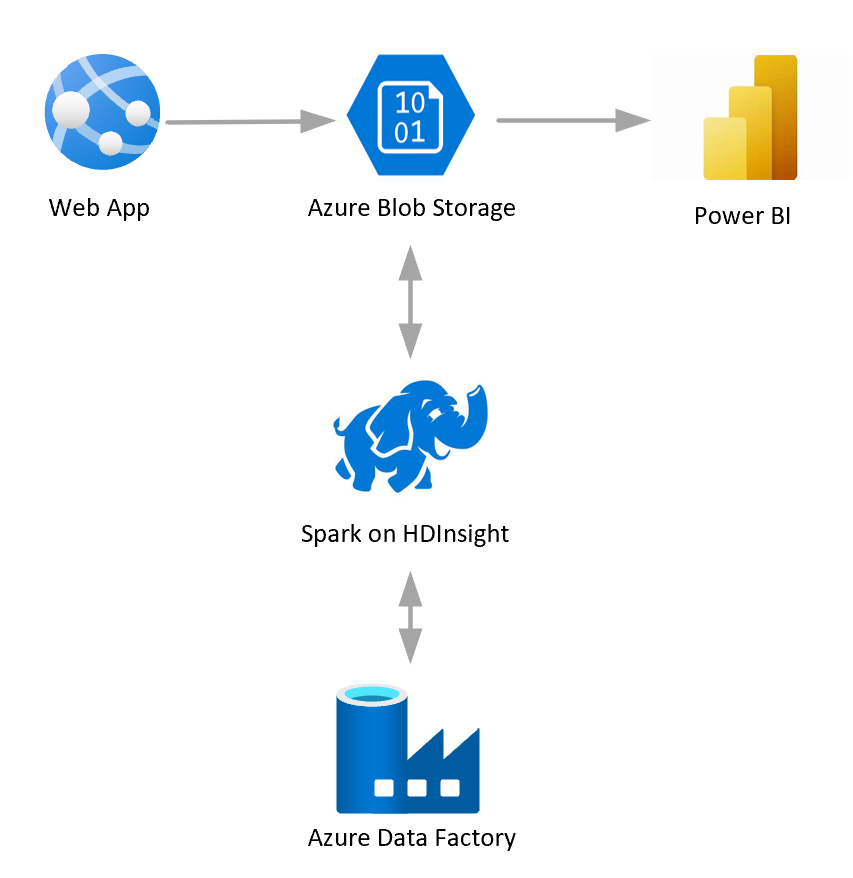

[!INCLUDE [header_file](../../../includes/sol-idea-header.md)]

Pricing is recognized as a pivotal determinant of success in many industries and can be one of the most challenging tasks. Companies often struggle with several aspects of the pricing process, including accurately forecasting the financial impact of potential tactics, taking reasonable consideration of core business constraints, and fairly validating the executed pricing decisions. Expanding product offerings add further computational requirements to make real-time pricing decisions, compounding the difficulty of this already overwhelming task.

This solution addresses the challenges raised above by utilizing historical transaction data to train a demand forecasting model. Pricing of products in a competing group is also incorporated to predict cross-product impacts such as cannibalization. A price optimization algorithm then employs the model to forecast demand at various candidate price points and takes into account business constraints to maximize profit. The solution can be customized to analyze various pricing scenarios as long as the general data science approach remains similar.

The process described above is operationalized and deployed in the Cortana Intelligence Suite. This solution will enable companies to ingest historical transaction data, predict future demand, and obtain optimal pricing recommendations on a regular basis. As a result, the solution drives opportunities for improved profitability and reductions in time and effort allocated to pricing tasks.

## Architecture

*Download an [SVG](../media/demand-forecasting-and-price-optimization.svg) of this architecture.*

## Description

Save time and let one of these trained SI partners help you with a proof of concept, deployment & integration of this solution.

The Cortana Intelligence Suite provides advanced analytics tools through Microsoft Azure - data ingestion, data storage, data processing and advanced analytics components - all of the essential elements for building a demand forecasting and price optimization solution.

This solution combines several Azure services to create powerful advantages. Azure Blob Storage stores the weekly raw sales data. Apache Spark for Azure HDInsight ingests the data and executes data preprocessing, forecasting modeling and price optimization algorithms. Finally, Data Factory orchestrates and schedules the entire data flow.

The 'Deploy' button will launch a workflow that will deploy an instance of the solution within a Resource Group in the Azure subscription you specify. The solution includes multiple Azure services (described below) along with a web job that simulates data so that immediately after deployment you can see data flowing through the end-to-end pipeline.

For post deployment instructions and more details on the technical implementation, please see the [instructions here](https://github.com/Azure/cortana-intelligence-price-optimization/blob/master/Automated%20Deployment%20Guide/Post%20Deployment%20Instructions.md).

## Technical details and workflow

  1. The simulation data is generated hourly by newly deployed Azure Web Jobs.
  2. This synthetic data is stored at Azure Blob Storage, that will be used in the rest of the solution flow.
  3. Spark on HDInsight is used to ingest and preprocess the raw data, build and retrain the demand forecasting models, and execute price optimization algorithms.
  4. Azure Data Factory orchestrates and schedules the entire data flow.
  5. Finally, Power BI is used for results visualization, so that users can monitor the results of the sales, predicted future demand as well as recommended optimal prices for a variety of products sold in different stores.
