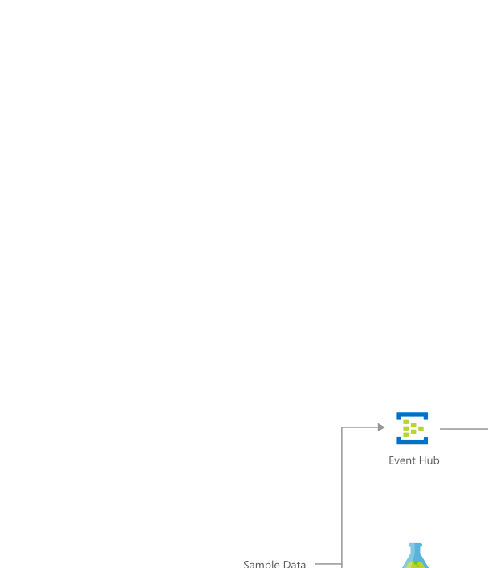

[!INCLUDE [header_file](../../../includes/sol-idea-header.md)]

Almost every business needs to predict the future to make better decisions and allocate resources more effectively. This article provides an architecture for an end-to-end demand-forecasting implementation on Azure.

## Architecture

*Download a [Visio file](https://arch-center.azureedge.net/demand-forecasting.vsdx) of this architecture.*

### Dataflow

The Microsoft AI Platform provides advanced analytics tools through Microsoft Azure - data ingestion, data storage, data processing, and advanced analytics components. These tools include all of the essential elements for building a demand-forecasting-for-energy solution.

This solution combines several Azure services to provide actionable predictions:

  1. Event Hubs collects real-time consumption data.
  1. Stream Analytics aggregates the streaming data and makes it available for visualization.
  1. Azure SQL Database stores and transforms the consumption data.
  1. Machine Learning implements and executes the forecasting model.
  1. Power BI visualizes the real-time energy consumption and the forecast results.
  1. Finally, Data Factory orchestrates and schedules the entire dataflow.

### Components

Key technologies used to implement this architecture:

* [Azure Event Hubs](https://azure.microsoft.com/services/event-hubs): Simple, secure, and scalable real-time data ingestion
* [Azure Stream Analytics](https://azure.microsoft.com/services/stream-analytics): Provide Serverless real-time analytics, from the cloud to the edge
* [Azure SQL Database](https://azure.microsoft.com/services/sql-database): Manage your intelligent SQL in the cloud
* [Azure Machine Learning](https://azure.microsoft.com/services/machine-learning): Build, deploy, and manage predictive analytics solutions
* [Power BI](https://azure.microsoft.com/services/developer-tools/power-bi): Realize the value of your data and bring the insights discovered in Azure data and analytics tools to the organization.

## Scenario details

This solution idea provides an architecture for forecasting demand. Accurately forecasting spikes in demand for products and services, for example, can give a company a competitive advantage. The better the forecasting, the more they can scale as demand increases, and the less they risk holding onto unneeded inventory. Use cases include predicting demand for a product in a retail/online store, forecasting hospital visits, and anticipating power consumption.

### Potential use cases

The following scenarios are ways an organization can utilize demand forecasting:

- Inventory planning for retail
- Network capacity planning (telecommunications)
- Workforce planning
- Increased customer satisfaction

## Next steps

  - [Forecasting Best Practices (on GitHub)](https://github.com/microsoft/forecasting)
  - [AutoML For Forecasting (on GitHub)](https://github.com/Azure/MachineLearningNotebooks/tree/master/how-to-use-azureml/automated-machine-learning)
  - [Azure Machine Learning documentation](/azure/machine-learning)
  - [Training: Get started with Azure Stream Analytics](/training/modules/introduction-to-data-streaming)
  - [Welcome to Azure Stream Analytics](/azure/stream-analytics/stream-analytics-introduction)
  
## Related resources

- [Use a demand forecasting model for price optimization](../../solution-ideas/articles/demand-forecasting-price-optimization-marketing.yml)
- [Demand forecasting for shipping and distribution](../../solution-ideas/articles/demand-forecasting-for-shipping-and-distribution.yml)
- [Analytics architecture design](../../solution-ideas/articles/analytics-start-here.yml)
- [Choose a real-time analytics and streaming processing technology on Azure](/azure/stream-analytics/streaming-technologies)
