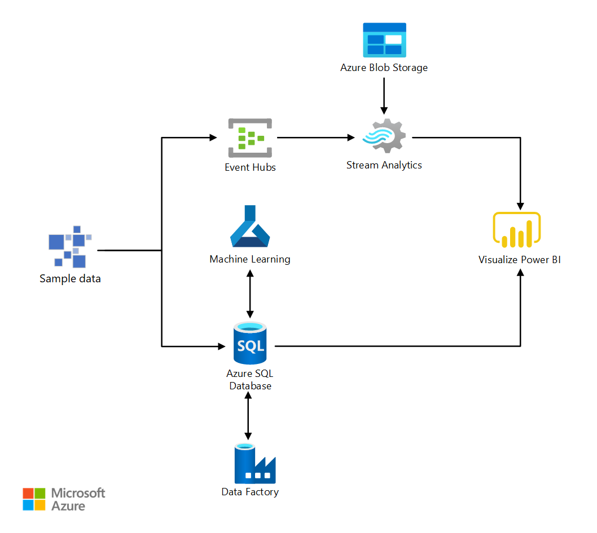

[!INCLUDE [header_file](../../../includes/sol-idea-header.md)]

Almost every business needs to predict the future to make better decisions and allocate resources more effectively. As an example, accurately forecasting spikes in demand for products and services can give a company a competitive advantage. The better the forecasting, the more they can scale as demand increases, and the less they risk holding onto unneeded inventory. Use cases include predicting demand for a product in a retail/online store, forecasting hospital visits, and anticipating power consumption.

This article focuses on presenting useful links to the forecasting best practices and an example of detailed architecture for an end-to-end implementation in Azure.

## Architecture

*Download an [SVG](../media/demand-forecasting.svg) of this architecture.*

### Workflow

The Microsoft AI Platform provides advanced analytics tools through Microsoft Azure - data ingestion, data storage, data processing, and advanced analytics components - all of the essential elements for building a demand forecasting for energy solution.

This solution combines several Azure services to provide actionable predictions:

  1. Event Hubs collects real-time consumption data.
  2. Stream Analytics aggregates the streaming data and makes it available for visualization.
  3. Azure SQL Database stores and transforms the consumption data.
  4. Machine Learning implements and executes the forecasting model.
  5. Power BI visualizes the real-time energy consumption and the forecast results.
  6. Finally, Data Factory orchestrates and schedules the entire data flow.

### Components

Key technologies used to implement this architecture:

* [Azure Event Hubs](https://azure.microsoft.com/services/event-hubs/): Simple, secure, and scalable real-time data ingestion
* [Azure Stream Analytics](https://azure.microsoft.com/services/stream-analytics/): Provide Serverless real-time analytics, from the cloud to the edge
* [Azure SQL Database](https://azure.microsoft.com/services/sql-database/): Manage your intelligent SQL in the cloud
* [Azure Machine Learning](https://azure.microsoft.com/services/machine-learning): Build, deploy, and manage predictive analytics solutions
* [Power BI](https://azure.microsoft.com/services/developer-tools/power-bi/): Realize the value of your data and bring the insights discovered in Azure data and analytics tools to the organization.

## Next steps

  * [Forecasting Best Practices (on GitHub)](https://github.com/microsoft/forecasting)
  * [AutoML For Forecasting (on GitHub)](https://github.com/Azure/MachineLearningNotebooks/tree/master/how-to-use-azureml/automated-machine-learning)
