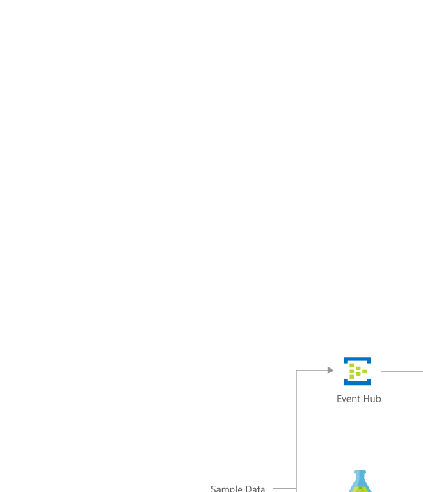

[!INCLUDE [header_file](../../../includes/sol-idea-header.md)]

This solution idea uses historical demand data to forecast demand in future periods across various customers, products, and destinations. 

## Architecture

*Download a [Visio file](https://arch-center.azureedge.net/demand-forecasting-for-shipping-and-distribution.vsdx) of this architecture.*

### Dataflow

For an example of a demand forecasting solution for shipping and distribution similar to the solution described in this article, see the [Azure AI Gallery](https://gallery.azure.ai/Solution/Demand-Forecasting-for-Shipping-and-Distribution-2). General characteristics of demand forecasting solutions like the one proposed here are:

* There are numerous kinds of items with differing volumes that roll up under one or more category levels.
* There's a history available for the quantity of the item at each time in the past.
* The volumes of the items differ widely, with possibly a large number that have zero volume at times.
* The history of items shows both trend and seasonality, possibly at multiple time scales.
* The quantities committed or returned aren't strongly price sensitive. In other words, the delivery company can't strongly influence quantities by short-term changes in prices, although there may be other determinants that affect volume, such as weather.

Under these conditions, you can take advantage of the hierarchy formed among the time series of the different items. By enforcing consistency so that the quantities lower in the hierarchy (for example, individual product quantities) sum to the quantities above (customer product totals), you can improve the accuracy of the overall forecast. The same idea applies if individual items are grouped into categories, even for categories that overlap. For example, you might be interested in forecasting demand of all products in total, by location, by product category, or by customer.

The [AI Gallery solution](https://gallery.azure.ai/Solution/Demand-Forecasting-for-Shipping-and-Distribution-2) computes forecasts at all aggregation levels in the hierarchy for each time period specified. Remember that deployments of your demand forecasting solutions will incur consumption charges for the services used. Use the [Pricing Calculator](https://azure.microsoft.com/pricing/calculator) to predict costs. When you're no longer using a deployed solution, delete it to stop incurring charges.

### Components

This demand forecasting solution idea uses the following resources hosted and managed in Azure:

* [Azure SQL Database](https://azure.microsoft.com/products/azure-sql/database) instance for persistent storage; to store forecasts and historical distribution data
* [Azure Machine Learning](https://azure.microsoft.com/services/machine-learning) web service to host forecasting code
* [Azure Blob Storage](https://azure.microsoft.com/services/storage/blobs) for intermediate storage of generated forecasts
* [Azure Data Factory](https://azure.microsoft.com/services/data-factory) to orchestrate regular runs of the Azure Machine Learning model
* [Power BI](https://powerbi.microsoft.com) dashboard to display and drill down on the forecasts

## Scenario details

This solution uses historical demand data to forecast demand across customers, products, and destinations. One example of a use for this solution is when a shipping or delivery company wants to predict the quantities of the different products customers want delivered at different locations and at future times. The company can use demand forecasts as input to an allocation tool. The allocation tool can then optimize operations, such as delivery vehicle routing and planning capacity in the longer term.  A related example is when a vendor or insurer wants to know the number of products that will be returned because of failures.

### Potential use cases

The demand forecasting process described in this solution can be operationalized and deployed in [Microsoft AI platform](https://www.microsoft.com/ai/ai-platform). Microsoft AI platform has advanced analytics tools for data ingestion, data storage, scheduling, and advanced analytics. These tools are all the essential tools for running a demand forecasting solution that can be integrated with your current production systems.

This solution is optimized for the retail and manufacturing industries.

## Next steps

See product documentation:

* [Learn more about Data Factory](/azure/data-factory/data-factory-introduction)
* [Learn more about Power BI](/power-bi/fundamentals/power-bi-overview)

Learn about:

* [Demand forecasting for shipping and distribution solution](https://gallery.azure.ai/Solution/Demand-Forecasting-for-Shipping-and-Distribution-2) in the Azure AI Gallery
* [Forecasting best practices](https://github.com/microsoft/forecasting) on GitHub

## Related resources

Read related Azure Architecture Center articles:

* [Demand forecasting and price optimization](./demand-forecasting-price-optimization-marketing.yml)
* [Demand forecasting with Azure Stream Analytics and Machine Learning](./demand-forecasting.yml)
