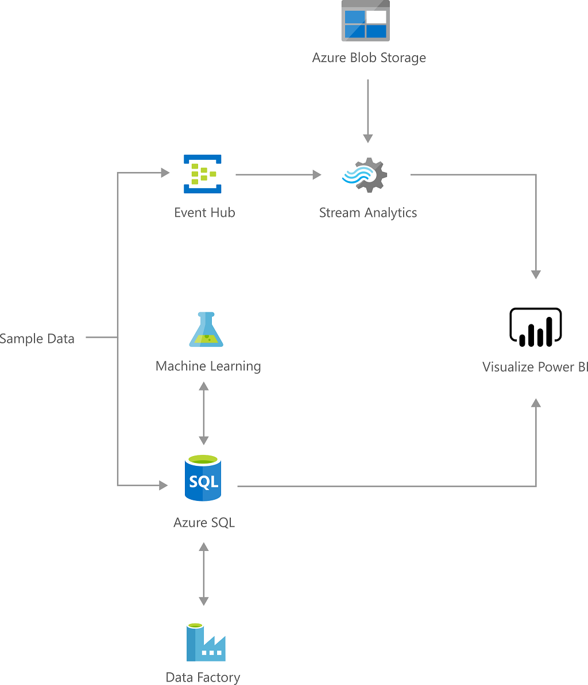

The Demand Forecasting for Shipping and Distribution Solution uses historical demand data to forecast demand in future periods across various customers, products and destinations. For instance, a shipping or delivery company wants to predict the quantities of the different products its customers want delivered at different locations at future times. A company can use these forecasts as input to an allocation tool that optimizes operations, such as delivery vehicles routing, or to plan capacity in the longer term.

[View on GitHub](https://github.com/Azure/cortana-intelligence-shipping-and-distribution-forecasting/blob/master/Technical%20Deployment%20Guide/Technical-Solution-Guide.md)

## Architecture

*Download an [SVG](../media/demand-forecasting-for-shipping-and-distribution.svg) of this architecture.*

## Summary

This is an an Azure Solution to reduce the uncertainty in forecasted shipments for organizations that need to plan based on future quantities. This page explains what the Solution does, and how to install a copy that you can run and modify in your [Azure](https://azure.microsoft.com/free) subscription.

Azure Solutions in the Cortana Intelligence Gallery are composed of advanced analytics tools for data ingestion, data storage, scheduling and advanced analytics components - all of the essential elements for running a demand forecasting solution that can be integrated with your current production systems. This Solution combines several Azure services. Azure SQL Server is used for storing forecasts and historical distribution data, Azure Machine Learning (AML) webservice for hosting the R forecasting code, Azure Data Factory to orchestrate the entire workflow, and Power BI to visualize it.

Use the [GitHub repository](https://github.com/Azure/cortana-intelligence-shipping-and-distribution-forecasting/blob/master/Technical%20Deployment%20Guide/Technical-Solution-Guide.md) to deploy an instance of the Solution for the Azure subscription you specify. This will bring you through the steps in your subscription needed to create and launch the resources that make up this solution so that you can run it. The Solution includes multiple Azure services (described below) along with Azure functions that, among other tasks, simulate the data and populate the database with it, so that immediately after deployment you will have a working end-to-end solution.

## Description

Estimated Daily Cost: [$4.66](https://azure.github.io/Azure-CloudIntelligence-SolutionAuthoringWorkspace/solution-prices#shipping-and-distribution-demand-forecasting)

The Demand Forecasting for Shipping and Distribution Solution uses historical demand data to forecast demand in future periods across various customers, products and destinations. For instance, a shipping or delivery company wants to predict the quantities of the different products its customers want delivered at different locations at future times. Similarly a vendor or insurer wants to know the number of products that will be returned due to failures over the course of a year. A company can use these forecasts as input to an allocation tool that optimizes operations, such as delivery vehicles routing, or to plan capacity in the longer term.

Characteristics of all of these forecasting cases are:

* There are numerous kinds of items with differing volumes, that roll up under one or more category levels.
* There is a history available for the quantity of the item at each time in the past. The volumes of the items differ widely, with possibly a substantial number that have zero volume at times.
* The history of items shows both trend and seasonality, possibly at multiple time scales. The quantities committed or returned are not strongly price sensitive. In other words, the delivery company cannot strongly influence quantities by short-term changes in prices, although there may be other determinants that affect volume, such as weather.

Under these conditions we can take advantage of the hierarchy formed among the time series of the different items. By enforcing consistency so that the quantities lower in the hierarchy (e.g. individual product quantities) sum to the quantities above (customer product totals) we improve the accuracy of the overall forecast. The same applies if individual items are grouped into categories, even possibly categories that overlap. For example, one might be interested in forecasting demand of all products in total, by location, by product category, by customer, etc.

This Solution computes forecasts at all aggregation levels in the hierarchy for each time period specified. For simplicity, we will refer to both hierarchial and grouped time series as "hierarchical time series."

## Shipping and distribution forecasting in use

We thank Kotahi for working with us to develop this Solution. Kotahi is a supply chain company that plans, sources, and delivers shipping containers for New Zealand exports. Read their Customer Story on how they engaged with us at Microsoft and a Microsoft Dynamics 2016 Inner Circle partner, DXC Eclipse, to put this into production. The solution helped to increase forecast accuracy and so improve their ability to choose the right-size container ships, at the right times, and dispatch them to the right ports.

## What's under the hood

The Solution uses five types of resources hosted and managed in Azure:

* Azure SQL Server instance (Azure SQL) for persistent storage
* Azure Machine Learning (AML) webservice to host the R forecasting code
* Azure Blob Storage for intermediate storage of generated forecasts
* Azure Data Factory (ADF) that orchestrates regular runs of the AML model
* Power BI dashboard to display and drill down on the forecasts

The Solution automates the running of periodic forecasts, at a pace configured in ADF (e.g. monthly), where it learns a model with the current historical data, and predicts quantities for future periods for all products in the product hierarchy. Each forecast cycle consists of a round-trip from the database, through the model, then back to the database. Each cycle measures forecast accuracy by conventional data holdout techniques. You can configure the number of periods, the product categories and the hierarchy among products. You need to load your current data in the Azure SQL database, and extract forecasts after each run from the same database. The Solution exposes the R code model to allow further customizations, and to allow you to simulate historical data, to test the Solution.

## Using the forecasting solution: Getting started

See the [Technical Solution Guide](https://github.com/Azure/cortana-intelligence-shipping-and-distribution-forecasting/blob/master/Technical%20Deployment%20Guide/Technical-Solution-Guide.md) for a full set of instructions on how to use this Solution as an example of what is possible with the Cortana Intelligence Suite. For technical problems or questions about deploying this Solution, please post in the issues tab of the repository.

## Solution Dashboard

Here is an example of a snapshot of the forecasts generated by the solution in the PowerBI dashboard that comes with the Solution.

## Pricing Info

Your Azure subscription used for the deployment will incur consumption charges on the services used in this solution, approximately $4.66/day. For more information, please visit the [Pricing Calculator](https://azure.microsoft.com/pricing/calculator).

Note: If you are no longer using the deployed solution, remember to delete it to stop incurring consumption charges.
