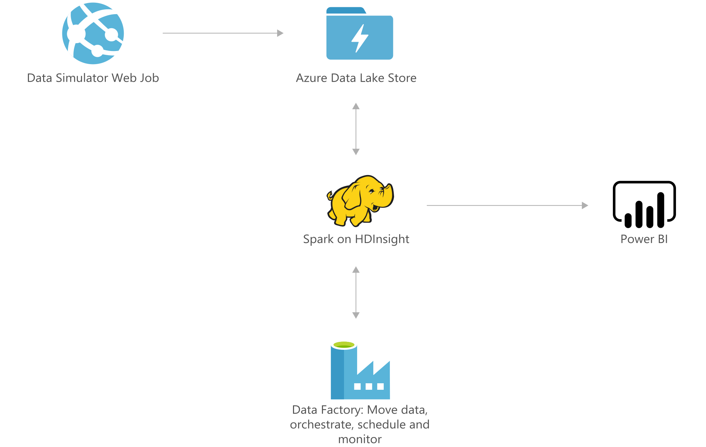

[!INCLUDE [header_file](../../../includes/sol-idea-header.md)]

Pricing is pivotal for many industries, but it can be one of the most challenging tasks. Companies often struggle to accurately forecast the fiscal impact of potential tactics, fully consider core business constraints, and fairly validate pricing decisions once they've been made. As product offerings expand and complicate the calculations behind real-time pricing decisions, the process grows even more difficult.

This solution addresses those challenges by using historical transaction data to train a demand-forecasting model in a retail context. It also incorporates the pricing of products in a competing group to predict cannibalization and other cross-product impacts. A price-optimization algorithm then uses that model to forecast demand at various price points and factors in business constraints to maximize potential profit.

By using this solution to ingest historical transaction data, predict future demand, and regularly optimize pricing, you'll have the opportunity to save time and effort around the process and improve your company's profitability.

## Architecture

*Download an [SVG](../media/demand-forecasting-price-optimization-marketing.svg) of this architecture.*

## Components

* [Azure Data Lake Storage](https://azure.microsoft.com/services/storage/data-lake-storage): Data Lake Store stores the weekly raw sales data, which is read by Spark on HDInsight.
* Spark on [HDInsight](https://azure.microsoft.com/services/hdinsight) ingests the data and executes data preprocessing, forecasting modeling, and price-optimization algorithms.
* [Data Factory](https://azure.microsoft.com/services/data-factory) handles orchestration and scheduling of the model retraining.
* [Power BI](https://powerbi.microsoft.com) visualizes sales results, the predicted future demand, and the recommended optimal prices for a variety of products sold in different stores.

## Next steps

* [Learn more about Data Lake Store](/azure/data-lake-store/data-lake-store-overview)
* [Get started with HDInsight using a Spark cluster with R Server](/azure/hdinsight/hdinsight-apache-spark-overview)
* [Learn more about Data Factory](/azure/data-factory/data-factory-introduction)
* [Learn more about Power BI](https://powerbi.microsoft.com/documentation/powerbi-landing-page)