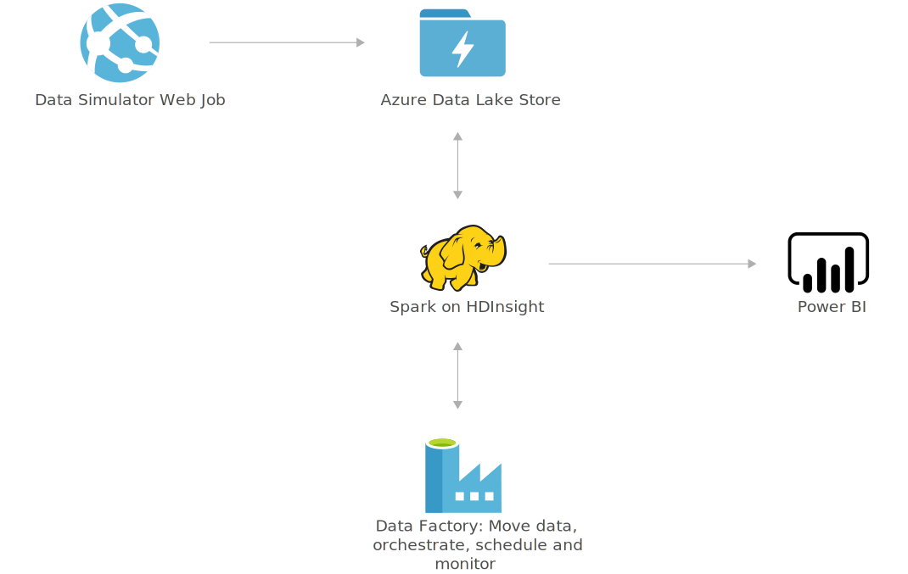

[!INCLUDE [header_file](../../../includes/sol-idea-header.md)]

This solution predicts future customer demand and optimizes pricing to maximize profitability using big-data and advanced-analytics services from Microsoft Azure.

## Architecture

*Download a [Visio file](https://arch-center.azureedge.net/demand-forecasting-price-optimization-marketing.vsdx) of this architecture.*

### Dataflow

[Microsoft AI platform](https://www.microsoft.com/ai/ai-platform) provides advanced analytics tools such as data ingestion, storage, processing, and advanced analytics components. These tools are the essential elements for building a demand forecasting and price optimization solution.

1. Azure Data Lake (or Azure Blob Storage) stores the weekly raw sales data.
2. Apache Spark for Azure HDInsight ingests the data and executes data preprocessing, forecasting modeling, and price optimization algorithms.
3. Data Factory orchestrates and schedules the entire data flow.

### Components

* [Azure Data Lake Storage](https://azure.microsoft.com/services/storage/data-lake-storage) stores the weekly raw sales data, which is read by Spark on HDInsight. As an alternative, use [Azure Blob Storage](https://azure.microsoft.com/services/storage/blobs).
* Spark on [HDInsight](https://azure.microsoft.com/services/hdinsight) ingests the data and executes data preprocessing, forecasting modeling, and price-optimization algorithms.
* [Data Factory](https://azure.microsoft.com/services/data-factory) handles orchestration and scheduling of the model retraining.
* [Power BI](https://powerbi.microsoft.com) enables visualization of results; monitor the results of the sales and predicted future demand and recommended optimal prices.

## Scenario details

Pricing is pivotal for many industries, but it can be one of the most challenging tasks. Companies often struggle to accurately forecast the fiscal impact of potential tactics, fully consider core business constraints, and fairly validate pricing decisions once they've been made. As product offerings expand and complicate the calculations behind real-time pricing decisions, the process grows even more difficult.

This solution addresses those challenges by using historical transaction data to train a demand-forecasting model in a retail context. It also incorporates the pricing of products in a competing group to predict cannibalization and other cross-product impacts. A price-optimization algorithm then uses that model to forecast demand at various price points and factors in business constraints to maximize potential profit.

The process described above can be operationalized and deployed in [Microsoft AI platform](https://www.microsoft.com/ai/ai-platform).

### Potential use cases

With this solution, you can ingest historical transaction data, predict future demand, and regularly optimize pricing, which saves you the time and effort you'd spend on pricing tasks.

## Next steps

See product documentation:

* [Learn more about Data Lake Store](/azure/data-lake-store/data-lake-store-overview)
* [Get started with HDInsight using a Spark cluster with R Server](/azure/hdinsight/hdinsight-apache-spark-overview)
* [Learn more about Data Factory](/azure/data-factory/data-factory-introduction)
* [Learn more about Power BI](/power-bi/fundamentals/power-bi-overview)

External links about forecasting:

* [Demand forecasting and price optimization](https://gallery.azure.ai/Solution/Demand-Forecasting-and-Price-Optimization) in the Azure AI Gallery
* [Forecasting best practices](https://github.com/microsoft/forecasting) on GitHub

## Related resources

See related Azure Architecture Center articles:

* [Demand forecasting for shipping and distribution](./demand-forecasting-for-shipping-and-distribution.yml)
* [Demand forecasting with Azure Stream Analytics and Machine Line](./demand-forecasting.yml)
