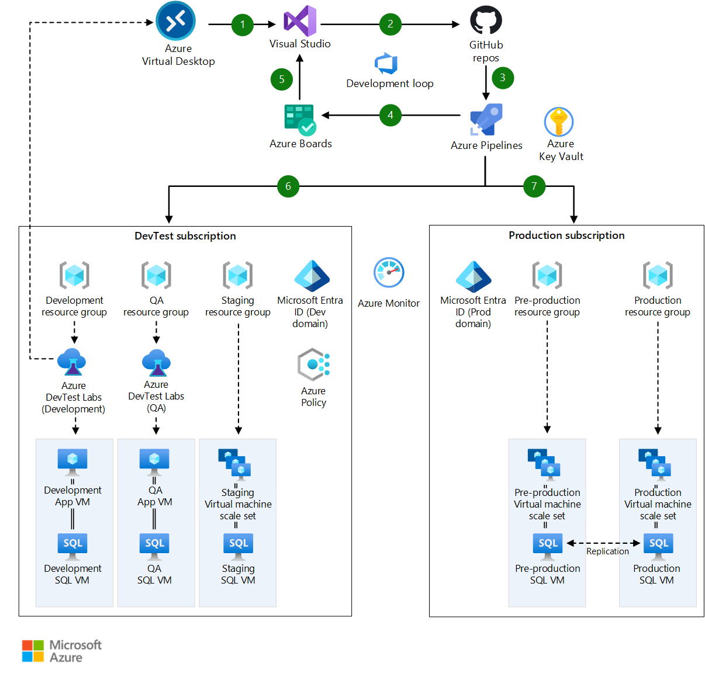

# Dev-Test deployment for testing IaaS solutions

[!INCLUDE [header_file](../header.md)]

This architecture represents how to configure your infrastructure for development and testing of a standard IaaS-based SaaS system.

This solution is built on the Azure managed services: [Azure DevOps](https://azure.microsoft.com/services/devops), [Azure DevTest Labs](https://azure.microsoft.com/services/devtest-lab), [Virtual Machines](https://azure.microsoft.com/services/virtual-machines) and Application Insights. These services run in a high-availability environment, patched and supported, allowing you to focus on your solution instead of the environment they run in.

## Architecture

*Download an [SVG](../media/dev-test-iaas.svg) of this architecture.*

## Components

* [Azure DevOps](https://azure.microsoft.com/services/devops) manages the development process.
* The [Microsoft Release Management](https://www.visualstudio.com/docs/release/getting-started/configure-agents) build and release agents deploy the Azure Resource Manager template and associated code to the various environments.
* [Azure DevOps resource groups](https://www.visualstudio.com/docs/release/getting-started/configure-agents) are used to define all the services required to deploy the solution into a dev-test or production environment.
* [Azure DevTest Labs](https://azure.microsoft.com/services/devtest-lab): Azure Dev-Test Labs manages all of the virtual machines used in the development and test environments.
* [Virtual Machines](https://azure.microsoft.com/services/virtual-machines): Virtual machines are used to deploy all of the products used in the solution. Staging slots swap pre-production and production versions.
* Application Insights: Application Insights monitors the web application during development and test runs, and then monitors the full production system when it’s released.

## Next steps

* [Set up Azure DevOps](https://www.visualstudio.com/docs/setup-admin/get-started)
* [Configure Microsoft Release Management agents](https://www.visualstudio.com/docs/release/getting-started/configure-agents)
* [Deploy using Azure Resource Groups](https://github.com/microsoft/azure-pipelines-tasks/tree/master/Tasks/AzureResourceGroupDeploymentV2)
* [Create a lab in Azure DevTest Labs](https://docs.microsoft.com/azure/lab-services/tutorial-create-custom-lab)
* [Create your first Windows virtual machine in the Azure portal](https://docs.microsoft.com/azure/virtual-machines/windows/quick-create-portal)
* [Set up Application Insights for ASP.NET](https://docs.microsoft.com/azure/azure-monitor/app/asp-net)
