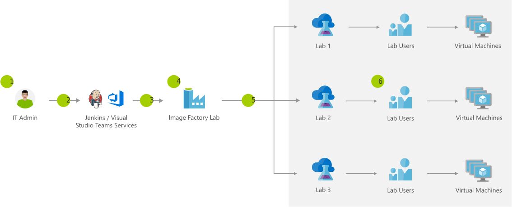

[!INCLUDE [header_file](../../../includes/sol-idea-header.md)]

The image factory provides a great way for organizations to create, maintain, and distribute custom images with Azure DevTest Labs. Whether you have globally distributed teams that need to work with a common set of custom images, need to centrally manage the configuration of images to ensure they meet regulatory compliance and security requirements, or complex software setup and configuration requirements, the image factory provides an automated solution to manage it.

## Potential use cases

The solution enables the speed of creating virtual machines from custom images while eliminating extra ongoing maintenance costs. With this solution, you can automatically create custom images, distribute them to other DevTest Labs, and retire the old images.

Some popular uses for Azure DevTest Labs include:

- Developers need many, sometimes different virtual machines (VMs) and environments as they iterate on apps.
- Testers use many identical or different VMs and environments for performance testing and sandboxed investigations.
- In the education industry, teachers and trainers periodically need new classroom, lab, and hackathon VMs and environments.

## Architecture

*Download a [Visio file](https://arch-center.azureedge.net/dev-test-image-factory.vsdx) of this architecture.*

### Dataflow

1. With config as code, define the images to push and select which labs will receive the image.
1. IT admin checks into source code control of choice (such as Visual Studio Team Services or GitHub + Jenkins).
1. Orchestrator triggers "golden image" creation based on configuration in source code control that goes to the image factory.
1. Image factory lab receives commands to create virtual machines (VMs) and custom images.
1. Specified images copied from image factory lab to team labs.
1. Team lab users claim VMs or create VMs with the latest images.

### Components

* [Azure Lab Services](https://azure.microsoft.com/services/lab-services): Set up labs for classrooms, trials, development and testing, and other scenarios
* [Virtual Machines](https://azure.microsoft.com/services/virtual-machines): Provision Windows and Linux virtual machines in seconds
* [Azure DevOps](https://azure.microsoft.com/services/devops): Services for teams to share code, track work, and ship software

## Next steps

* [Azure Lab Services documentation](/azure/lab-services)
* [Virtual Machines documentation](/azure/virtual-machines)
* [Azure DevOps documentation](/azure/devops)
