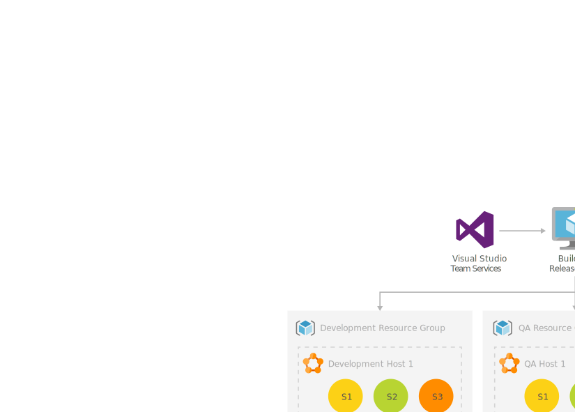

[!INCLUDE [header_file](../../../includes/sol-idea-header.md)]

Microservice architectures design applications as collections of loosely coupled services. In a microservices architecture, services are fine-grained and protocols are lightweight. Microservices offer benefits such as clear separation of concerns and decoupling of dependencies.

Microservices introduce complexities in the development cycle compared to traditional monolithic applications. Traditionally, development occurs in a local or virtual replica of the application stack, which configures and runs compute and storage components locally in isolation. In a microservice model, developers need to test their services against the existing architecture, catch integration issues early to save on build and deployment time, and keep integrated builds clean over the lifecycle of the application.

*Development testing (DevTest)* is a software development approach that integrates testing early in the development phase to speed development. *DevOps* is a set of practices that combine software development and IT operations to shorten the development cycle and provide high-quality continuous delivery. [Kubernetes](https://kubernetes.io) is an open-source container orchestration system for automating application deployments.

This solution architecture models a development and deployment environment that uses DevOps in DevTest for rapid iterative development of an [Azure Kubernetes Service (AKS)](https://azure.microsoft.com/services/kubernetes-service) microservice application.

## Potential use cases

- Legacy application modernization
- Solutions requiring real-time processing (banking/finance or data streaming/media)
- RAM or CPU-intensive parts of an application (native language processing)

## Architecture

*Download a [Visio file](https://arch-center.azureedge.net/dev-test-microservice.vsdx) of this architecture.*

### Dataflow

1. Developers use [Local Process with Kubernetes](/visualstudio/containers/overview-local-process-kubernetes) to run their local microservice versions within the context of the development Kubernetes cluster. Connecting to the cluster while debugging the service allows quick testing and development in the full application context.

1. Each microservice codebase uses a separate [GitHub](https://azure.microsoft.com/en-us/products/github) code repository for source control.

1. [GitHub Actions](https://docs.github.com/en/actions/creating-actions/creating-a-docker-container-action) builds the microservice container images and pushes them to [Azure Container Registries](/azure/container-registry/container-registry-intro). GitHub Actions also update the *latest* tag of repositories for continuous integration (CI), or tags repositories for release.

1. GitHub Actions automated testing generates work items for [Azure Boards](https://github.com/marketplace/azure-boards), making all work items manageable in one place.

1. [Visual Studio Code](https://code.visualstudio.com) extensions support Azure Boards and GitHub integration. Associating Azure Boards work items with GitHub repos ties requirements to code, driving the development loop forward.

1. Commits merged into the integration branch trigger GitHub Actions builds and [Docker](https://www.docker.com) pushes to the DevTest container registries. Each microservice has its own repository in Container Registries, paralleling the GitHub repositories. CI builds are tagged with *latest*, representing the most recent successful microservice builds.

1. [Azure Pipelines](/azure/devops/pipelines/ecosystems/kubernetes/aks-template) runs the Kubernetes `apply` command to trigger deployment of the updated Container Registry images to the DevTest Kubernetes clusters. Azure can authenticate AKS to run unattended Container Registry pulls, simplifying the continuous deployment (CD) process.

   Azure Pipelines uses [Azure Key Vault](/azure/devops/pipelines/release/azure-key-vault) to securely consume secrets like credentials and connection strings required for release and deployment configurations.

1. When a version of the application is ready for quality assurance (QA) testing, Azure Pipelines triggers a QA release. The pipeline tags all appropriate images with the next incremental version, updates the Kubernetes manifest to reflect the image tags, and runs the `apply` command. In this example, while a developer may be iterating on a service in isolation, only builds integrated via CI/CD are moved over to deployment.

1. After testing has approved a version of the service for deployment, GitHub Actions promotes a release from the DevTest Container Registry to a Production Container Registry. GitHub Actions tag the images with the appropriate version and pushes them into the Production Container Registry, following [container registry best practices](/azure/container-registry/container-registry-best-practices).

1. Azure Pipelines creates a release to Production. The pipeline imposes approval gates and pre-stage and post-stage conditions to protect the Production environment from inadvertent or incorrect deployment.

The application uses [Azure Cosmos DB](https://azure.microsoft.com/services/cosmos-db) for its globally distributed database tier.

All services and environments report metrics to [Azure Monitor](/azure/devtest-labs/security-baseline).

In this solution, a single [Azure Active Directory (Azure AD)](https://azure.microsoft.com/services/active-directory) manages identity for both the DevTest and Production subscriptions. [Azure role-based access control (Azure RBAC)](/azure/role-based-access-control/overview) restricts access to protected resources, preventing unauthorized or inadvertent modification of Production resources. Developers don't have the same access control levels in Production as in their DevTest sandboxes.

### Components

- [Azure DevTest Labs](https://azure.microsoft.com/services/devtest-lab) provides labs that have all the necessary tools and software to create environments. Developers can efficiently self-manage resources without waiting for approvals. With DevTest Labs, teams can control costs and regulate resources per lab, granting developers permission and flexibility to operate their sandboxes within cost constraints.

- [GitHub](https://docs.github.com/github/creating-cloning-and-archiving-repositories/about-repositories) is a code hosting platform for version control and collaboration. A GitHub source-control [repository](https://docs.github.com/github/creating-cloning-and-archiving-repositories/about-repositories) contains all project files and their revision history. Developers can work together to contribute, discuss, and manage code in the repository.

- [GitHub Actions](https://github.com/features/actions) provides a suite of build and release workflows, covering CI, automated testing, and container deployments.

- [Azure Boards](https://azure.microsoft.com/services/devops/boards) is a service for managing work for software projects. Azure Boards brings a rich set of capabilities including native support for Scrum and Kanban methodologies, customizable dashboards, and integrated reporting.

- [Azure Pipelines](https://azure.microsoft.com/services/devops/pipelines) is a fully featured CI/CD service that can automatically deploy updated Container Registry images to Kubernetes clusters.

- [Azure Key Vault](/azure/key-vault/general/basic-concepts) securely stores and tightly controls access to secrets like API keys, passwords, and certificates. For more information about Key Vault in DevOps scenarios, see [DevSecOps on AKS](../../guide/devsecops/devsecops-on-aks.yml) and [DevSecOps in GitHub](devsecops-in-github.yml).

- [Azure Container Registry](/azure/container-registry) supports building, storing, and managing container images and artifacts in private registries for all types of container deployments.

- [Azure Kubernetes Service](/azure/aks/intro-kubernetes) makes it simple to deploy managed Kubernetes clusters by offloading much of the complexity, responsibility, and operational overhead to Azure.

- [Azure Active Directory (Azure AD)](/azure/active-directory/fundamentals/active-directory-whatis) enterprise identity platform provides single sign-on and multifactor authentication to govern user access. A single Azure AD can manage identity for all environments across subscriptions. [Azure role-based access control (Azure RBAC)](/azure/role-based-access-control/overview) restricts access to protected resources, preventing unauthorized or inadvertent modification of production resources.

- [Azure Cosmos DB](/azure/cosmos-db/optimize-dev-test) is a fully managed, widely distributed database-as-a-service that supports high availability, multi-region applications, and both SQL and NoSQL APIs. Azure Cosmos DB includes DevTest features like a local Azure Cosmos DB emulator that integrates with Azure DevOps, and low-cost tiers for managing costs in DevTest sandboxes.

- [Azure Monitor](/azure/devtest-labs/security-baseline) can monitor both Production and DevTest environments. Azure Monitor collects log data from VM operating systems and crash dump files, and aggregates them for viewing in [Microsoft Defender for Cloud](/azure/security-center/security-center-enable-data-collection).

### Alternatives

- [Azure Repos](https://azure.microsoft.com/services/devops/repos) is an alternative to GitHub for Git repository hosting. With Azure Repos, Azure Boards, and Azure Pipelines, all Azure DevOps Services use the same portal and user interface, consolidating the services developers need for DevOps activities.

- Some integrations available in Azure Pipelines, such as service connection or authentication directly into the Azure backbone, don't currently exist in GitHub Actions. For these needs, consider using Azure Pipelines instead of GitHub Actions for CI and build activities.

- In a widely distributed system, there are benefits to separating microservices into individual repositories. Separation of ownership and permission is simpler, and projects in different languages are easier to maintain than with a single repository. However, in solutions with fewer microservices all in the same language or runtime, maintaining a single Git repository for the project may be easier.

## Next steps

- [Design a microservice-oriented application](/dotnet/architecture/microservices/multi-container-microservice-net-applications/microservice-application-design)
- [Set up Azure DevOps](/azure/devops/get-started)
- [Create a lab in Azure DevTest Labs](/azure/lab-services/tutorial-create-custom-lab)

## Related resources

- [CI/CD pipeline for container-based workloads](../../guide/aks/aks-cicd-github-actions-and-gitops.yml)
- [DevSecOps on AKS](../../guide/devsecops/devsecops-on-aks.yml)
- [DevTest and DevOps for IaaS solutions](dev-test-iaas.yml)
- [DevTest and DevOps for PaaS solutions](dev-test-paas.yml)
