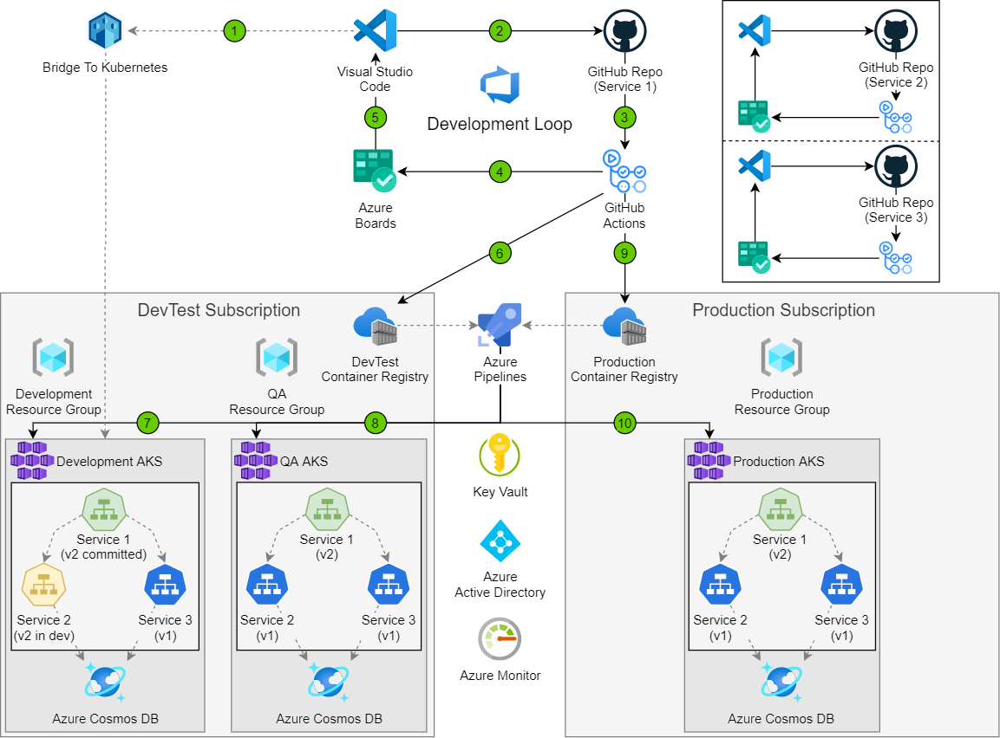

# Dev-Test deployment for testing microservice solutions

[!INCLUDE [header_file](../../../includes/sol-idea-header.md)]

This architecture represents how to configure your infrastructure for development and testing of a microservices-based system.

This solution is built on the Azure managed services: [Azure DevOps](https://azure.microsoft.com/services/devops), [Service Fabric](https://azure.microsoft.com/services/service-fabric) and [Azure SQL Database](https://azure.microsoft.com/services/sql-database). These services run in a high-availability environment, patched and supported, allowing you to focus on your solution instead of the environment they run in.

## Architecture

*Download an [SVG](../media/dev-test-microservice.svg) of this architecture.*

## Components

* [Azure DevOps](https://azure.microsoft.com/services/devops) manages the development process.
* The [Microsoft Release Management](https://www.visualstudio.com/docs/release/getting-started/configure-agents) build and release agents deploy the Azure Resource Manager template and associated code to the various environments.
* [Azure DevOps resource groups](https://www.visualstudio.com/docs/release/getting-started/configure-agents) are used to define all the services required to deploy the solution into a dev-test or production environment.
* [Service Fabric](https://azure.microsoft.com/services/service-fabric) orchestrates all of the microservices used in the solution. In development, code is deployed directly from the development tools, while in test and production environments the code is deployed through the build and release agent using Resource Manager templates.
* [Azure SQL Database](https://azure.microsoft.com/services/sql-database) maintains data for the website. Copies are deployed in the dev, test, and production environments.

## Next steps

* [Set up AzureDevOps](https://www.visualstudio.com/docs/setup-admin/get-started)
* [Configure Microsoft Release Management agents](https://www.visualstudio.com/docs/release/getting-started/configure-agents)
* [Deploy using Azure Resource Groups](https://github.com/microsoft/azure-pipelines-tasks/tree/master/Tasks/AzureResourceGroupDeploymentV2)
* [Create your first Azure Service Fabric application](https://docs.microsoft.com/api/Redirect/documentation/articles/service-fabric-create-your-first-application-in-visual-studio)
* [SQL Database tutorial: Create a SQL database in minutes by using the Azure portal](https://docs.microsoft.com/api/Redirect/documentation/articles/sql-database-get-started)
