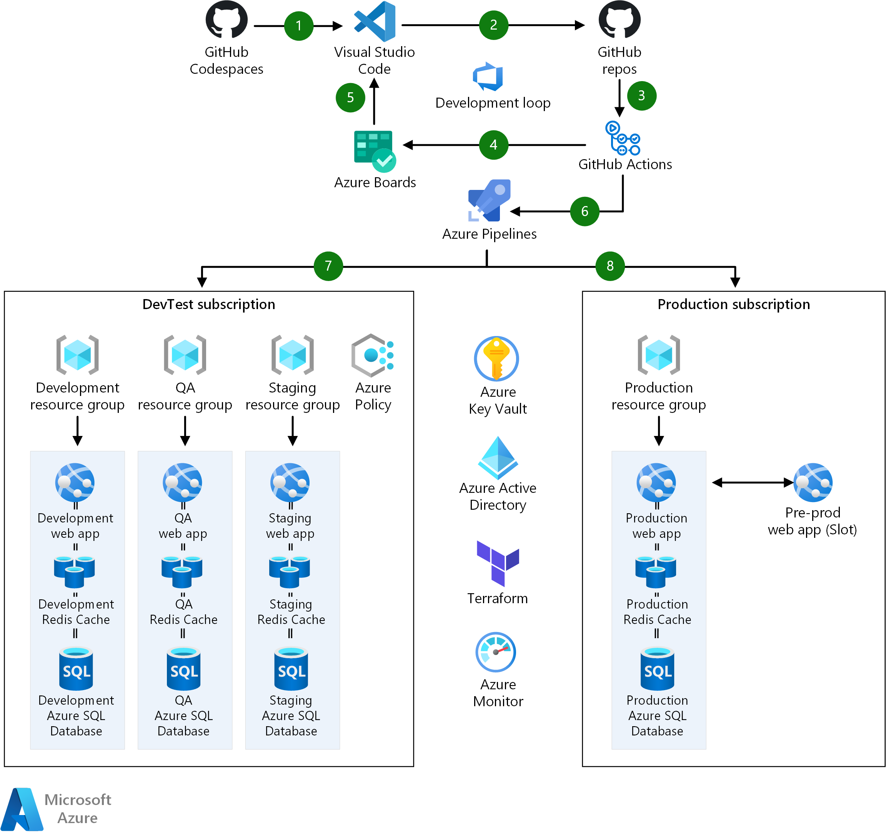

# DevTest and DevOps for microservices

Microservice architectures design applications as collections of loosely coupled services. In a microservices architecture, services are fine-grained and protocols are lightweight. Microservices offer benefits such as clear separation of concerns and decoupling of dependencies.

Microservices introduce complexities in the development cycle that aren't present in traditional monolithic applications. Traditional development occurs in a local or virtual replica of the application stack. Compute and storage components are configured and run locally in isolation. In the microservice model, developers need a way to test their services against the existing architecture, catching integration issues early, saving on build and deploy time, and keeping integrated builds cleaner over the lifecycle of the application.

*Development testing (DevTest)* is a software development approach that integrates testing early in the development phase to speed development. *DevOps* is a set of practices that combine software development and IT operations, to shorten the development life cycle and provide continuous delivery with high software quality. This solution architecture models a development and deployment environment that utilizes DevOps in DevTest for rapid iterative development of an [Azure Kubernetes Service (AKS)](https://azure.microsoft.com/services/kubernetes-service/) microservice application. 
## Architecture

1. [Bridge to Kubernetes](/visualstudio/containers/overview-local-process-kubernetes) allows developers to run their local microservice versions within the context of the development Kubernetes cluster. Service functionality is debugged in an integrated fashion against deployed services and data.
2. Each microservice codebase is source controlled in a separate [GitHub](https://azure.microsoft.com/en-us/products/github) code repository.
3. [GitHub Actions](https://docs.github.com/en/actions/creating-actions/creating-a-docker-container-action) builds and pushes the service images to container registries. GitHub Actions can update the latest tag of a repository for *continuous integration (CI)*, or tag a repository for release.
4. GitHub Actions also runs automated testing, and the results of those tests generate work items for [Azure Boards](https://github.com/marketplace/azure-boards). GitHub is integrated with Azure Boards to make all work items manageable in one place.
5. Developers work in [Visual Studio Code](https://code.visualstudio.com/), with extensions that integrate Azure Boards and GitHub. Work items are associated with branches, tying requirements to code and driving the development loop forward.
6. Commits merged into the integration branch trigger CI builds via GitHub Actions. Once the CI action builds the microservice container image, it performs a [Docker](https://www.docker.com/) push to the DevTest [Azure Container Registry (ACR)](/azure/container-registry/container-registry-intro). Each microservice has its own repository in the ACR, paralleling the GitHub repositories. In general, CI builds are tagged with *latest*, representing the most recent successful microservice build.
7. [Azure Pipelines](/azure/devops/pipelines/ecosystems/kubernetes/aks-template) runs the Kubernetes `apply` command to trigger the deployment of the Docker image to the DevTest Kubernetes clusters when the image is updated in ACR. Azure can authenticate AKS to run unattended ACR pulls, simplifying the *continuous deployment (CD)* process.
8. Once *quality assurance (QA)* is ready to test a version of the application, Azure Pipelines triggers a QA release. Pipelines tags all appropriate images with the next incremental version, updates the Kubernetes manifest to reflect the image tags, and runs the `apply` command.
   In this example, while a developer may be iterating on Service 2 in isolation, only builds integrated via CI/CD are moved over on a deployment.
9. Once testers have approved a version of the service for deployment, GitHub Actions promote a release from the DevTest ACR to a Production ACR. Production image repositories are tagged with the appropriate version and pushed into the Production ACR following [container registry best practices](/azure/container-registry/container-registry-best-practices).
10. Azure Pipelines creates a Release. Pipelines configures approval gates and pre- and post-stage conditions to protect the Production environment from inadvertent or incorrect deployment.

## Components
- [Azure DevTest Labs](https://azure.microsoft.com/services/devtest-lab/) provides labs that have all the necessary tools and software to create environments. Developers can efficiently self-manage resources without waiting for approvals. DevTest Labs let you control cost and regulate resources per lab, granting users permission and flexibility to operate their sandboxes without breaking the bank.
- [Azure Container Registry](/azure/container-registry/) lets you build, store, and manage container images and artifacts in a private registry for all types of container deployments.
- [Azure Kubernetes Service](/azure/aks/intro-kubernetes) makes it simple to deploy managed Kubernetes clusters by offloading much of the complexity, responsibility, and operational overhead to Azure.
- Azure Pipelines uses [Azure Key Vault](/azure/devops/pipelines/release/azure-key-vault) to securely consume secrets like credentials and connections strings required for release and deployment configurations. For more information, see [DevSecOps in Azure](/azure/architecture/solution-ideas/articles/devsecops-in-azure).
- A single [Azure Active Directory](/azure/active-directory/fundamentals/active-directory-whatis) can be used across subscriptions to manage identity for all environments. [Role-based access control (RBAC)](/azure/role-based-access-control/overview) restricts access to protected resources, preventing unauthorized or inadvertent modification of production resources without the appropriate permission.
- [Terraform](https://www.terraform.io/docs/providers/azurerm/r/app_service.html) is a third-party tool that allows cross-platform [infrastructure-as-code](/azure/devops/learn/what-is-infrastructure-as-code) configuration and deployment across Azure and other cloud providers. Using infrastructure as code enables the team to validate infrastructure changes similar to code changes. Azure Pipelines can implement a Release per environment stack that uses Terraform to provision and modify the resources per environment, specifically the AKS clusters, tailoring size, instance count, and other properties between environments.
- [Azure Cosmos DB](/azure/cosmos-db/optimize-dev-test) is a fully managed, widely distributed database-as-a-service that supports high availability, multi-region applications, and both SQL and NoSQL APIs. Azure Cosmos DB includes DevTest features like a local Cosmos DB emulator that integrates with Azure DevOps, and low-cost tiers that can be provisioned in DevTest sandboxes to reduce costs.
- [Azure Monitor](/azure/devtest-labs/security-baseline) can monitor VMs in both Production and DevTest environments. Azure Monitor can collect log data from VM operating systems as well as crash dump files, and aggregate them to be viewed in [Azure Security Center](/azure/security-center/security-center-enable-data-collection). [Application Insights](/azure/azure-monitor/app/app-insights-overview) is a feature of Azure Monitor that can be enabled with App Services to monitor application performance and issues.

## Alternatives
- [Azure Repos](https://azure.microsoft.com/services/devops/repos/) is a viable alternative to GitHub for Git repository hosting. By using Azure Repos, all DevOps services are hosted in the same portal and user interface, consolidating all the services developers need for DevOps activities.
- Some integrations available in Azure Pipelines, such as service connection or authentication directly into the Azure backbone, may not currently exist in GitHub Actions. In those situations, consider using Azure Pipelines instead of GitHub Actions for CI and build activities.
- In a widely distributed system, there are benefits to separating projects into individual repositories. Separation of ownership and permission is simpler, and projects in different languages are easier to maintain. However, in a solution where there are fewer microservices, all in the same language or runtime, it may be easier to maintain a single Git repository for the project.

## Next steps
- [Design a microservice-oriented application](/dotnet/architecture/microservices/multi-container-microservice-net-applications/microservice-application-design)
- [DevSecOps in Azure](/azure/architecture/solution-ideas/articles/devsecops-in-azure)
- [DevTest and DevOps for IaaS solutions](dev-test-iaas.md)
- [DevTest and DevOps for PaaS solutions](dev-test-paas.md)
