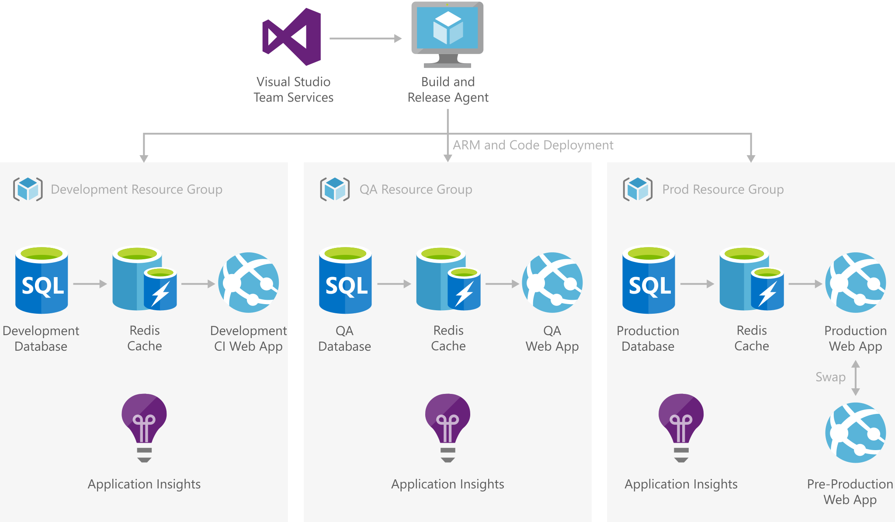

# DevTest and DevOps for PaaS

In *platform as a service (PaaS)* cloud computing, a service provider delivers a platform that lets clients develop, run, and manage applications without having to build and maintain infrastructure. Software solution development based on Azure Platform resources and services removes the overhead of managing virtual machines, virtual networks, disks, and related configurations.

*Development testing (DevTest)* is a software development approach that integrates testing early in the development phase. *DevOps* is a set of practices that combine software development and IT operations, to shorten the development cycle and provide continuous delivery (CD) with high quality.

This solution architecture combines reduced overhead and a DevOps toolchain to support rapid DevTest iteration cycles and a fast development environment with PaaS resources.

## Architecture

1. Developers use GitHub Codespaces pre-configured development environments to avoid manually configuring development environments. Developers can use Codespaces in-browser or through [Visual Studio Code](https://code.visualstudio.com/).
   
2. Source code is available in [GitHub](https://azure.microsoft.com/products/github/) repos, which integrate seamlessly with [Azure DevOps](https://azure.microsoft.com/services/devops/).
   
3. Similar to Azure DevOps, GitHub Actions set automated builds to trigger on GitHub commits or pull requests. In the current solution, the build action publishes artifacts to a [GitHub Package](https://github.com/features/packages) source package for deployment.
   
4. [Azure Boards](https://github.com/marketplace/azure-boards) connects back to GitHub Repos to generate work items from automated and manual testing, and tracks all work in the development cycle.
   
5. Developers create feature or fix branches that associate work items with development sprints or cycles, tracking all code with tasks and requirements. Maintaining velocity through an active development loop is critical to agile software development.
   
6. [Azure Pipelines](/azure/devops/pipelines/get-started/pipelines-get-started) is the solution for Azure PaaS deployments. Azure Pipelines handles CD and release tasks, which consume the package versions exposed by GitHub Actions builds.
   
7. Azure Pipelines contains deployment tasks that specifically support Azure PaaS resources, including web application deployments:
   1. In conjunction with the continuous builds from GitHub Actions, a continuous release deploys the latest application build to a Development environment.
   1. The pipeline promotes the build selected for testing up to the next deployment ring, the Test environment.
   1. After the build passes all tests, it's promoted and staged in the next outer ring for *User Acceptance Testing (UAT)*.
   
   All three of these DevTest environments exist under a discounted-cost [Azure DevTest Subscription](https://azure.microsoft.com/pricing/dev-test). An [Azure Policy](/azure/governance/policy/overview) can add additional rules for the size and number of App Services or PaaS databases to limit costs.
   
8. Once solution quality reaches a Production state, Azure Pipelines triggers a Production release. For an App Service, a Pipelines release can deploy the targeted build version to the Production resource in the Pre-Production App Slot, and swap slots to Production in place. The pipeline limits Production subscription deployments to the minimum number necessary.

## Components
- [Azure DevTest Labs](https://azure.microsoft.com/services/devtest-lab/) provides labs that have all the necessary tools and software to create environments. Developers can efficiently self-manage resources without waiting for approvals. DevTest Labs let teams control cost and regulate resources per lab, granting developers permission and flexibility to operate their sandboxes within cost constraints.
  
- [GitHub](https://docs.github.com/github/creating-cloning-and-archiving-repositories/about-repositories) is a code hosting platform for version control and collaboration, with other integrated features:
  - A GitHub source-control [repository](https://docs.github.com/github/creating-cloning-and-archiving-repositories/about-repositories) contains all project files and their revision history. Developers can work together to contribute, discuss, and manage code in the repository.
  - [GitHub Codespaces](https://github.com/features/codespaces) provide pre-configured development environments that cover library dependencies as well as user configuration and extensions, to avoid manually configuring development environments. Developers can provision codespaces in GitHub, and use them either in-browser or through [Visual Studio Code](https://code.visualstudio.com/).
  - [GitHub Actions](https://github.com/features/actions) provide a suite of build and release workflows, covering continuous integration (CI), automated testing, and [Azure Resource Manager (ARM) template](/azure/azure-resource-manager/templates/overview) or container deployments.
  - [GitHub Packages](https://docs.github.com/packages/publishing-and-managing-packages/about-github-packages) package hosting service allows hosting software packages and using them as dependencies in projects.
  
- [Azure Boards] is a service for managing work for software projects. Azure Boards brings a rich set of capabilities including native support for Scrum and Kanban, customizable dashboards, and integrated reporting.
  
- [Azure Pipelines](https://azure.microsoft.com/services/devops/pipelines/) deploys the VM application images. Pipelines can also deploy the VM resources themselves, through [Azure Resource Manager (ARM) templates](/azure/azure-resource-manager/templates/overview). This [infrastructure-as-code](/azure/devops/learn/what-is-infrastructure-as-code) can be source controlled and configured for CI/CD, ensuring that the infrastructure remains up to date.
  
- Azure Pipelines uses [Azure Key Vault](/azure/devops/pipelines/release/azure-key-vault) to securely consume secrets like credentials and connections strings that are required for release and deployment configurations. For more information, see [DevSecOps in Azure](/azure/architecture/solution-ideas/articles/devsecops-in-azure).
  
- [Azure Active Directory (Azure AD)](/azure/active-directory/fundamentals/active-directory-whatis) enterprise identity platform provides single sign-on and multifactor authentication to govern user access. A single Azure AD can manage identity for all environments across subscriptions. [Role-based access control (RBAC)](/azure/role-based-access-control/overview) restricts access to protected resources, preventing unauthorized or inadvertent modification of production resources. Developers don't have the same access control levels in Production as in their DevTest sandboxes.
  
- [Terraform](https://www.terraform.io/docs/providers/azurerm/r/app_service.html) is a third-party tool that allows cross-platform [infrastructure-as-code](/azure/devops/learn/what-is-infrastructure-as-code) configuration and deployment across Azure and other cloud providers. Infrastructure-as-code lets developers validate infrastructure changes the same way they validate code changes.
  
  Terraform provisions and modifies resources per environment, tailoring size, instance count, and other properties. The current solution models an environment stack of Azure App Service, Azure Cache for Redis, and Azure SQL Database.
  
- [Azure App Service](/azure/app-service/overview) is a fully managed web hosting service for building web apps. In this scenario, Azure App Service can swap deployment slots in place. If something goes wrong during the swap of Pre-Production to Production, App Service can roll back the swap for extra deployment safety.
  
- [Azure Cache for Redis](/azure/azure-cache-for-redis/cache-overview) provides an in-memory data store based on the open-source software Redis, which improves performance and scalability of applications that rely heavily on backend data stores.
  
- [Azure SQL Database](/azure/azure-sql/database/sql-database-paas-overview) is a fully managed PaaS database engine that handles most database management functions like upgrading, patching, backups, and monitoring without user involvement.
  
- [Azure Policy](/azure/governance/policy/concepts/recommended-policies) governs resources to meet organizational standards and compliance. In a DevTest role, Azure Policy can regulate and limit numbers and costs of VMs in a subscription. Auditing can provide insight and usage tracking of the DevTest VMs.
  
- [Azure Monitor](/azure/devtest-labs/security-baseline) can monitor both Production and DevTest environments. Azure Monitor can collect log data from VM operating systems as well as crash dump files, and aggregate them for viewing in [Azure Security Center](/azure/security-center/security-center-enable-data-collection). [Application Insights](/azure/azure-monitor/app/app-insights-overview) is a feature of Azure Monitor that works with App Service to monitor application performance and issues.

## Considerations
Developing an Azure SQL Database design that adequately supports the web app is an important consideration. Source control and versioning are as important for data schemas as for code and builds.

Tools like [Entity Framework](/ef/) can source control schema changes via migrations. Migrations codify changes to the database structure and provide methods to both advance forward and roll back changes if issues occur.

## Alternatives
- While this architecture uses Azure Pipelines for deployments, GitHub Actions can also perform PaaS deployments.
  
- Some integrations available in Azure Pipelines, such as service connection or authentication directly into the Azure backbone, don't currently exist in GitHub Actions. For these needs, consider using Azure Pipelines instead of GitHub Actions for CI and build activities.
  
- While Terraform is a powerful environment management tool, one of its main features is its cross-platform capabilities. For applications that exist solely in Azure, consider using ARM templates instead of Terraform for resource deployments. ARM templates have direct Microsoft support, have their own tasks in Azure Pipelines, and may be able to deploy features or properties that aren't immediately available in Terraform.

## Next steps
- [DevSecOps in Azure](/azure/architecture/solution-ideas/articles/devsecops-in-azure)
- [DevTest and DevOps for IaaS solutions](dev-test-iaas.md)
- [DevTest and DevOps for microservices](dev-test-microservice.md)
- [Set up Azure DevOps](/azure/devops/get-started/)
- [Create a lab in Azure DevTest Labs](/azure/lab-services/tutorial-create-custom-lab)
- [Create a SQL database in minutes by using the Azure portal](/azure/sql-database/sql-database-single-database-get-started)
- [How to create a web app with Azure Cache for Redis](/azure/azure-cache-for-redis/cache-web-app-howto)
