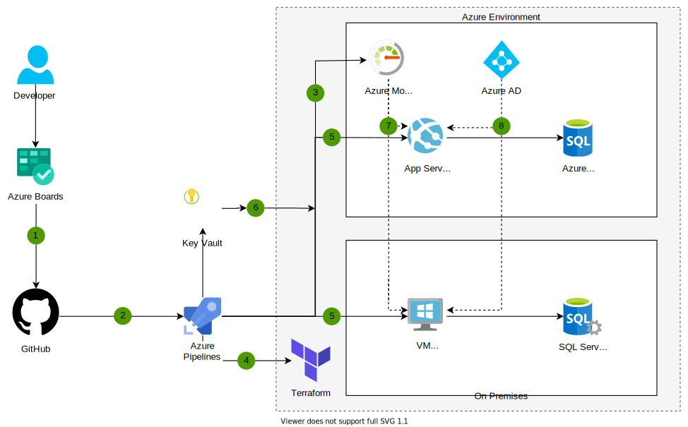

[!INCLUDE [header_file](../../../includes/sol-idea-header.md)]

In many scenarios, the adoption of the Azure cloud as a business solution involves the migration of an on-premises environment. It's not practical to deprecate the on-premises environment quickly, and in many cases the on-premises environment will need to persist alongside the cloud environment for a significant amount of time. The tools provided in Azure allow for the implementation of a DevOps strategy that capably manages both cloud and on-premises environments in tandem.

## Potential use cases

Organizations have adopted this solution to:

- Accelerate time to market.
- Build more agile practices.
- Shift into a more rolling product-delivery approach.
- Deploying changes with little to no system downtime.

## Architecture

:::image type="content" border="false" source="../media/devops-in-a-hybrid-environment.svg" alt-text="Architecture diagram shows the developer to Azure Boards, GitHub, then to Azure Pipelines into Terraform and Azure A D: devops in a hybrid environment." lightbox="../media/devops-in-a-hybrid-environment.svg":::

*Download a [Visio file](https://arch-center.azureedge.net/devops-in-a-hybrid-environment.vsdx) of this architecture.*

### Dataflow

1. GitHub Enterprise is used as the code repository for the application
1. Pull Requests trigger CI builds and automated testing in Azure Pipelines
1. Continuous monitoring with Azure Monitor extends to release pipelines to gate or rollback releases based on monitoring data
1. A release on Azure Pipelines integrates the Terraform tool, managing both cloud and on-premises infrastructure as code, provisioning resources such as Azure Web Apps, VMs, and databases in both locations
1. Azure Pipelines define both Continuous Delivery (CD) to a development environment in the cloud, and release deployments to an on-premises production environment.
1. Azure Key Vault is used to securely inject secrets and credentials into a deployment, abstracting secrets away from developers
1. Azure Monitor can be configured to log analytics from both the cloud and on-premises environments. Application Insights as a part of Azure Monitor can be connected to both cloud and on-premises applications for monitoring
1. Azure AD in the cloud can be used to provide identity services for the application, both running on Azure and on-premises.

### Components

* [Azure Boards](/azure/devops/boards/github/connect-to-github): Use Azure Board to plan work and track its progress, using Agile tools such as Kanban boards.
* Source code is hosted on [GitHub Enterprise](https://github.com/enterprise), where developers can collaborate within your organization and the open source communities. GitHub Enterprise offers advanced security features to identify vulnerabilities in the code you write and in open source dependencies.
* [Azure Pipelines](/azure/devops/pipelines/)  runs Continuous Integration and Continuous Delivery jobs for your application, as well as the creation of your infrastructure with the integration with Terraform.
* You can use [Azure Key Vault](/azure/key-vault/basic-concepts) to store certificates, connection strings, tokens, and other secrets. These are read by your application at run-time, so they're abstracted away from your developers
* [Terraform](/azure/terraform/terraform-install-configure) is a third-party product developed by HashiCorp that allows infrastructure automation on Azure, on-premises, and other environments
* Using [Azure Monitor](/azure/azure-monitor/overview) lets you get insights on the availability and performance of your application and infrastructure.
* [Azure AD](/azure/active-directory/fundamentals/active-directory-whatis) provides identity and access management services for your application, both on-premises and on the cloud. Azure AD can synchronize with an on-premises Active Directory to seamlessly allow your users to authenticate everywhere.
* [Azure Web Apps](/azure/app-service/overview) is a managed platform for hosting web-based applications in the cloud.
* [Azure SQL Database](/azure/sql-database/sql-database-technical-overview) is a managed database service for transactional applications.

## Contributors

*This article is maintained by Microsoft. It was originally written by the following contributors.*

Principal author:

 * [Alessandro Segala](https://www.linkedin.com/in/alessandrosegala) | Product Marketing Manager for VS Code

## Related resources

* [Run containers in a hybrid environment](../../hybrid/hybrid-containers.yml)
* [CI/CD for Azure Web Apps](./azure-devops-continuous-integration-and-continuous-deployment-for-azure-web-apps.yml)
* [DevTest and DevOps for microservice solutions](./dev-test-microservice.yml)
