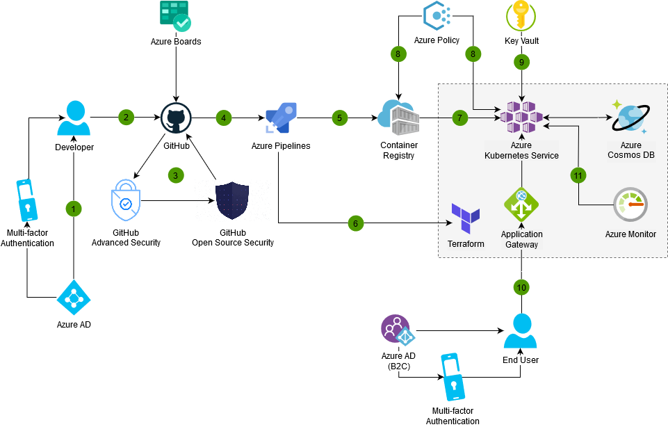

[!INCLUDE [header_file](../../../includes/sol-idea-header.md)]

Security is a prime concern for businesses that store any sort of custom or client data. The solution that is covering the management and interface of this data should be developed with security in mind. DevSecOps involves utilizing security best practices from the beginning of development, shifting the focus on security away from auditing at the end and towards development in the beginning using a shift-left strategy.

## Architecture

*Download an [SVG](../media/devsecops-in-azure.svg) of this architecture.*

### Dataflow

1. Azure Active Directory (AD) can be configured as the identity provider for GitHub. Multi-factor authentication can be enabled for extra security.
2. Developers commit to GitHub Enterprise, driven by work items and bugs tracked with Azure Boards.
3. GitHub Enterprise can integrate automatic security and dependency scanning through GitHub Advanced Security and GitHub Open Source Security.
4. Pull Requests trigger CI builds and automated testing in Azure Pipelines.
5. The CI build in Azure Pipelines generates a Docker container image that is stored to Azure Container Registry, which is to be used at release time by Azure Kubernetes Service.
6. Upon uploading to the Azure Container Registry, Microsoft Defender for Cloud will scan the image for Azure-native vulnerabilities and for security recommendations for the pushed image.
7. A release on Azure Pipelines integrates the Terraform tool, managing both the cloud infrastructure as code, provisioning resources such as Azure Kubernetes Service, Application Gateway, and Azure Cosmos DB.
8. Azure Pipelines enable Continuous Delivery (CD) to Azure Kubernetes Service, by accessing the Container Registry through a secure service connection.
9. Azure Policy can be applied to Azure Pipelines to enforce post-deployment gateways, and can be applied directly to the AKS engine for policy enforcement.
10. Azure Key Vault is used to securely inject secrets and credentials into an application at runtime, abstracting sensitive information away from developers.
11. End users can authenticate with Azure AD B2C, required to use MFA for extra security, and be routed through an Application Gateway that can load balance and protect core services.
12. Continuous monitoring with Azure Monitor extends to release pipelines to gate or rollback releases based on monitoring data. Azure Monitor also ingests security logs and can alert on suspicious activity.
13. As addition and final part of a DevSecOps flow, Microsoft Defender for Cloud will be able to do active threat monitoring on the Azure Kubernetes Service, on both Node level (VM threats) and internals.

### Components

- [Azure Active Directory](/azure/active-directory/fundamentals/active-directory-whatis) provides identity and access management services for your organization, allowing control over access to the resources inside Azure, GitHub Enterprise, and Azure DevOps.
- Source code is hosted on [GitHub Enterprise](https://help.github.com/en/github), where developers can collaborate within your organization and the open-source communities. GitHub Enterprise offers advanced security features to identify vulnerabilities in the code you write and in open-source dependencies
- Use [Azure Boards](/azure/devops/boards/github/connect-to-github?view=azure-devops) to plan work and track its progress, using Agile tools such as Kanban boards.
- [Azure Pipelines](/azure/devops/pipelines/get-started/pipelines-get-started?view=azure-devops) is a service that provides Continuous Integration and Continuous Delivery jobs, to build and release your application automatically.
- Host your Docker container images on [Azure Container Registry](/azure/container-registry/container-registry-concepts). This service includes container image scanning with the integration with Microsoft Defender for Cloud.
- [Azure Kubernetes Service](/azure/aks/intro-kubernetes) offers a Kubernetes cluster that is fully managed by Azure, to ensure availability and security of your infrastructure.
- [Terraform](/azure/terraform/terraform-create-k8s-cluster-with-tf-and-aks) is a third-party product developed by HashiCorp that allows infrastructure automation on Azure, as well as on other environments.
- [Azure Policy](/azure/governance/policy/overview) lets you create, assign, and manage policies. These policies enforce different rules and effects over your resources, so those resources stay compliant with your corporate standards and service level agreements. It integrates with Azure Kubernetes Service too.
- You can use [Azure Key Vault](/azure/key-vault/key-vault-overview) to store certificates, connection strings, tokens, and other secrets. This sensitive information is read by your application at run-time, so it's abstracted away from your developers.
- Azure [Cosmos DB](/azure/cosmos-db/introduction) is a globally distributed, multi-model database service, that is fully managed and compatible with multiple APIs, including MongoDB, Cassandra, SQL.
- [Azure Application Gateway](/azure/application-gateway/ingress-controller-overview) is a Layer-7 load balancer with support for advanced routing rules and a Web Application Firewall (WAF).
- Using [Azure Monitor](/azure/azure-monitor/overview) lets you get insights on the availability and performance of your application and infrastructure. It also gives you access to signals to monitor your solution's health and spot abnormal activity early.
- Using [Azure AD B2C](/azure/active-directory-b2c/overview) you can provide identity services to consumers (end-users) of your application, even if they're not part of your organization.

## Next steps

- Using [Microsoft Defender for Cloud](/azure/security-center/container-security), you can supply threat and vulnerability management for your deployed container-based solution.

## Related resources

- [DevSecOps in GitHub](./devsecops-in-github.yml)
- [DevSecOps for Infrastructure as Code (IaC)](./devsecops-infrastructure-as-code.yml)
