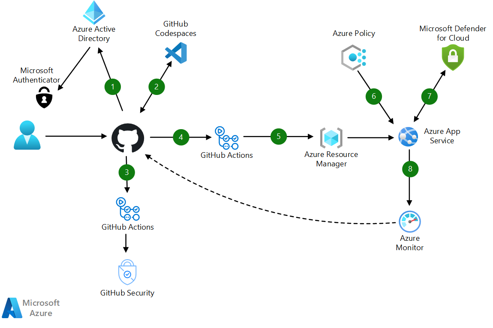
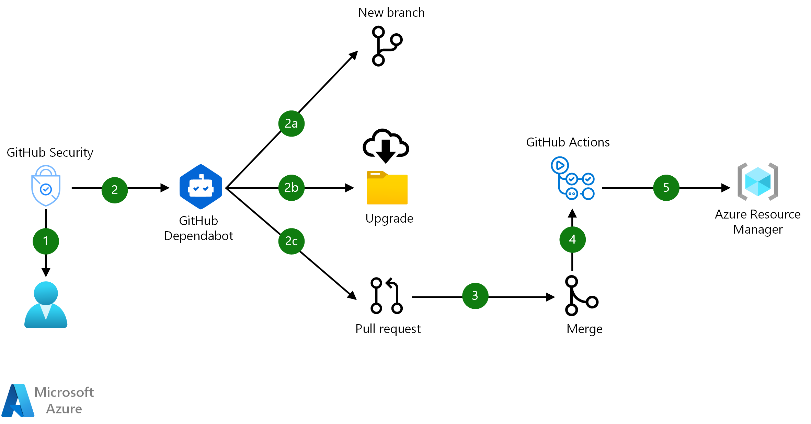

# DevSecOps in GitHub

Starting with the first steps of development, DevSecOps adheres to security best practices. By using a [shift-left](https://devops.com/devops-shift-left-avoid-failure/#:~:text=The%20term%20%E2%80%9Cshift%20left%E2%80%9D%20refers,testing%20earlier%20than%20ever%20before) strategy, DevSecOps redirects the security focus. Instead of pointing toward auditing at the end, the security spotlight shifts to development in the beginning. This [fail fast](https://whatis.techtarget.com/definition/fail-fast) approach helps to identify and resolve problems early on, when they're easy to fix.

With many security capabilities, GitHub offers tools that support every part of a DevSecOps workflow:

- Browser-based IDEs with built-in security extensions.
- Continuous monitoring of security advisories and replacement of vulnerable dependencies.
- Agents that maintain dependency trees and update out-of-date packages.
- Search capabilities that scan source code for vulnerabilities.
- Functionality that revokes or replaces tokens and credentials that are exposed in code.
- Action-based workflows that automate every step of development, testing, and deployment.
- Spaces that provide a way to privately discuss and resolve security vulnerabilities and then publish the information.

Combined with the monitoring and evaluation power of Azure, these features provide a superb service for building secure cloud solutions.

## Potential use cases

GitHub DevSecOps installations cover a verity of security scenarios. Possibilities include the following cases:

- Development teams that want to take advantage of pre-configured environments that offer security capabilities.
- Team leaders who rely on having up-to-date, prioritized security reports at their fingertips, delivered with detailed information on affected code and suggested fixes.
- Streamlined organizations that need systems to automatically acquire new, uncompromised security devices when secrets are left exposed in code.
- Developers with no time to sift through dependencies, who instead need tools that automate the tasks of tracking vulnerabilities and available upgrades.
- Administrators who count on the deployment process stopping automatically when risks are identified.
- Teams that could benefit from automatic upgrades when newer or more secure versions of external libraries become available.
- Developers who need code reverted when packages that they use violate at-rest encryption and potentially leak sensitive information.

## Architecture

*Download an [.svg](https://github.com/fmigacz/devsecops-architecture/tree/master/media/devsecops-in-github.svg) of this architecture.*

1. When developers access GitHub resources, GitHub redirects them to Azure AD for SAML authentication. This service offers single sign-on and uses the Microsoft Authenticator app for FIDO2 strong authentication.
1. Developers begin working on tasks in Codespaces. Organized into containers, these pre-built development environments provide correctly configured IDEs that are equipped with required security scanning extensions.
1. When developers commit new code, GitHub Actions automatically scan the code to quickly find vulnerabilities and coding errors.
1. Pull requests trigger code builds and automated testing through GitHub Actions. GitHub encrypts secrets and credentials at rest and obfuscates these entries in logs.
1. GitHub Actions deploy build artifacts to App Service while making changes to other cloud resources, such as service endpoints.  
1. Azure Policy evaluates Azure resources that are in deployment. It then potentially denies releases, modifies cloud resources, or creates warning events in activity logs.
1. Azure Security Center identifies attacks targeting applications that are running in deployed projects.
1. Azure Monitor continuously tracks and evaluates app behavior. When conditions arise that pose risks to security or stability, this service reverts changes by rolling code back to previous commits.

## Components

- [Azure Active Directory](/azure/active-directory/fundamentals/active-directory-whatis) is a multi-tenant, cloud-based identity service that controls access to Azure and other cloud apps like M365 and GitHub.
- [GitHub](https://docs.github.com/en/github) provides a code-hosting platform that developers can use for collaborating on both open-source and innersource projects.
- [Codespaces](https://docs.github.com/en/github/developing-online-with-codespaces/about-codespaces) is an online development environment. Hosted by GitHub and powered by Visual Studio Code, this tool provides a complete development solution in the cloud.
- [GitHub Actions](https://docs.github.com/en/actions/getting-started-with-github-actions/about-github-actions) are custom workflows that provide continuous integration (CI) and continuous deployment (CD) capabilities directly in repositories.
- [App Service](https://azure.microsoft.com/services/app-service/) provides a framework for building, deploying, and scaling web apps. This platform offers built-in infrastructure maintenance, security patching, and scaling.
- [Azure Policy](/azure/governance/policy/overview) helps teams manage and prevent IT issues through policy definitions that can enforce rules for cloud resources. For instance, if your project is about to deploy a virtual machine with an unrecognized SKU, Azure Policy alerts you to the problem and stops the deployment.
- [Azure Security Center](/azure/security-center/security-center-intro) provides unified security management and advanced threat protection across hybrid cloud workloads.
- [Azure Monitor](/azure/azure-monitor/overview) collects and analyzes app telemetry, such as performance metrics and activity logs. When this service identifies irregular conditions, it alerts apps and personnel.
- GitHub Security works to eliminate vulnerabilities in repositories in multiple ways:

  - [Code scanning](https://docs.github.com/en/github/finding-security-vulnerabilities-and-errors-in-your-code/about-code-scanning) inspects code for known vulnerabilities and coding errors. As an example, if a developer leaves a database connection string exposed in code, this feature discovers the secret. After verifying its validity with the database, GitHub initiates the steps needed to secure an uncompromised string. These checks use CodeQL, a code analysis platform that improves upon traditional analyzers by treating code as data. They automatically run at scheduled times or after certain events occur, like commits or pushes.
  - [GitHub Dependabot](https://docs.github.com/en/github/administering-a-repository/about-github-dependabot) checks for outdated or vulnerable packages and applications. This automated agent updates software, replacing out-of-date or insecure dependencies with newer, secure versions. For instance, Dependabot might determine that an open-source library that your project uses does not encrypt sensitive cleartext before storing that information in a database. Dependabot then creates a PR that upgrades the library to a version that encrypts the information.
  - [Vulnerability management](https://docs.github.com/en/github/managing-security-vulnerabilities) identifies and updates known vulnerabilities in code and in software packages that the code uses. It performs checks whenever the following events occur:

    - A repository's dependencies change (for instance, when a project switches from .NET to .NET Core).
    - A notification appears from [WhiteSource](https://www.whitesourcesoftware.com/). This third-party service tracks vulnerabilities by continuously scanning open-source repositories.
    - A new vulnerability enters the [GitHub Advisory Database](https://docs.github.com/en/github/managing-security-vulnerabilities/browsing-security-vulnerabilities-in-the-github-advisory-database). Entries in this database originate from the following sources:

      - The [National Vulnerability Database](https://nvd.nist.gov/): A standardized repository of vulnerabilities that the U.S. government maintains.
      - [GitHub tracking](https://docs.github.com/en/github/managing-security-vulnerabilities/browsing-security-vulnerabilities-in-the-github-advisory-database#about-the-github-advisory-database): A combination of machine learning and human review that GitHub conducts to detect vulnerabilities in public commits.
      - [GitHub security advisories](https://github.com/features/security): Information about vulnerabilities that development teams make public on GitHub.
      - [PHP Security Advisories Database](https://github.com/FriendsOfPHP/security-advisories): References to known security vulnerabilities in PHP projects and libraries.  
  
  When GitHub identifies a *vulnerability*, it initiates the data flow illustrated in the following diagram.
  
  *Download an [.svg](../media/devsecops-in-github-vulnerability-management-data-flow.svg) of this diagram.*

  1. GitHub sends an email alert to the organization owners and repository administrators.
  1. GitHub Dependabot, a DevOps bot agent, automatically performs the following three tasks:
      1. Creates a new branch in the repository.
      1. Upgrades the necessary dependencies to the minimum possible secure version needed to eliminate the vulnerability.
      1. Creates a pull request (PR) with the upgraded dependency.
  1. When the PR is approved, the new branch merges with the base branch.
  1. The merged branch triggers CI/CD tasks in GitHub Actions.
  1. GitHub Actions deploy the new app version to a test or staging environment.

## Considerations
Consider the following points when deciding how to implement this pattern:

- You can augment the code-scanning capabilities of GitHub by adding [third-party code-scanning tools](https://docs.github.com/en/github/finding-security-vulnerabilities-and-errors-in-your-code/about-code-scanning) that produce Static Analysis Results Interchange Format (SARIF) files. GitHub then creates alerts when those tools identify potential security issues.
- One concern with DevSecOps is that code scans can generate noisy results filled with false positives, leading to the following types of problems:
  - Developers waste time investigating nonexistent problems.
  - Addressing security issues interrupts workflow.
  - Having lost trust in security tools because of the inaccuracies, developers ignore results.  

  GitHub DevSecOps solves these problems by [integrating security into the software lifecycle](https://github.blog/2020-04-28-how-to-build-an-effective-devsecops-culture/) in the following ways:
  - Employing tools like CodeSpaces that embed scanning checks in IDEs, meaning developers use them in familiar environments.
  - Making security checks a regular part of code reviews instead of an afterthought.
  - [Putting developers in charge of high-precision scans but leaving noisier checks to security teams](https://github.blog/2020-08-27-secure-at-every-step-putting-devsecops-into-practice-with-code-scanning/).
- Project managers on tight schedules may worry that adding security measures will delay development. However, [GitHub DevSecOps implementations often observe the opposite](https://github.blog/2020-08-13-secure-at-every-step-a-guide-to-devsecops-shifting-left-and-gitops/):
  - Teams save time by making fewer mistakes when testing shifts left, closer to the source.
  - When developers address issues during programming, rather than months down the line in production, they don't need to refresh their knowledge of the code.

## Tenets of the Azure Well-Architected Framework
The [Azure Well-Architected Framework](azure/architecture/framework/) provides a set of guiding tenets that can improve the quality of workloads. These tenets emphasize five pillars of architectural excellence: Cost Optimization, Operational Excellence, Performance Efficiency, Reliability, and Security. Recommendations in the following sections provide tips for keeping GitHub DevSecOps solutions aligned with these principles.

### Cost Optimization

- GitHub bills customers for GitHub Actions by the minute. In addition, the choice of operating system that hosts Actions jobs affects the per-minute consumption rate and per-minute cost. Wherever possible, choose Linux to host Actions. See [About billing for GitHub Actions](https://docs.github.com/en/github/setting-up-and-managing-billing-and-payments-on-github/about-billing-for-github-actions).

### Operational Excellence

- Run automated tests and maintenance in environments that use vulnerability management capabilities. These features change your code and its dependencies on your behalf, but automated testing will identify issues with these changes.
- Take advantage of Azure Policy features, which can do more than just deny deployments and log compliance issues. They can also modify resources, making them compliant, even if they aren't deployed that way. For example, if you try to deploy a storage account in Azure that uses HTTP, Azure Policy can automatically change the deployment and force the storage account to use HTTPS.
- Azure Resource Manager uses JSON templates to describe the resources involved in deployment. Teams can also manage these template documents by using DevOps tools, like version control, code collaboration, and CI/CD workflows.

### Performance Efficiency

- GitHub *runners* are the computers that host CI/CD jobs. For long-running or complex Actions, consider hosting your own runners so that you can choose computers with powerful processing capabilities and ample memory. See [About self-hosted runners](https://docs.github.com/en/actions/hosting-your-own-runners/about-self-hosted-runners).

### Reliability

- [GitHub Enterprise Server](https://azuremarketplace.microsoft.com/marketplace/apps/github.githubenterprise) can run in a [highly available failover configuration](https://docs.github.com/en/enterprise/2.21/admin/enterprise-management/about-high-availability-configuration). If you use self-hosted Actions runners, you can also distribute them geographically.

### Security

- Using self-hosted Actions runners for public repositories isn't advised. A malicious user could join your repo and create a pull request that runs unsafe code on computers in your network. GitHub-hosted runners remove this risk.
- Scan your code using the CodeQL analysis engine. CodeQL can discover potential vulnerabilities and coding errors. It can run both on a schedule and when events occur, such as commits or pull requests. See [About code scanning](https://docs.github.com/en/github/finding-security-vulnerabilities-and-errors-in-your-code/about-code-scanning).
- Make sure to [configure Dependabot security updates](https://docs.github.com/en/github/managing-security-vulnerabilities/configuring-github-dependabot-security-updates), which can remove known threats from projects.

## Related resources

- [DevSecOps in Azure](/azure/architecture/solution-ideas/articles/devsecops-in-azure)
- [Shift left](https://devops.com/devops-shift-left-avoid-failure/#:~:text=The%20term%20%E2%80%9Cshift%20left%E2%80%9D%20refers,testing%20earlier%20than%20ever%20before)
- [Fail fast](https://whatis.techtarget.com/definition/fail-fast)
- [Training materials, tools, and other resources on GitHub DevSecOps](https://github.com/devsecops/awesome-devsecops)
- [Tips for getting started with GitHub DevSecOps](https://resources.github.com/whitepapers/Architects-guide-to-DevOps/)
- [CodeQL](https://securitylab.github.com/tools/codeql)
- [SARIF files](https://docs.github.com/en/github/finding-security-vulnerabilities-and-errors-in-your-code/sarif-support-for-code-scanning)
