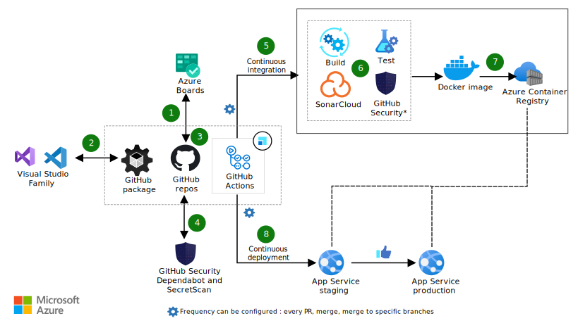
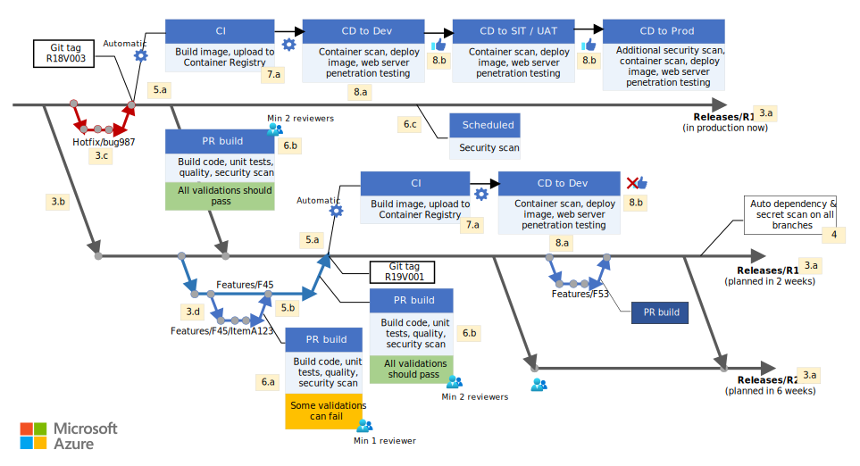

[!INCLUDE [header_file](../../../includes/sol-idea-header.md)]

Implement DevSecOps for your organization to help improve developer velocity, introduce the fail-fast culture, and achieve a shift-left in your vulnerability resolution journey.

## Potential use cases

This solution is for organizations that use automation and security tools like [DevSecOps in GitHub](/azure/architecture/solution-ideas/articles/devsecops-in-github). It shows how to integrate and use the DevSecOps capabilities with your branching strategy—by configuring the continuous integration and continuous deployment (CI/CD) pipelines with the right validations, triggers, and schedulers.

## Architecture

**Diagram 1: DevSecOps with GitHub.**

 

**Diagram 2: DevSecOps with rolling main branch strategy.**

*Download a [Visio file](https://arch-center.azureedge.net/devsecops-rolling-branch.vsdx) of all diagrams in this article.*

### Dataflow

A developer’s day:

1. **Diagram 1 (D1)** The day starts off on Azure Boards. The developer checks the assigned items and picks the task of the day from the sprint backlog.
1. **D1** The developer opens an integrated development environment (IDE) and checks out the relevant branch. The developer checks out either a task or a bug, based on the release and item type.
1. **D1** The code is stored and versioned in a GitHub repository. The repository's branches follow a specific branching strategy called the rolling main branch. It requires a release manager or technical lead to create and maintain the branch updates.
    1. **Diagram 2 (D2)** Each release is associated with a branch in the "Releases" folders. The "main" branch changes over time, based on which release is in production at that moment. These branches are protected, by requiring several approvals for a developer's code commitments.
    1. **D2** The branches are merged from old releases to newer ones, to make sure that any feature or production bug fix is available in later releases.
    1. **D2** When a bug fix is required, the branch is created using the `hotfix/*` naming convention. This pattern is useful to define workflows (or pipelines) to trigger automatically based on the branch name.
    1. **D2** When the development of a new feature starts, the branch is created using the `Features/<Feature ID>/*` naming convention. The feature branch is protected using the branch policies.
1. **D1 and D2** GitHub Advanced Security analyses all the branches, looking for hardcoded secrets and dependency vulnerabilities. If a vulnerability is detected (for example, a dependency to a deprecated non-secure package), GitHub sends alerts to the organization or repository owners and maintainers. GitHub Dependabot creates a new branch in the repository, automatically upgrades the old dependency to a secure version, and creates a pull request (PR) with the upgraded dependency. The PR requires manual approval, followed by the PR process described in the next steps.
1. **D1** The continuous integration (CI) is triggered when a new pull request is created, or code is merged in a release branch. Note the following triggers:
    1. **D2** The full CI/CD is triggered when a hotfix or a feature is merged in a release branch at **7.a**.
    1. **D2** A development task is merged in the "Feature/F45" branch that is under development. This event doesn’t trigger any build. The relevant validation is done during the PR review process.
1. **D1** The PR validation can be configured in several ways to build, test, and scan the quality and the vulnerabilities of the code. Those validations can be performed in parallel, when possible, to speed up the overall process. In a web project, a possible approach is to do the following validations:
    1. **D2** During a feature development, if an open PR targets the feature branch, it triggers the build (compile), test execution, code quality scan, and scans for vulnerability (by using CodeQL, offered by GitHub Advanced Security). Some validations might fail, and the number of code reviewers can be limited based on internal policies. If you're using a shift-left approach, you'll start security scans beginning with this step.
    1. **D2** In this scenario, a PR targets a release branch. The workflows (or pipelines) triggered are the same as at point **6.a**, except when a stricter rule on the validation criteria is wanted, like more code reviewers and no failing validations **6.b**.
    1. **D2** GitHub Actions can be scheduled daily or weekly. Scheduled vulnerability scanning discovers exploits that can be attacked. Scheduled scanning for code vulnerability is beneficial during team holidays, when a project is live, or during a period of infrequent updates.
1. **D1** When a PR is merged into a release branch, a continuous integration (CI) workflow listening to this event triggers the build and push off the related docker container to the Azure Container Registry (**D2, 7.a**).
1. **D1** The continuous deployment (CD) pipelines listen to the upload of new containers in the registry. When a new container is available, the pipeline scans it, deploy it automatically to the development environment (**D2, 8a**), and do basic penetration testing on the new web service. Any subsequent deployment will be performed only if the environment owners approve that specific feature or fix, then it's deployed to other environments (**D2, 8.b**).

### Components

* [Azure Boards](https://azure.microsoft.com/services/devops/boards). Azure Boards provides software development teams with interactive and customizable tools for software projects.
* [Azure Container Registry](https://azure.microsoft.com/services/container-registry). Azure Container Registry is a managed, private Docker registry service. Create and maintain Azure container registries to store and manage your private Docker container images and related artifacts.
* [GitHub packages / release](/azure/architecture/solution-ideas/articles/devsecops-in-github). GitHub is a public (or private) repository for packages, libraries, and applications. GitHub is the key tool to improve reusability and modularity in your software. GitHub is similar to other products like JFrog, npm, or Maven.
* [GitHub Actions](https://github.com/features/actions). The engine that enables your CI/CD to work, like Jenkins or Azure DevOps.
  * [Workflows Triggers](https://docs.github.com/actions/learn-github-actions/events-that-trigger-workflows): You can configure your workflows to run when a specific activity on GitHub happens, at a scheduled time, or when an event outside of GitHub occurs.
  * [Deployment reviewers](https://docs.github.com/actions/managing-workflow-runs/reviewing-deployments): Jobs that reference an environment configured with required reviewers will wait for an approval before starting.
* [GitHub Advanced Security](https://docs.github.com/get-started/learning-about-github/about-github-advanced-security). Advanced Security provides features to improve and maintain the quality of your code in three major areas. It requires an extra license.
  * **Code scanning**: Search for potential security vulnerabilities and coding errors in your code.
  * **Secret scanning**: Detect secrets (for example, keys and tokens) that have been checked into the repository.
  * **Dependency review**: Show the full impact of changes to dependencies and see details of any vulnerable versions before you merge a PR.
* [GitHub and Azure Boards integration](/azure/devops/boards/github). By connecting Azure Boards with GitHub repositories, you enable linking between GitHub commits, PRs, and issues to work items. You can use GitHub for software development while using Azure Boards to plan and track your work. Azure Boards provides the scalability to grow as your organization and business needs grow.
* [SonarCloud](https://sonarcloud.io/code-quality). Sonar Cloud’s static analysis detects bugs and code issues in your repositories and provides the feedback you need to write better code.
* [Branching strategy](/azure/devops/repos/git/git-branching-guidance). Define the naming conventions, ownership, PRs, and reviewers of branches for a Git project at an organization level.

## Contributors

*This article is maintained by Microsoft. It was originally written by the following contributors.*

Principal author:

 * [Francesco De Liva](https://www.linkedin.com/in/francescodeliva) | App Innovation / Cloud Solution Architect

## Next steps

* [Secure DevOps](https://www.microsoft.com/securityengineering/devsecops)
* [Security strategy essentials](https://github.com/githubtraining/security-strategy-essentials)
* [Learn GitHub Actions](https://docs.github.com/actions/learn-github-actions)
* [Azure Boards documentation](/azure/devops/boards)
* [Azure Container Registry documentation](/azure/container-registry)
* [Specify events that trigger pipelines](/azure/devops/pipelines/build/triggers)

## Related resources

* [DevSecOps on AKS](../../guide/devsecops/devsecops-on-aks.yml)
* [DevSecOps in GitHub](/azure/architecture/solution-ideas/articles/devsecops-in-github)
