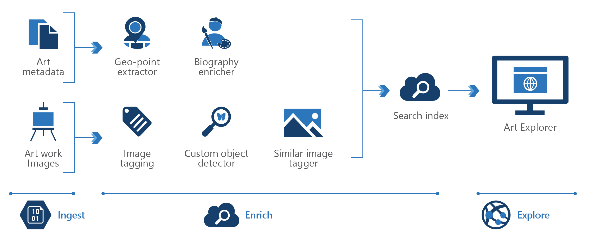

<!-- cSpell:ignore pracjain -->

This architecture describes digital asset management for knowledge mining.

Given the amount of unstructured data created daily, many companies are struggling to make use of or find information within their files. Knowledge mining through a search index makes it easy for end customers and employees to locate what they are looking for faster.

## Data Flow

There are three steps: Ingest, Enrich and Exploration. First, the unstructured and structured data is ingested then enrichment of this data with AI to extract information and find and finally explore the newly structured data via search, existing business applications or analytics solutions.

1. The user can ingest different types of technical content like article and image archives, photos and videos, internal documents, marketing assets, brochures
2. This content is enriched by using automatic image captioning and object detection with computer vision, celebrity recognition, language translation, and entity recognition
3. And finally, the user can integrate the search index into a website.

## Components

Key technologies used to implement tools for technical content review and research

* [Azure Cognitive Search](/azure/search/)
* [Microsoft Computer Vision API](https://azure.microsoft.com/services/cognitive-services/computer-vision/)
* [Microsoft Face API](https://azure.microsoft.com/services/cognitive-services/face/)
* [Web API custom skill interface](/azure/search/cognitive-search-custom-skill-interface)

## Next steps

* [Artificial intelligence (AI) - Architectural overview](../../data-guide/big-data/ai-overview.md)
* Use the [Knowledge Mining Solution Accelerator](/samples/azure-samples/azure-search-knowledge-mining/azure-search-knowledge-mining/) to build an initial knowledge mining prototype with Azure Cognitive Search
* [How to add a custom skill to an Azure Cognitive Search enrichment pipeline](/azure/search/cognitive-search-custom-skill-interface)