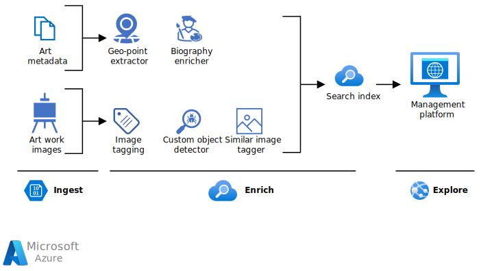

[!INCLUDE [header_file](../../../includes/sol-idea-header.md)]

Use digital asset management to mine knowledge and find information. Ingest unstructured and structured data, enrich it with AI, and explore it by using search.

## Architecture

There are three steps in knowledge mining: ingest, enrich, and explore.

*Download a [Visio file](https://arch-center.azureedge.net/knowledge-mining-digital-asset-management.vsdx) of this architecture.*

- **Ingest**

   The ingest step aggregates content from a range of sources, including structured and unstructured data. For digital asset management, sources can be technical content like article and image archives, photos, videos, internal documents, marketing assets, and brochures.

- **Enrich**

   The enrich step uses AI capabilities to extract information, find patterns, and deepen understanding. For example, you can enrich the content by using automatic image captioning and object detection with computer vision, celebrity recognition, language translation, and entity recognition.

- **Explore**

   The explore step is exploring the data via search, existing business applications, or analytics solutions. For example, you can integrate the search index into a web site.

### Components

The following key technologies are used to implement tools for technical content review and research:

- [Azure Cognitive Search](https://azure.microsoft.com/services/search) is a cloud search service that supplies infrastructure, APIs, and tools for searching. You can use Azure Cognitive Search to build search experiences over private, heterogeneous content in web, mobile, and enterprise applications.
- The [Azure Cognitive Search custom skill interface](/azure/search/cognitive-search-custom-skill-interface) is used to integrate a custom skill into an Azure Cognitive Search enrichment pipeline.
- [Computer Vision](https://azure.microsoft.com/services/cognitive-services/computer-vision) uses text recognition APIs to extract text from images. Computer Vision is part of [Azure Cognitive Services](https://azure.microsoft.com/services/cognitive-services).
- [Face API](https://azure.microsoft.com/services/cognitive-services/face) is AI service that analyzes faces in images. Face API is part of Cognitive Services.

## Scenario details

This architecture demonstrates how to use [knowledge mining](https://azure.microsoft.com/solutions/knowledge-mining) in digital asset management.

### Potential use cases

Given the amount of unstructured data created daily, many companies struggle to make use of or find information within their files. One of the key functions of a digital asset management system is to allow assets to be easily retrieved.

Knowledge mining can help with retrieval by providing a search index that enables users to quickly locate what they are looking for.

## Next steps

- Read an architecture overview on [artificial intelligence (AI)](../../data-guide/big-data/ai-overview.md).
- To build an initial knowledge mining prototype with Azure Cognitive Search, use the [knowledge mining solution accelerator](/samples/azure-samples/azure-search-knowledge-mining/azure-search-knowledge-mining).
- Build an Azure Cognitive Search [custom skill](/azure/search/cognitive-search-custom-skill-interface).
- Explore the Microsoft learning path [Knowledge mining with Azure Cognitive Search](/training/paths/implement-knowledge-mining-azure-cognitive-search).
- To learn more about the components in this solution, see these resources:

  - [Azure Cognitive Search documentation](/azure/search)
  - [What is Computer Vision?](/azure/cognitive-services/computer-vision/overview)
  - [What is the Azure Face service?](/azure/cognitive-services/computer-vision/overview-identity)

## Related resources

- [Knowledge mining in auditing, risk, and compliance management](./auditing-and-risk-compliance.yml)
- [Knowledge mining in business process management](./business-process-management.yml)
- [Knowledge mining for content research](./content-research.yml)
- [Knowledge mining in contract management](./contract-management.yml)
- [Knowledge mining for customer support and feedback analysis](./customer-feedback-and-analytics.yml)
