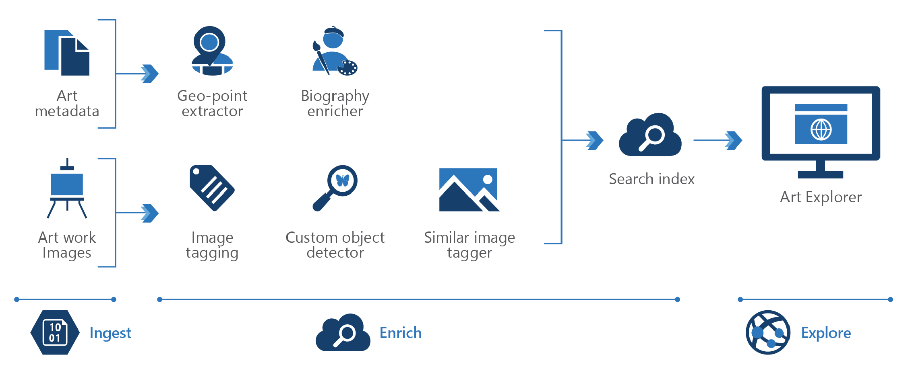

<!-- cSpell:ignore pracjain -->

[!INCLUDE [header_file](../../../includes/sol-idea-header.md)]

This architecture demonstrates how to use [knowledge mining](https://azure.microsoft.com/solutions/knowledge-mining) in digital asset management.

## Potential use cases

Given the amount of unstructured data created daily, many companies struggle to make use of or find information within their files. One of the key functions of a digital asset management system is to allow assets to be easily retrieved.

Knowledge mining can help with retrieval by providing a search index that enables users to quickly locate what they are looking for.

## Architecture

There are three steps in knowledge mining: ingest, enrich, and explore.

- **Ingest**

   The ingest step aggregates content from a range of sources, including structured and unstructured data. For digital asset management, sources can be technical content like article and image archives, photos, videos, internal documents, marketing assets, and brochures.

- **Enrich**

   The enrich step uses AI capabilities to extract information, find patterns, and deepen understanding. For example, you can enrich the content by using automatic image captioning and object detection with computer vision, celebrity recognition, language translation, and entity recognition.

- **Explore**

   The explore step is exploring the data via search, existing business applications, or analytics solutions. For example, you can integrate the search index into a web site.

### Components

Key technologies used to implement tools for technical content review and research:

- [Azure Cognitive Search](/azure/search/)
- [Cognitive Services Computer Vision](https://azure.microsoft.com/services/cognitive-services/computer-vision/)
- [Cognitive Services Face](https://azure.microsoft.com/services/cognitive-services/face/)
- [Cognitive Search custom skill interface](/azure/search/cognitive-search-custom-skill-interface)

## Next steps

- Read an architecture overview on [artificial intelligence (AI)](../../data-guide/big-data/ai-overview.md).

- Use the [Knowledge Mining Solution Accelerator](/samples/azure-samples/azure-search-knowledge-mining/azure-search-knowledge-mining/) to build an initial knowledge mining prototype with Azure Cognitive Search.
- Build an Azure Cognitive Search [custom skill](/azure/search/cognitive-search-custom-skill-interface).

- Explore the Microsoft Learning Path [knowledge mining with Azure Cognitive Search](/learn/paths/implement-knowledge-mining-azure-cognitive-search/).
