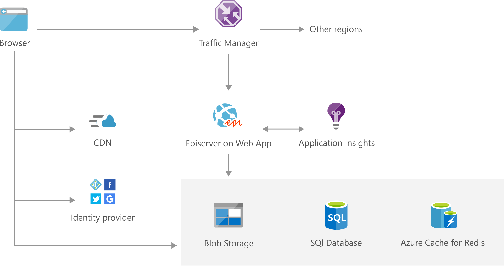

# Scalable Episerver marketing website

[!INCLUDE [header_file](../../../includes/sol-idea-header.md)]

Let your business run multi-channel digital marketing websites on one platform and spin up and spin down campaigns on demand. Take advantage of the comprehensive capabilities of Episerver to manage every aspect of your site and campaign performance.

This solution is built on the Azure managed services: [Traffic Manager](https://azure.microsoft.com/services/traffic-manager), [Content Delivery Network](https://azure.microsoft.com/services/cdn), [Azure SQL Database](https://azure.microsoft.com/services/sql-database), [Azure Cache for Redis](https://azure.microsoft.com/services/cache) and [Azure Monitor](https://azure.microsoft.com/services/monitor). These services run in a high-availability environment, patched and supported, allowing you to focus on your solution instead of the environment they run in.

## Architecture

*Download an [SVG](../media/digital-marketing-episerver.svg) of this architecture.*

## Components

* App Service [Web Apps](https://azure.microsoft.com/services/app-service/web) runs in multiple regions, accessible to web and mobile browsers, and is scaled out across multiple server instances.
* [Traffic Manager](https://azure.microsoft.com/services/traffic-manager) determines which web app is geographically best placed to handle each request.
* [Content Delivery Network](https://docs.microsoft.com/azure/cdn/cdn-add-to-web-app): A content delivery network serves static content such as images, script, and CSS, and reduces the load on the Web App servers.
* [Azure SQL Database](https://azure.microsoft.com/services/sql-database): A SQL Database stores and serves data about the site.
* [Azure Cache for Redis](https://azure.microsoft.com/services/cache) enables very fast queries, and improves scalability by reducing the load on the main database.
* Azure [Blob storage](https://azure.microsoft.com/services/storage/blobs) provides high-performance, high-scale storage.
* [Azure Monitor](https://azure.microsoft.com/services/monitor): Application Insights provides service health, performance monitoring, and diagnostics.
* [Identity provider](https://docs.microsoft.com/azure/app-service/app-service-authentication-overview): An identity provider such as Azure Active Directory or Facebook handles authentication to the app.

## Next steps

* [Deploy an ASP.NET web app to Azure App Service, using Visual Studio](https://docs.microsoft.com/api/Redirect/documentation/articles/web-sites-dotnet-get-started)
* [Configure Performance traffic routing method](https://docs.microsoft.com/api/Redirect/documentation/articles/traffic-manager-configure-performance-routing-method)
* [Use Azure CDN in Azure App Service](https://docs.microsoft.com/api/Redirect/documentation/articles/cdn-websites-with-cdn)
* [SQL Database tutorial: Create a SQL database in minutes by using the Azure portal](https://docs.microsoft.com/api/Redirect/documentation/articles/sql-database-get-started)
* [How to create a Web App with Azure Cache for Redis](https://docs.microsoft.com/azure/azure-cache-for-redis/cache-web-app-arm-with-redis-cache-provision)
* [Get started with Azure Blob storage using .NET](https://docs.microsoft.com/api/Redirect/documentation/articles/storage-dotnet-how-to-use-blobs)
* [Application Performance Management with Application Insights](https://docs.microsoft.com/azure/azure-monitor/app/app-insights-overview)
* [How to configure your App Service application to use Facebook login](https://docs.microsoft.com/api/Redirect/documentation/articles/app-service-mobile-how-to-configure-facebook-authentication)
