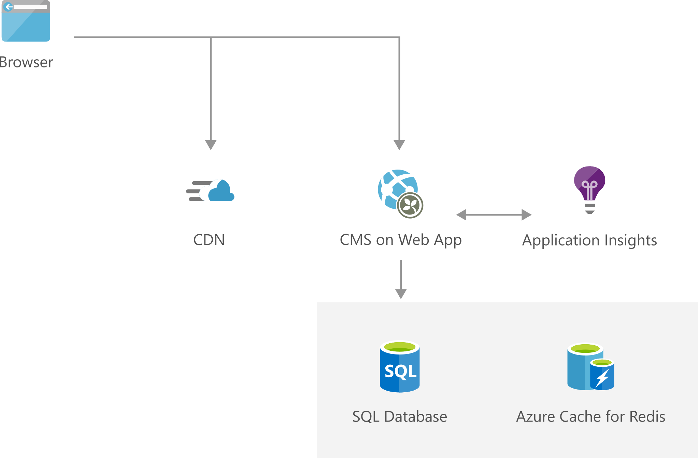

[!INCLUDE [header_file](../../../includes/sol-idea-header.md)]

Start simple with the content management system that enables you to easily maintain the messaging on your website in real time, from a browser, with no coding skills.

This solution is built on the Azure managed services: [Azure SQL Database](https://azure.microsoft.com/services/sql-database), [Azure Monitor](https://azure.microsoft.com/services/monitor), [Content Delivery Network](https://azure.microsoft.com/services/cdn), and [Azure Cache for Redis](https://azure.microsoft.com/services/cache). These services run in a high-availability environment, patched and supported, allowing you to focus on your solution instead of the environment they run in.

## Architecture

*Download an [SVG](../media/digital-marketing-smb.svg) of this architecture.*

### Components

* [Web Apps](https://azure.microsoft.com/services/app-service/web): An App Service Web App runs in a single region, accessible to web and mobile browsers. A content management system like Orchard or Umbraco provides service to manage and deploy content to the website.
* [Azure SQL Database](https://azure.microsoft.com/services/sql-database): A SQL Database instance stores and serves data about the site.
* [Azure Monitor](https://azure.microsoft.com/services/monitor): Application Insights, provides health and performance monitoring, and diagnostics.
* [Content Delivery Network](https://azure.microsoft.com/services/cdn): A content delivery network serves static content such as images, script, and CSS, and reduces the load on the web app servers.
* [Azure Cache for Redis](https://azure.microsoft.com/services/cache) enables fast queries, and improves scalability by reducing the load on the main database.

## Next steps

* [Deploy an ASP.NET web app to Azure App Service, using Visual Studio](/azure/app-service/quickstart-dotnetcore)
* [SQL Database tutorial: Create a SQL database in minutes by using the Azure portal](/azure/azure-sql/database/single-database-create-quickstart)
* [Application Performance Management with Application Insights](/azure/azure-monitor/app/app-insights-overview)
* [Use Azure Content Delivery Network in Azure App Service](/Azure/cdn/cdn-add-to-web-app)
* [How to Use Azure Cache for Redis](/azure/azure-cache-for-redis/cache-dotnet-how-to-use-azure-redis-cache)
