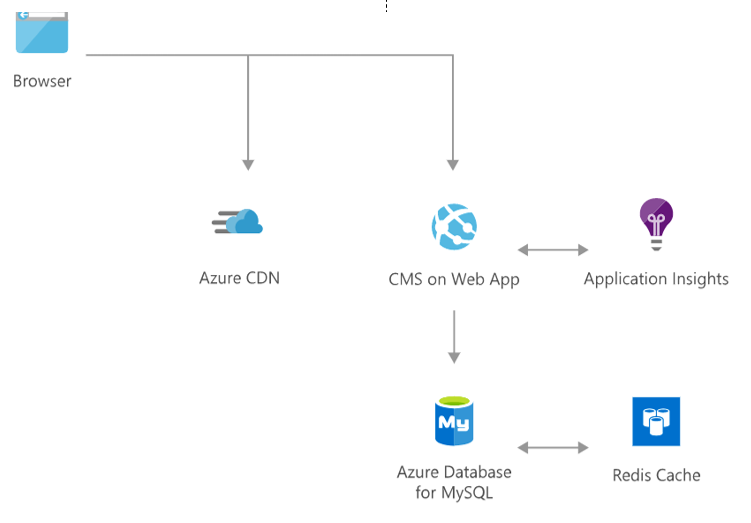

[!INCLUDE [header_file](../../../includes/sol-idea-header.md)]

Engage with customers around the world with rich, personalized digital marketing experiences. Quickly build and launch digital campaigns that automatically scale based on customer demand.

Digital marketing is the marketing of products or services using digital technologies, mainly on the Internet, but also including mobile phones, display advertising, and any other digital medium.Digital marketing methods such as search engine optimization (SEO), search engine marketing (SEM), content marketing, influencer marketing, content automation, campaign marketing, data-driven marketing, e-commerce marketing, social media marketing, social media optimization, e-mail direct marketing, display advertising, e–books, and optical disks and games are becoming more common in our advancing technology.

This solution consists of the Azure managed services: Azure CDN, Webapps, Azure Database for MySQL, Application Insights, and Azure Cache for Redis. These services run in a high-availability environment, patched and supported, which allows you to focus on your solution instead of the environment the services run in.

## Architecture

*Download an [SVG](../media/digital-marketing-using-azure-database-for-mysql.svg) of this architecture.*

### Data flow

1. Web app service can provide with content management system and supports WordPress, Umbraco, Joomla! and Drupal
2. Azure Content Delivery Network (CDN) lets you reduce load times, save bandwidth and speed responsiveness
3. Load customer data into an Azure Database for MySQL which is a fully managed database service with minimal requirements
4. Store session state and output cache on Azure Cache for Redis to improve performance and reduce the load on your web front end
5. Detect issues, diagnose crashes, and track usage in your web app with Application Insights. Make informed decisions throughout the development lifecycle

### Components

* [CMS on Webapp](/azure/app-service/)
* [Azure CDN](/azure/cdn/)
* [Azure Database for MySQL](https://azure.microsoft.com/services/mysql)
* [Redis Cache](/azure/azure-cache-for-redis/cache-overview)
* [Application Insights](/azure/azure-monitor/app/app-insights-overview)

## Next steps

* Explore on marketplace for [CMS templates](https://azuremarketplace.microsoft.com/marketplace/apps/category/web?page=1&subcategories=blogs-cmss)

## Related resources

The following solution ideas feature Azure Database for MySQL:

* [Gaming using Azure Database for MySQL](./gaming-using-azure-database-for-mysql.yml)
* [Retail and e-commerce using Azure Database for MySQL](./retail-and-ecommerce-using-azure-database-for-mysql.yml)
* [Intelligent apps using Azure Database for MySQL](./intelligent-apps-using-azure-database-for-mysql.yml)
* [Finance management apps using Azure Database for MySQL](./finance-management-apps-using-azure-database-for-mysql.yml)
* [Scalable web and mobile applications using Azure Database for MySQL](./scalable-web-and-mobile-applications-using-azure-database-for-mysql.yml)
