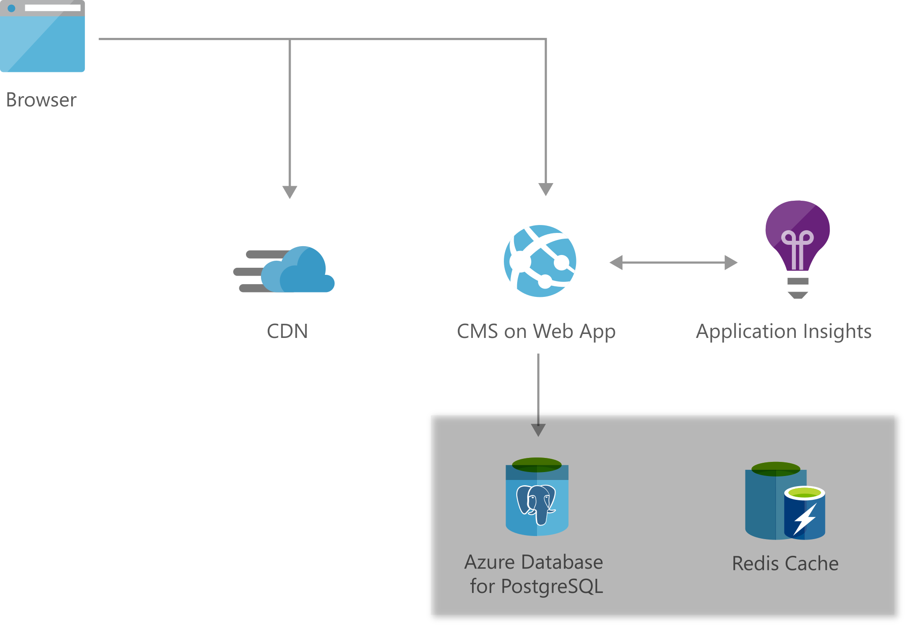

[!INCLUDE [header_file](../../../includes/sol-idea-header.md)]

Engage with customers around the world with rich, personalized digital marketing experiences. Quickly build and launch digital campaigns that automatically scale based on customer demand.  

Create personalized and timely customer experiences, increase campaign performance to win new customers, drive more revenue for your business and get maximum performance by automatically scaling on demand.

## Architecture

*Download an [SVG](../media/digital-marketing-using-azure-database-for-postgresql.svg) of this architecture.*

## Data Flow

1. Azure App Service enables you to build and host Content Management System of your choice without managing infrastructure. It offers auto-scaling and high availability.
2. Azure Content Delivery Network (CDN) efficiently delivers web content to users by caching their content at strategically placed nodes across the world thus reducing latency for your users.
3. Load customer data into an Azure Database for PostgreSql which is a fully managed and intelligent Azure database for PostgreSQL which provides high availability and scalability. 
4. Store session state and output cache on Azure Cache for Redis to improve performance and reduce load times of your web front end.
5. Detect issues, diagnose crashes, and track usage in your web app with Application Insights. Use It's designed to help you continuously improve performance and usability

## Components

* [Web App](https://azure.microsoft.com/services/app-service/web): An App Service Web App runs in a single region, accessible to web and mobile browsers. A content management system provides service to manage and deploy content to the website.
* [Azure Database for PostgreSQL](https://azure.microsoft.com/services/postgresql): A fully managed and intelligent Azure Database for PostgreSQL.
* [Azure Monitor Application Insights](https://azure.microsoft.com/services/monitor): Application Insights, provides health and performance monitoring, and diagnostics.
* [Content Delivery Network](https://azure.microsoft.com/services/cdn): A content delivery network serves static content such as images, script, and CSS, and reduces the load on the web app servers.
* [Azure Cache for Redis](https://azure.microsoft.com/services/cache) enables very fast queries, and improves scalability by reducing the load on the main database.

## Next Steps

* [Deploy an ASP.NET web app](azure/app-service/quickstart-dotnetcore)
* [PostgreSQL Database tutorial: Create an Azure Database for PostgreSQL server by using the Azure portal](/azure/postgresql/quickstart-create-server-database-portal)
* [Start monitoring your website with Azure Monitor Application Insights](/azure/azure-monitor/app/website-monitoring)
* [Add Azure CDN to an Azure App Service web app](/azure/cdn/cdn-add-to-web-app)
* [Use Azure Cache for Redis in .NET Core](/azure/azure-cache-for-redis/cache-dotnet-core-quickstart)
* [Digital Marketing Solution Architectures](https://azure.microsoft.com/en-us/solutions/digital-marketing/)
* [Explore on Azure marketplace for CMS templates](https://azuremarketplace.microsoft.com/marketplace/apps/category/web?page=1&subcategories=blogs-cmss)
