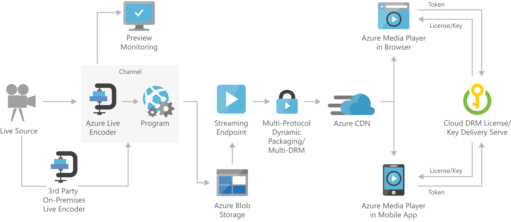

[!INCLUDE [header_file](../../../includes/sol-idea-header.md)]

A live streaming solution allows you to capture video in real-time and broadcast it to consumers in real time, such as streaming interviews, conferences, and sporting events online. In this solution, video is captured by a video camera and sent to a Live Event input endpoint. The Live Event receives the input stream and makes it available for streaming through a Streaming Endpoint to a web browser or mobile app. The Live Event also provides a preview monitoring endpoint to preview and validate your stream before further processing and delivery. The Live Event can also record and store the ingested content in order to be streamed later (video-on-demand).

This solution is built on the Azure managed service: [Media Services](/azure/media-services/) and [Content Delivery Network](https://azure.microsoft.com/services/cdn). These services run in a high-availability environment, patched and supported, allowing you to focus on your solution instead of the environment they run in.

## Architecture

*Download an [SVG](../media/digital-media-live-stream.svg) of this architecture.*

### Components

* [Partner on-premises live encoder](/azure/media-services/latest/become-on-premises-encoder-partner): Outputs the live source for ingest into the cloud as RTMP(S), or Smooth Streaming.
* Stores large amounts of unstructured data, such as text or binary data, that can be accessed from anywhere in the world via HTTP or HTTPS. You can use [Blob storage](https://azure.microsoft.com/services/storage/blobs) to expose data publicly to the world, or to store application data privately.
* [Media Services](https://azure.microsoft.com/services/media-services): Provides the ability to ingest, encode, preview, store, and deliver your live streaming content. Live Events, Live Outputs, and Streaming Endpoints handle the live streaming functions, including ingestion, formatting, DVR, security, scalability, and redundancy.
* [Media Servics Streaming Endpoint](/azure/media-services/latest/streaming-endpoint-concept): Represents a streaming service that can deliver content directly to a client player application, or to a content delivery network (CDN) for further distribution.
* [Content Delivery Network](https://azure.microsoft.com/services/cdn): Provides secure, reliable content delivery with broad global reach and a rich feature set.
* [Azure Media Player](https://azure.microsoft.com/services/media-services/media-player): Uses industry standards such as HTML5 (MSE/EME) to provide an enriched adaptive streaming experience. Regardless of the playback technology used, developers have a unified JavaScript interface to access APIs.
* [Preview monitoring](/azure/media-services/latest/live-events-outputs-concept#live-event-preview-url): Provides the ability to preview and validate a live stream before further processing and delivery.
* [Multi-DRM content protection](/azure/media-services/latest/content-protection-overview): Delivers content securely using multi-DRM (PlayReady, Widevine, FairPlay Streaming) or AES clear key encryption.

## Next steps

* [Overview of Media Services live transcoding](/azure/media-services/latest/live-event-types-comparison)
* [How to use Azure Blob storage](/azure/storage/blobs/storage-quickstart-blobs-dotnet)
* [Overview of Media Services live streaming](/azure/media-services/latest/live-streaming-overview)
* [Overview of Content Protection](/azure/media-services/latest/content-protection-overview)
* [Using Azure Content Delivery Network](/azure/cdn/cdn-create-new-endpoint)
* [Azure Media Services documentation](/azure/media-services/)
* [Media services content protection](https://azure.microsoft.com/services/media-services/content-protection)
