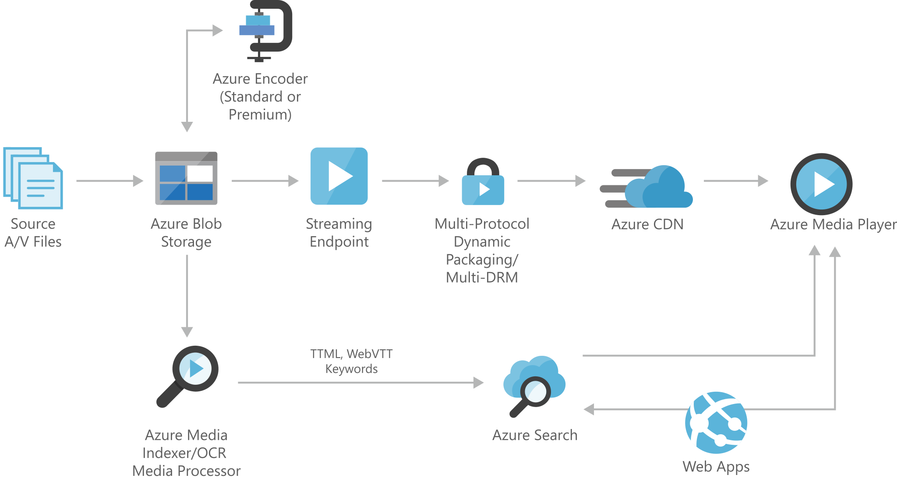

[!INCLUDE [header_file](../../../includes/sol-idea-header.md)]

A speech-to-text solution allows you to identify speech in static video files so you can manage it as standard content, such as allowing employees to search within training videos for spoken words or phrases, and then enabling them to quickly navigate to the specific moment in the video. This solution allows you to upload static videos to an Azure website. The Azure Media Indexer uses the Speech API to index the speech within the videos and stores it in SQL Azure. You can search for words or phrases by using Azure Web Apps and retrieve a list of results. Selecting a result enables you to see where in the video the word or phrase is mentioned.

## Potential use cases

This solution is built on the Azure managed services: [Content Delivery Network](https://azure.microsoft.com/services/cdn) and [Azure Cognitive Search](https://azure.microsoft.com/services/search). These services run in a high-availability environment, patched and supported, which allows you to focus on your solution instead of the environment they run in.

## Architecture

*Download an [SVG](../media/digital-media-speech-text.svg) of this architecture.*

### Dataflow

* Stores large amounts of unstructured data, such as text or binary data, that can be accessed from anywhere in the world via HTTP or HTTPS. You can use [Blob Storage](https://azure.microsoft.com/services/storage/blobs) to expose data publicly to the world, or to store application data privately.
* [Azure Encoding](https://azure.microsoft.com/services/media-services/encoding): Encoding jobs are one of the most common processing operations in Media Services. You create encoding jobs to convert media files from one encoding to another.
* [Azure streaming endpoint](https://azure.microsoft.com/services/media-services/live-on-demand): Represents a streaming service that can deliver content directly to a client player application, or to a content delivery network (CDN) for further distribution.
* [Content Delivery Network](https://azure.microsoft.com/services/cdn): Provides secure, reliable content delivery with broad global reach and a rich feature set.
* [Azure Media Player](https://azure.microsoft.com/services/media-services/media-player): Uses industry standards, such as HTML5 (MSE/EME) to provide an enriched adaptive streaming experience. Regardless of the playback technology used, developers have a unified JavaScript interface to access APIs.
* [Azure Cognitive Search](https://azure.microsoft.com/services/search): Delegates search-as-a-service server and infrastructure management to Microsoft, leaving you with a ready-to-use service that you can populate with your data, and then use to add search to your web or mobile application.
* [Web Apps](https://azure.microsoft.com/services/app-service/web): Hosts the website or web application.
* [Azure Media Indexer](https://azure.microsoft.com/services/media-services/media-indexer): Enables you to make the content of your media files searchable and to generate a full-text transcript for closed-captioning and keywords. You can process one media file or multiple media files in a batch.

## Components

* [Azure Blob Storage](https://azure.microsoft.com/services/storage/blobs)
* [Azure Media Services](https://azure.microsoft.com/services/media-services)
* [Azure Encoding](https://azure.microsoft.com/services/media-services/encoding)
* [Azure Media Player](https://azure.microsoft.com/services/media-services/media-player) 
* [Azure Content Delivery Network](https://azure.microsoft.com/services/cdn)
* [Azure Cognitive Search](https://azure.microsoft.com/services/search)
* [Azure Web Apps](https://azure.microsoft.com/services/app-service/web)

## Next steps

* [How to use Azure Blob storage](/azure/storage/blobs/storage-blob-dotnet-get-started)
* [How to encode an asset using Media Encoder](/azure/media-services/previous/media-services-dotnet-encode-with-media-encoder-standard)
* [How to manage streaming endpoints](/azure/media-services/previous/media-services-streaming-endpoints-overview)
* [Using Azure Content Delivery Network](/azure/cdn/cdn-create-new-endpoint)
* Develop video player applications
* [Create an Azure Cognitive Search service](/azure/search/search-create-service-portal)
* [Run Web Apps in the cloud](/azure/app-service/overview)
* [Indexing media files](/azure/media-services/previous/media-services-index-content)
