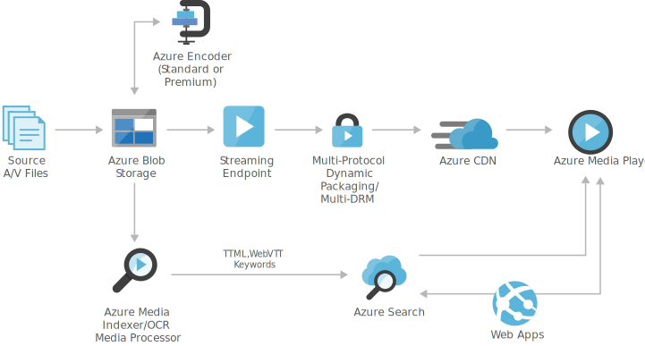

[!INCLUDE [header_file](../../../includes/sol-idea-header.md)]

This solution idea identifies speech in static video files to manage speech as standard content.

## Architecture

*Download a [Visio file](https://arch-center.azureedge.net/digital-media-speech-text.vsdx) of this architecture.*

### Dataflow

- Azure Blob Storage stores large amounts of unstructured data that can be accessed from anywhere in the world via HTTP or HTTPS. You can use [Blob Storage](/azure/storage/blobs/storage-blobs-introduction) to expose data publicly to the world, or to store application data privately.
- [Azure Encoding](/azure/media-services/latest/encode-concept) converts media files from one encoding to another.
- [Azure streaming endpoint](/azure/media-services/latest/media-services-overview) represents a streaming service that can deliver content directly to a client player application, or to a content delivery network (CDN) for further distribution.
- [Content Delivery Network](/azure/frontdoor/front-door-overview) provides secure, reliable content delivery with broad global reach and a rich feature set.
- [Azure Media Player](/azure/media-services/latest/media-services-overview) uses industry standards, such as HTML5 (MSE/EME) to provide an enriched adaptive streaming experience. Regardless of the playback technology used, you have a unified JavaScript interface to access APIs.
- [Azure Cognitive Search](/azure/search) provides a ready-to-use service that gets populated with data and then used to add search functionality to a web or mobile application.
- [Web Apps](/azure/app-service/overview) hosts the website or web application.
- [Azure Media Indexer](/azure/media-services/previous/media-services-index-content) makes the content of your media files searchable and generates a full-text transcript for closed-captioning and keywords. Media files are processed individually or in batches.

### Components

- [Blob Storage](https://azure.microsoft.com/services/storage/blobs) is a service that's part of [Azure Storage](https://azure.microsoft.com/products/category/storage). Blob Storage offers optimized cloud object storage for large amounts of unstructured data.
- [Azure Media Services](https://azure.microsoft.com/services/media-services) is a cloud-based platform that you can use to stream video, enhance accessibility and distribution, and analyze video content.
- [Live and on-demand streaming](https://azure.microsoft.com/services/media-services/live-on-demand) is a feature of Azure Media Services that delivers content to various devices at scale.
- [Azure Encoding](https://azure.microsoft.com/services/media-services/encoding) provides a way to convert files that contain digital video or audio from one standard format to another.
- [Azure Media Player](https://azure.microsoft.com/services/media-services/media-player) plays videos that are in various formats.
- [Azure Content Delivery Network](https://azure.microsoft.com/services/cdn) offers a global solution for rapidly delivering content. This service provides your users with fast, reliable, and secure access to your apps' static and dynamic web content.
- [Azure Cognitive Search](https://azure.microsoft.com/services/search) is a cloud search service that supplies infrastructure, APIs, and tools for searching. You can use Azure Cognitive Search to build search experiences over private, heterogeneous content in web, mobile, and enterprise applications.
- [App Service](https://azure.microsoft.com/en-us/services/app-service/) provides a framework for building, deploying, and scaling web apps. The [Web Apps](https://azure.microsoft.com/en-us/services/app-service/web/) feature is a service for hosting web applications, REST APIs, and mobile back ends.
- [Azure Media Indexer](https://azure.microsoft.com/services/media-services/media-indexer) provides a way to make content of your media files searchable. It can also generate a full-text transcript for closed captioning and keywords.

## Scenario details

A speech-to-text solution provides a way to identify speech in static video files so you can manage it as standard content. For instance, employees can use this technology to search within training videos for spoken words or phrases. Then they can navigate to the specific moment in the video that contains the word or phrase.

When you use this solution, you can upload static videos to an Azure website. The Azure Media Indexer uses the Speech API to index the speech within the videos and stores it in an Azure database. You can search for words or phrases by using the Web Apps feature of Azure App Service. Then you can retrieve a list of results. When you select a result, you can see the place in the video that mentions the word or phrase.

This solution is built on the Azure managed services [Content Delivery Network](https://azure.microsoft.com/services/cdn) and [Azure Cognitive Search](https://azure.microsoft.com/services/search).

### Potential use cases

This solution applies to scenarios that can benefit from the ability to search recorded speech. Examples include:

- Training and educational videos.
- Crime investigations.
- Customer service analysis.

## Next steps

- [How to use Azure Blob Storage](/azure/storage/blobs/storage-blob-dotnet-get-started)
- [How to encode an asset using Media Encoder](/azure/media-services/previous/media-services-dotnet-encode-with-media-encoder-standard)
- [How to manage streaming endpoints](/azure/media-services/previous/media-services-streaming-endpoints-overview)
- [Using Azure Content Delivery Network](/azure/cdn/cdn-create-new-endpoint)
- [Develop video player applications](/azure/media-services/azure-media-player/azure-media-player-writing-plugins)
- [Create an Azure Cognitive Search service](/azure/search/search-create-service-portal)
- [Run Web Apps in the cloud](/azure/app-service/overview)
- [Indexing media files](/azure/media-services/previous/media-services-index-content)

## Related resources

- [Gridwich cloud media system](../../reference-architectures/media-services/gridwich-architecture.yml)
- [Live stream digital media](./digital-media-live-stream.yml)
- [Video-on-demand digital media](/azure/architecture/solution-ideas/articles/digital-media-video)
