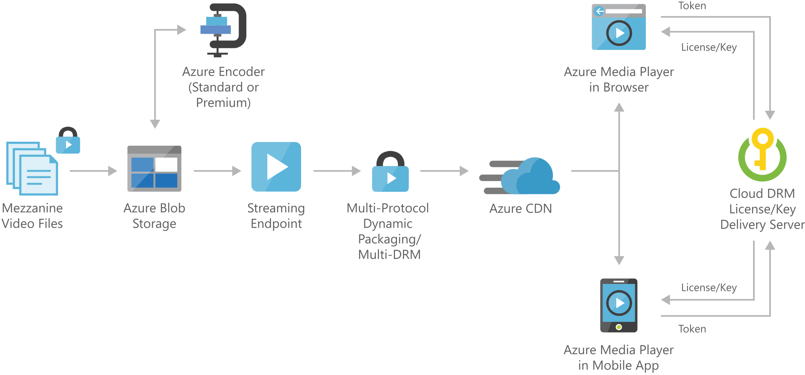

[!INCLUDE [header_file](../../../includes/sol-idea-header.md)]

A basic video-on-demand solution that gives you the capability to stream recorded video content such as movies, news clips, sports segments, training videos, and customer support tutorials to any video-capable endpoint device, mobile application, or desktop browser. Video files are uploaded to Azure Blob storage, encoded to a multi-bitrate standard format, and then distributed via all major adaptive bit-rate streaming protocols (HLS, MPEG-DASH, Smooth) to the Azure Media Player client.

This solution is built on the Azure managed services: [Blob Storage](https://azure.microsoft.com/services/storage/blobs), [Content Delivery Network](https://azure.microsoft.com/services/cdn), and [Azure Media Player](https://azure.microsoft.com/services/media-services/media-player). These services run in a high-availability environment, patched and supported, allowing you to focus on your solution instead of the environment they run in.

## Architecture

*Download an [SVG](../media/digital-media-video.svg) of this architecture.*

### Components

* [Blob Storage](https://azure.microsoft.com/services/storage/blobs): Stores large amounts of unstructured data, such as text or binary data, that can be accessed from anywhere in the world via HTTP or HTTPS. You can use Blob storage to expose data publicly to the world, or to store application data privately.
* [Azure Media Services Encoder](/azure/media-services/latest/encoding-concept): Encoding jobs are one of the most common processing operations in Media Services. You create encoding jobs to convert media files from one encoding to another.
* [Azure Media Services Streaming Endpoint](/azure/media-services/latest/dynamic-packaging-overview#on-demand-streaming-workflow): A streaming service that can deliver content directly to a client player application, or to a content delivery network (CDN) for further distribution.
* [Content Delivery Network](https://azure.microsoft.com/services/cdn): Provides secure, reliable content delivery with broad global reach and a rich feature set.
* [Azure Media Player](/azure/media-services/azure-media-player/azure-media-player-overview): Uses industry standards, such as HTML5 (MSE/EME), to provide a rich adaptive streaming experience. Regardless of the playback technology used, developers have a unified JavaScript interface to access APIs.
* [Multi-DRM content protection](/azure/media-services/latest/content-protection-overview): Delivers content securely using multi-DRM (PlayReady, Widevine, FairPlay Streaming) or AES clear key encryption

## Next steps

* [Azure Media Services overview](/azure/media-services/)
* [How to use Azure Blob storage](/azure/storage/blobs/storage-quickstart-blobs-portal)
* [How to encode an asset using Media Encoder](/azure/media-services/latest/stream-files-tutorial-with-api)
* [How to manage streaming endpoints](/azure/media-services/latest/streaming-endpoint-concept)
* [Using Azure Content Delivery Network](/azure/cdn/cdn-create-new-endpoint)
* [Playing your content with existing players](https://github.com/Azure-Samples/media-services-3rdparty-player-samples)
* [Deliver content securely](/azure/media-services/latest/content-protection-overview)
