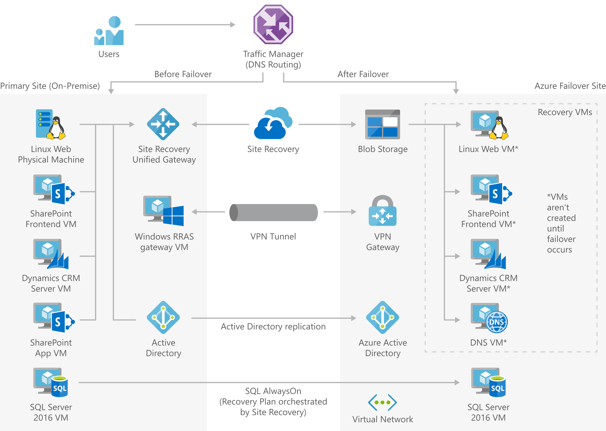

# Enterprise-scale disaster recovery

[!INCLUDE [header_file](../../../includes/sol-idea-header.md)]

A large enterprise architecture for SharePoint, Dynamics CRM, and Linux web servers hosted on an on-premises datacenter with failover to Azure infrastructure.

This solution is built on the Azure managed services: [Traffic Manager](https://azure.microsoft.com/services/traffic-manager), [Azure Site Recovery](https://azure.microsoft.com/services/site-recovery), [Azure Active Directory](https://azure.microsoft.com/services/active-directory), [VPN Gateway](https://azure.microsoft.com/services/vpn-gateway) and [Virtual Network](https://azure.microsoft.com/services/virtual-network). These services run in a high-availability environment, patched and supported, allowing you to focus on your solution instead of the environment they run in.

## Architecture

*Download an [SVG](../media/disaster-recovery-enterprise-scale-dr.svg) of this architecture.*

## Components

* DNS traffic is routed via [Traffic Manager](https://azure.microsoft.com/services/traffic-manager) which can easily move traffic from one site to another based on policies defined by your organization.
* [Azure Site Recovery](https://azure.microsoft.com/services/site-recovery) orchestrates the replication of machines and manages the configuration of the failback procedures.
* [Blob storage](https://azure.microsoft.com/services/storage/blobs) stores the replica images of all machines that are protected by Site Recovery.
* [Azure Active Directory](https://azure.microsoft.com/services/active-directory) is the replica of the on-premises [Azure Active Directory](https://azure.microsoft.com/services/active-directory) services allowing cloud applications to be authenticated and authorized by your company.
* [VPN Gateway](https://azure.microsoft.com/services/vpn-gateway): The VPN gateway maintains the communication between the on-premises network and the cloud network securely and privately.
* [Virtual Network](https://azure.microsoft.com/services/virtual-network): The virtual network is where the failover site will be created when a disaster occurs.

## Next steps

* [Configure Failover routing method](https://docs.microsoft.com/azure/traffic-manager/traffic-manager-routing-methods#priority-traffic-routing-method)
* [How does Azure Site Recovery work?](https://docs.microsoft.com/azure/site-recovery/site-recovery-overview)
* [Introduction to Microsoft Azure Storage](https://docs.microsoft.com/azure/storage/common/storage-introduction)
* [Integrating your on-premises identities with Azure Active Directory](https://docs.microsoft.com/azure/active-directory/hybrid/whatis-azure-ad-connect)
* [Create a VNet with a Site-to-Site connection using the Azure portal](https://docs.microsoft.com/azure/vpn-gateway/vpn-gateway-howto-site-to-site-resource-manager-portal)
* [Designing your network infrastructure for disaster recovery](https://gallery.technet.microsoft.com/Designing-Your-Network-a849fa98)
