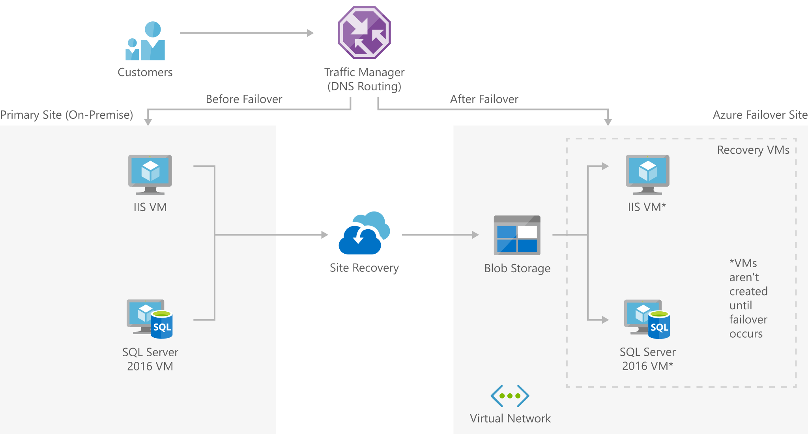

[!INCLUDE [header_file](../../../includes/sol-idea-header.md)]

Small and medium businesses can inexpensively implement disaster recovery to the cloud by using Azure Site Recovery or a partner solution like Double-Take DR.

This solution is built on the Azure managed services: [Traffic Manager](https://azure.microsoft.com/services/traffic-manager), [Azure Site Recovery](https://azure.microsoft.com/services/site-recovery), and [Virtual Network](https://azure.microsoft.com/services/virtual-network). These services run in a high-availability environment, patched and supported, allowing you to focus on your solution instead of the environment they run in.

## Architecture

*Download an [SVG](../media/disaster-recovery-smb-azure-site-recovery.svg) of this architecture.*

### Components

* DNS traffic is routed via [Traffic Manager](https://azure.microsoft.com/services/traffic-manager) which can easily move traffic from one site to another based on policies defined by your organization.
* [Azure Site Recovery](https://azure.microsoft.com/services/site-recovery) orchestrates the replication of machines and manages the configuration of the failback procedures.
* [Virtual Network](https://azure.microsoft.com/services/virtual-network): The virtual network is where the failover site will be created when a disaster occurs.
* [Blob storage](https://azure.microsoft.com/services/storage/blobs) stores the replica images of all machines that are protected by Site Recovery.

## Next steps

* [Configure Failover routing method](/azure/traffic-manager/traffic-manager-configure-priority-routing-method)
* [How does Azure Site Recovery work?](/azure/site-recovery/azure-to-azure-architecture)
* [Designing your network infrastructure for disaster recovery](/azure/site-recovery/concepts-on-premises-to-azure-networking)
* [Introduction to Microsoft Azure Storage](/azure/storage/common/storage-introduction)
