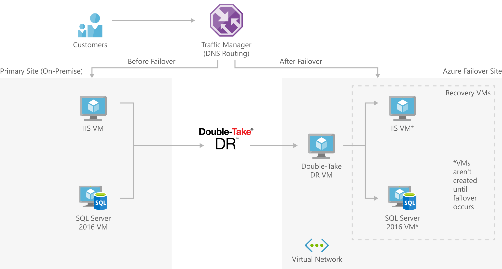

[!INCLUDE [header_file](../../../includes/sol-idea-header.md)]

Small and medium businesses can inexpensively implement disaster recovery to the cloud by using a partner solution like Double-Take DR.

This solution is built on the Azure managed services: [Traffic Manager](https://azure.microsoft.com/services/traffic-manager), [VPN Gateway](https://azure.microsoft.com/services/vpn-gateway), and [Virtual Network](https://azure.microsoft.com/services/virtual-network). These services run in a high-availability environment, patched and supported, allowing you to focus on your solution instead of the environment they run in.

## Architecture

*Download an [SVG](../media/disaster-recovery-smb-double-take-dr.svg) of this architecture.*

### Components

* DNS traffic is routed via [Traffic Manager](https://azure.microsoft.com/services/traffic-manager) which can easily move traffic from one site to another based on policies defined by your organization.
* [VPN Gateway](https://azure.microsoft.com/services/vpn-gateway): The VPN gateway maintains the communication between the on-premises network and the cloud network securely and privately.
* [Virtual Network](https://azure.microsoft.com/services/virtual-network): The virtual network is where the failover site will be created when a disaster occurs.

## Next steps

* [Configure Failover routing method](/azure/traffic-manager/traffic-manager-routing-methods)
* [Create a VNet with a Site-to-Site connection using the Azure portal](/azure/vpn-gateway/vpn-gateway-howto-multi-site-to-site-resource-manager-portal)
