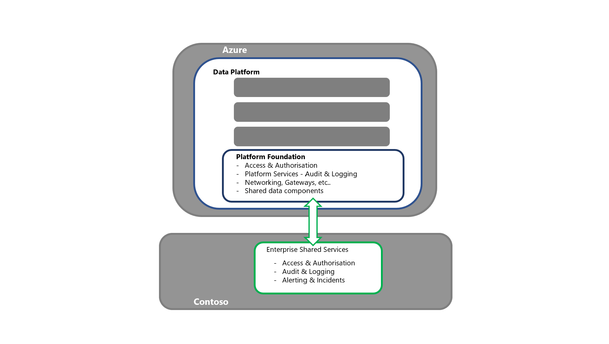

# Disaster recovery for the Azure Analytics platform: Deploy this scenario

## Customer Activities Required

### Pre-incident

For Azure services

- Be familiar with [Azure Service Health](/azure/service-health/service-health-overview) in the Azure portal. This will act as the “one-stop shop” during an incident
- Consider the use of [Service Health alerts](/azure/service-health/alerts-activity-log-service-notifications-portal), which can be configured to automatically produce notifications when Azure incidents occur

For Power BI

- Be familiar with [Service Health](https://portal.office.com/AdminPortal/Home) in the Microsoft 365 admin center. This will act as the ‘one stop shop’ during an incident
- Consider the use of [M365 Admin mobile app](/microsoft-365/admin/admin-overview/admin-mobile-app?view=o365-worldwide) to get automatic service incident alert notifications

### During the incident

For Azure services

- [Azure Service Health](/azure/service-health/service-health-overview) within their Azure management portal will provide the latest updates
    - If there are issues accessing Service Health, refer to the public [Azure Status page](https://status.azure.com/en-us/status)
    - If there are ever issues accessing the Status page, go to @AzureSupport on Twitter
- If impact/issues don’t match the incident (or persist after mitigation), then [contact support](https://www.aka.ms/AzurePortalSupportRequest) to raise a service support ticket

For Power BI

- The [Service Health](https://portal.office.com/AdminPortal/Home) page within their Microsoft 365 admin center will provide the latest updates
    - If there are issues accessing Service Health, refer to the [Microsoft 365 status page](https://status.office.com)
    - If impact/issues don’t match the incident (or if these persist after mitigation), they should contact support to raise a [service support ticket](https://dynamics.microsoft.com/en-us/support/)

### Post Microsoft recovery

See the sections below for this detail.

### Post incident

For Azure Services

- Microsoft will publish a PIR to the [Azure Portal - Service Health](https://www.aka.ms/ash-portal) for review

For Power BI 

- Microsoft will publish a PIR to the [M365 Admin - Service Health](https://portal.office.com/AdminPortal/Home) for review

## Wait for Microsoft Process

The “Wait for Microsoft” process is simply waiting for Microsoft to recover all components and services in the impacted, primary region. Once recovered, validate the binding of the data platform to enterprise share services etc., the date of the system and then execute the processes of bringing the system up to the current date.  

Once this process has been completed, technical and business SME validation can be completed enabling the stakeholder sign-off for the service recovery.

## Redeploy on Disaster

For a “Redeploy on Disaster” strategy, the following high-level process flow can be described.

1. **Recover Contoso – Enterprise Shared Services and source systems**  

- This step is a prerequisite to the recovery of the data platform 
- This would be completed by the various Contoso Operational Support groups responsible for the Enterprise shared services, operational source systems, etc

1. **Recover Azure services**
Azure Services refers to the applications and services that make the Azure Cloud offering, are available within the secondary region for deployment.

Azure Services refers to the applications and services that make the Azure Cloud offering, are available within the secondary region for deployment.

- This step is a prerequisite to the recovery of data platform
- This would be completed by Microsoft and other PaaS/SaaS partners

1. **Recover the Data Platform Foundation**  

- This is the entry point for the Platform recovery activities
- For the Redeployment strategy, each required component/service would be procured and deployed into the secondary region
    - See the [Azure Service and Component Section](link_to_article) in this series for a detailed breakdown of this
- This should also include the binding to the enterprise shared services, ensuring connectivity to access/authentication, the log offloading is working, etc., while also ensuring connectivity to both upstream and downstream processes
- Data/Processing should be confirmed i.e. what is the timestamp of the recovered platform?
    - If there are questions about data integrity, the decision could be made to rollback further in time before executing the new processing to bring the platform up to date
    - Having a priority order for processes (based upon business impact) will help in orchestrating the recovery
- This should be closed out by technical validation unless business users directly interact with the services. If there is direct access, there will need to be a business validation step
- Once validation has been completed, there is a handover to the individual solution teams to start their own DR recovery process
    - This handover should include confirmation of the current timestamp of the data/processes
    - If core enterprise data processes are going to be executed, the individual solutions should be made aware of this i.e. inbound/outbound flows

1. **Recover the Individual Solutions Hosted by the Platform**  

- Each individual solution should have its own DR runbook. This should at least contain the nominated business stakeholders who will test/signoff that DR has been completed
- Depending on resource contention or priority, key solutions/workloads may be prioritized over others i.e. core enterprise processes over ad hoc labs
- Once the validation steps have been completed, there is a handover to the downstream solutions to start their DR recovery process

1. **Handover to Downstream, Dependent Systems**

- Once the Dependent services have been recovered, this brings the E2E DR recovery process to an end

>[!NOTE]
>While it is theoretically possible to completely automate an E2E DR process, it’s unlikely given the risk of the event vs. the cost of the SDLC activities required to cover the E2E process

1.    **Fallback to the Primary Region**
Fallback is the process of moving the data platform service and its data back to the primary region, once it is available for BAU.  

Depending on the nature of the source systems and various data processes, fallback of the data platform could be done independently of other parts of the data eco-system.  

Customers are advised to review their own data platform’s dependencies (both upstream and downstream) to make the appropriate decision. The following section assumes an independent recovery of the data platform.

- Once all required components/services have become available in the primary region, customers would complete a smoke-test to validate the Microsoft recovery 
- Component/Service configuration would be validated. Deltas would be addressed via redeployment from source control
- The system date in the primary region would be established across stateful components. The delta between this and date/timestamp in the secondary region should be addressed by re-executing or replaying the data ingestion processes from that point forward
- With approval from both business and technical stakeholders, a fallback window would be selected. Ideally, during a lull in system activity and process
- During the fallback, the primary region would be brought into sync with the secondary region, before the system was switched over
- After a period of a parallel run, the secondary region would be taken offline from the system
- The components in the secondary region would either be dropped or stripped back, depending on the DR strategy selected

## Warm spare process
For a “Warm Spare” strategy, the high-level process flow is closely aligned to that of the “Redeploy on Disaster”, the key difference being that components have already been procured in the secondary region. This eliminates the risk of resource contention from other organizations looking to complete their own DR in that region.

## Hot spare process
The “Hot Spare” strategy means the Platform service and the solutions its hosts will continue, despite the disaster event.  

Hot Spare customers would monitor the Microsoft recovery of components/services in the primary region. Once completed, customers would validate these and complete the fallback to the primary region. This would be similar to the DR Failover process i.e. check the available codebase and data, redeploying as required.

>[!NOTE]
>A special note here should be made to ensure that any system metadata is consistent between the two regions.
>
> - Once Fallback to the primary has been completed, the system load balancers can be updated to bring the primary region back into system topology. If available, a canary release approach can be used to incrementally switch the primary region on for the system.

## DR Plan structure
An effective DR plan presents a step-by-step guide for service recovery that can be executed by an Azure technical resource. As such, the following lists a proposed MVP structure for DR Plan.

- Process Requirements
    - Any customer DR process-specific detail, such as the correct authorization required to start DR, and make key decisions about the recovery as necessary (including “definition of done”), service support DR ticketing reference, war room details, etc.
    - Resource confirmation, including the DR lead and executor backup. All resources should be documented with primary and secondary contacts, escalation paths, and leave calendars. In critical DR situations, roster systems may need to be considered
    - Laptop, power packs and/or backup power, network connectivity and mobile phone details for the DR executor, DR backup and any escalation points
    - The process to be followed if any of the process requirements aren’t met
- Contact Listing
    - DR leadership and support groups
    - Business SME’s who will complete the test/review cycle for the technical recovery
    - Impacted Business Owners, including the service recovery approvers
    - Impacted Technical Owners, including the technical recovery approvers
    - SME support across all impacted areas, including key solutions hosted by the platform
    - Impact Downstream systems – Operational support
    - Upstream Source systems – Operational support
    - Enterprise Share Services Contacts i.e. Access/Authentication, Security monitoring, Gateway support, etc.
    - Any external or 3rd party vendors, including support contacts for cloud providers
- Architecture design
    - Describe the end-end to E2E scenario detail, and attach all associated support documentation
- Dependencies
    - List out all the component’s relationships and dependencies
- DR Prerequisites
    - Confirmation that upstream source systems are available as required
    - Elevated access across the stack has been granted to the DR executor resources
    - Azure Services are available as required
    - The process to be followed if any of the prerequisites haven’t been met
- Technical Recovery - Step-by-Step instructions
    - Run order
    - Step description
    - Step prerequisite
    - Detailed process steps for each discrete action, including URL’s
    - Validation instructions, including the evidence required
    - Expected time to complete each step, including contingency
    - The process to be followed if the step fails
    - The escalation points in the case of failure or SME support
- Technical Recovery - Post requisites
    - Confirm the current date timestamp of the system across key components
    - Confirm the DR system URL’s & IP’s
    - Prepare for the Business Stakeholder review process, including confirmation of systems access and the business SME’s completing the validation and sign-off
- Business Stakeholder Review and Approval
    - Business resource contact details
    - The Business validation steps as per the technical recovery above
    - The Evidence trail required from the Business approver signing off the recovery
- Recovery Post requisites
    - Handover to Operational Support to execute the data processes to bring the system up to date
    - Handover the downstream processes and solutions – confirming the date and connection details of the DR system
    - Confirm recovery process complete with the DR lead – confirming the evidence trail and completed runbook
    - Notify Security administration that elevated access privileges can be removed from the DR team

## Callouts

- It is recommended to include system screenshots of each step process. This will help address the dependency on system SME to complete the tasks
    - To mitigate the risk from quickly evolving Cloud services, the DR plan should be regularly revisited, tested, and executed by resources with current knowledge of Azure and its services
- The Technical recovery steps should reflect the priority of the component and solution to the organization. i.e. core enterprise data flows are recovered before ad hoc data analysis labs
- The Technical recovery steps should follow the order of the workflows (typically left to right), once the foundation components/services have been recovered, i.e. Key Vault. This will ensure upstream dependencies are available and components can be appropriately tested
- Once the step-by-step plan has been completed, a total time for activities with contingency should be obtained. If this total is over the agreed RTO, there are several options available:
    - Automate selected recovery processes (where possible)
    - Look for opportunities to run selected recovery steps in parallel (where possible). However, noting e that this may require additional DR executor resources.
    - Uplift key components to higher levels of service tiers such as PaaS, where Microsoft takes greater responsibility for service recovery activities
    - Extend the RTO with stakeholders

## DR Testing
 The nature of the Azure Cloud service offering results in constraints for any DR testing scenarios. Therefore, the guidance is to stand up a DR subscription with the data platform components as they would be available in the secondary region.  

From this baseline, the DR plan runbook can be selectively executed, paying specific attention to the services and components which can be deployed and validated. This process will require a curated test dataset, enabling the confirmation of the technical and business validation checks as per the plan. 

It is important that a DR plan is tested regularly for the organization to build the “muscle memory” for recovery and validate the plan.

- Data and configuration backups should also be regularly tested to ensure they are “fit for purpose” to support any recovery activities 

The key area to focus on during a DR test is to ensure the prescriptive steps are still correct and the estimated timings are still relevant.

- If the instructions reflect the portal screens rather than code – the instructions should be validated at least every 12 months due to the cadence of change in cloud

While the aspiration is to have a fully automated DR process, this may be unlikely due to the rarity of the event. Therefore, it is recommended to establish the recovery baseline with DSC IaC used to deliver the platform and then uplift as new projects build upon this.

- Over time as components and services are extended, an NFR should be enforced, requiring the production deployment pipeline to be refactored to provide coverage for DR

If your runbook timings exceed your RTO, there are several options:

- Extend the RTO with stakeholders
- Lower the time required for the recovery activities, via automation, running tasks in parallel or migration to higher cloud server tiers

## Azure Chaos Studio
Microsoft has recently released [Azure Chaos Studio](/azure/chaos-studio/) (late 2020). Azure Chaos Studio is a managed service for improving resilience by injecting faults into your Azure applications. Chaos Studio enables you to orchestrate fault injection on your Azure resources in a safe and controlled way, using experiments.

Chaos Studio supports two types of faults - *service-direct* faults, which run directly against an Azure resource without any installation or instrumentation (for example, rebooting an Azure Cache for Redis cluster or adding network latency to AKS pods), and *agent-based* faults, which run in virtual machines or virtual machine scale sets to perform in-guest failures (for example, applying virtual memory pressure or killing a process).

The current iteration of Chaos studio is focused on the scope of VM’s with limited faults testing for [Cosmos DB](/azure/chaos-studio/chaos-studio-fault-library#cosmos-db-failover) and [Azure Cache](/azure/chaos-studio/chaos-studio-fault-library#azure-cache-for-redis-reboot). Until additional fault libraries are added, Chaos studio is a recommended approach for isolated resiliency testing rather than full system DR testing.

More information on Chaos studio can be found [here](/azure/chaos-studio/)

## Azure Site Recovery
For IaaS components, Azure Site Recovery will protect most workloads running on a [supported VM or physical server](/azure/site-recovery/site-recovery-faq#what-can-site-recovery-protect-)

There is strong guidance for:

- [Executing an Azure VM Disaster Recovery Drill](/azure/site-recovery/azure-to-azure-tutorial-dr-drill)
- [Executing a DR failover to a Secondary Region](/azure/site-recovery/azure-to-azure-tutorial-failover-failback)
- [Executing a DR fallback to the Primary Region](/azure/site-recovery/azure-to-azure-tutorial-failback)
- [Enabling automation of a DR Plan](/azure/site-recovery/site-recovery-runbook-automation)

## Related resources

- [Architecting for resiliency and availability](azure/architecture/reliability/architect)
- [Business continuity and disaster recovery](/azure/cloud-adoption-framework/ready/landing-zone/design-area/management-business-continuity-disaster-recovery)
- [Backup and disaster recovery for Azure applications](/azure/architecture/framework/resiliency/backup-and-recovery)
    - [Recover from the loss of an Azure region](/azure/architecture/resiliency/recovery-loss-azure-region)
- [Resiliency in Azure](/azure/availability-zones/overview)
    - [Business continuity management in Azure](/azure/availability-zones/business-continuity-management-program)
- [Service Level Agreements Summary](https://azure.microsoft.com/en-us/support/legal/sla/summary/)
    - [Azure Status](https://status.azure.com/en-us/status)
    - [Azure DevOps Status](https://status.dev.azure.com/)
- [Five Best Practices to Anticipate Failure](https://techcommunity.microsoft.com/t5/azure-architecture-blog/five-best-practices-to-anticipate-failure/ba-p/3314035)