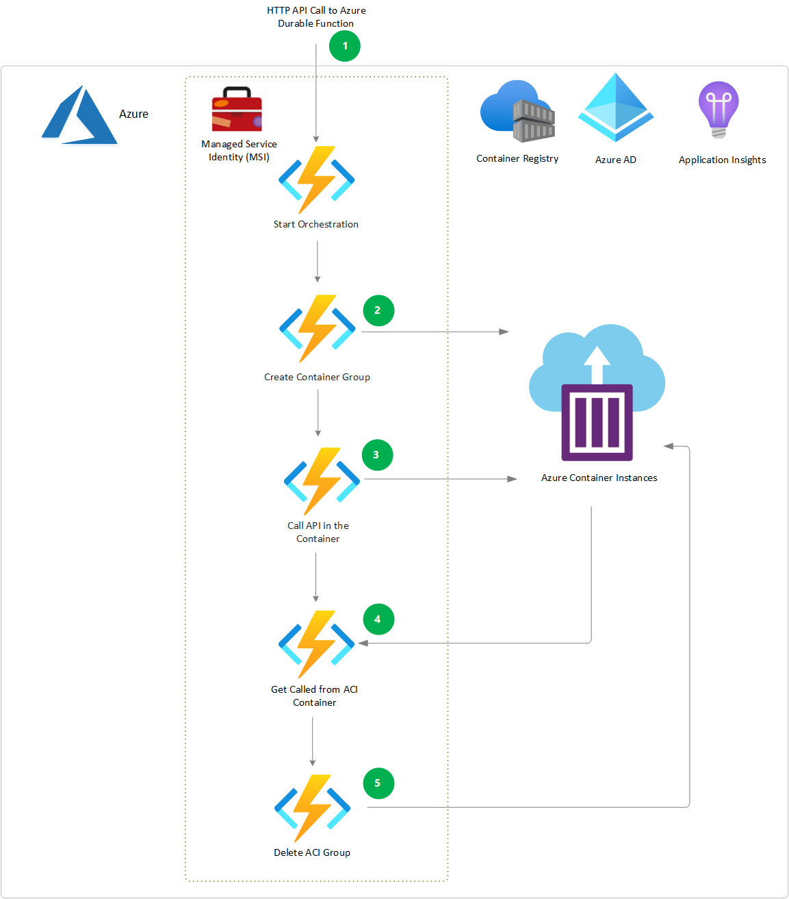

# Serverless batch processing using Durable Functions with Azure Container Instances

This article describes how you can use Azure Functions [Durable Functions](https://docs.microsoft.com/azure/azure-functions/durable/durable-functions-overview) to schedule, manage, and deploy serverless batch processing jobs in [Azure Container Instances](https://docs.microsoft.com/azure/container-instances/container-instances-overview) (ACI) containers.

Containers are well suited for packaging, deploying, and managing microservices-based architectures. *Orchestration* is the task of automating and managing containers and their interactions. Popular container orchestrator platforms like [Azure Kubernetes Service](https://azure.microsoft.com/services/kubernetes-service/) (AKS) and [Azure Service Fabric](https://azure.microsoft.com/services/service-fabric/) can manage complex, multi-container tasks and interactions.

You don't always need full-fledged container orchestrators to provision and manage simple apps and jobs in isolated containers. ACI is the fastest and simplest way to run containers in Azure, and Durable Functions can orchestrate container deployment.

For long-term, stable workloads, orchestrating containers in a cluster of dedicated virtual machines (VMs) is usually cheaper than using ACI. However, ACI can quickly expand and contract your overall capacity. Because they start quickly and bill by the second, container instances can be the fastest and most cost effective way to get started and to handle highly variable workloads. 

Rather than scaling out the number of VMs, then deploying more containers onto those machines, you simply deploy additional containers as needed, and delete them when they're no longer needed. You can use Durable Functions to schedule and manage the container deployment and deletion.

## Use cases
- Batch processing apps where computing needs vary depending on the job. For example, Job #1 may need 100 container instances with large CPU and memory requirements, and take days to run, whereas Job #2 needs only a couple of instances with less CPU and memory, and takes only hours to run. 
- Multi-tenant scenarios where some tenants need large computing power, while other tenants have small computing requirements.

## Architecture

[Download a Visio file](https://archcenter.blob.core.windows.net/cdn/Durable_Func_ACI.vsdx) of this architecture.

1. The batch processing app is packaged into a container image stored in Azure Container Registry (ACR), ready to deploy with options like AKS, Service Fabric, or ACI.
1. An HTTP trigger invokes the orchestrator function to orchestrate the container deployment.
1. An activity function uses the container image stored in ACR to [create an ACI container](https://docs.microsoft.com/rest/api/storageservices/create-container) in a container group.
1. The orchestrator function uses the container URL to call and start the batch processing job on the container instance, and to monitor job progress.
1. Once the job completes, the batch processing job invokes the orchestrator function by [raising an external event](https://docs.microsoft.com/azure/azure-functions/durable/durable-functions-external-events), and provides job status, Completed or Failed.
1. Depending on job status, the orchestrator function [stops, restarts, or deletes](https://docs.microsoft.com/azure/container-instances/container-instances-stop-start) the container group. You can also control the container instance using [restart policies](https://docs.microsoft.com/azure/container-instances/container-instances-restart-policy).

## Components

- A *Durable Functions* [orchestrator function](https://docs.microsoft.com/azure/azure-functions/durable/durable-functions-types-features-overview#orchestrator-functions) orchestrates and performs the ACI container and app deployment, monitoring, and cleanup.
- A *Durable Functions* [activity function](https://docs.microsoft.com/azure/azure-functions/durable/durable-functions-types-features-overview#activity-functions) creates the ACI container group and instance, using the [Azure Fluent API](https://github.com/Azure/azure-libraries-for-net) and [ACI Management libraries](https://docs.microsoft.com/dotnet/api/overview/azure/containerinstance?view=azure-dotnet).
- [Azure Container Registry](https://docs.microsoft.com/azure/container-registry/) stores the batch processing app in a container image.
- [Azure Container Instances](https://azure.microsoft.com/services/container-instances/) (ACI) containers run the batch processing jobs.
- The Durable Functions use [Azure Active Directory](https://azure.microsoft.com/services/active-directory/) (Azure AD) with [Managed Service Identity](https://docs.microsoft.com/azure/active-directory/managed-identities-azure-resources/overview) to manage the container instances.
- [Application Insights](https://docs.microsoft.com/azure/azure-monitor/app/app-insights-overview) monitors job progress.

## Implementation

The [.NET Core C# sample application](https://github.com/sowsan/az-func-aci) uses Azure Durable Functions to orchestrate ACI container deployment, monitoring, and cleanup.

## Next steps

- [Durable Functions](https://docs.microsoft.com/azure/azure-functions/durable/durable-functions-overview?tabs=csharp)
- [Azure Container Instances](https://docs.microsoft.com/azure/container-instances/container-instances-overview)
- [Azure Container Instances Management Libraries](https://docs.microsoft.com/dotnet/api/overview/azure/containerinstance?view=azure-dotnet)
- [Azure Container Instances and container orchestrators](https://docs.microsoft.com/azure/container-instances/container-instances-orchestrator-relationship)
