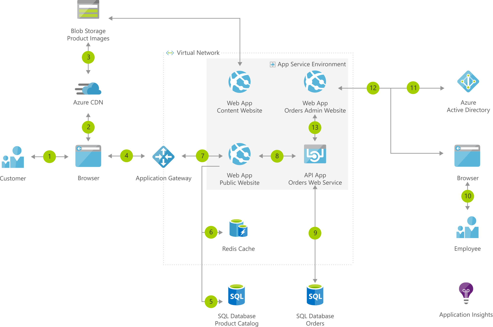

# E-commerce website running in secured App Service Environment

[!INCLUDE [header_file](../../../includes/sol-idea-header.md)]

## Architecture

*Download an [SVG](../media/ecommerce-website-running-in-secured-ase.svg) of this architecture.*

## Data Flow

1. Customer accesses the public website in browser.
1. Browser pulls static resources and product images from Azure Content Delivery Network.
1. Content Delivery Network pulls product images from blob storage.
1. Customer searches for products.
1. Public website pulls product catalog from product database.
1. Page output is cached in the Azure Cache for Redis.
1. Customer creates new orders.
1. Public website invokes orders web service.
1. Orders web service saves/loads orders from Azure SQL Database.
1. Employee accesses the admin website in browser.
1. Employee authenticates against Azure Active Directory (Azure AD).
1. Employee searches orders.
1. Admin website invokes orders web service.

## Components

* [App Service](https://azure.microsoft.com/services/app-service): Quickly create powerful cloud apps for web and mobile
* [Web Apps](https://azure.microsoft.com/services/app-service/web): An App Service Web App runs in a single region, accessible to web and mobile browsers
* [Azure SQL Database](https://azure.microsoft.com/services/sql-database): Managed, intelligent SQL in the cloud
* [API Apps](https://azure.microsoft.com/services/app-service/api): Publish APIs to external, partner, and employee developers securely and at scale.
* Application Insights: Detect, triage, and diagnose issues in your web apps and services
* [Application Gateway](https://azure.microsoft.com/services/application-gateway): Build secure, scalable, and highly available web front ends in Azure
* [Azure Cache for Redis](https://azure.microsoft.com/services/cache): Power applications with high-throughput, low-latency data access
* [Content Delivery Network](https://azure.microsoft.com/services/cdn): Ensure secure, reliable content delivery with broad global reach
* [Azure Active Directory](https://azure.microsoft.com/services/active-directory): Synchronize on-premises directories and enable single sign-on
* [Blob Storage](https://azure.microsoft.com/services/storage/blobs): Azure Blob storage is a Massively scalable object storage for any type of unstructured data—images, videos, audio, documents, and more—easily and cost-effectively.

## Next steps

* [Create and use an internal load balancer with an App Service Environment](https://docs.microsoft.com/azure/app-service/environment/create-ilb-ase)
* [Deploy web apps with CMS using pre-built templates](https://azure.microsoft.com/resources/templates/?term=CMS)
* [Build an ASP.NET app in Azure with SQL Database](https://docs.microsoft.com/azure/app-service/app-service-web-tutorial-dotnet-sqldatabase)
* [Deploy your first API app](https://docs.microsoft.com/azure/app-service/app-service-web-tutorial-rest-api)
* [Application Performance Management with Application Insights](https://docs.microsoft.com/azure/application-insights/app-insights-overview)
* [Overview of Application Gateway](https://docs.microsoft.com/azure/application-gateway/application-gateway-introduction)
* [Azure Cache for Redis documentation](https://docs.microsoft.com/azure/redis-cache)
* [Quickstart: Create an Azure Content Delivery Network profile and endpoint](https://docs.microsoft.com/azure/cdn/cdn-create-new-endpoint)
* [Get started with Azure AD](https://docs.microsoft.com/azure/active-directory/get-started-azure-ad)
* [Quickstart: Upload, download, and list blobs](https://docs.microsoft.com/azure/storage/blobs/storage-quickstart-blobs-dotnet?tabs=windows)
