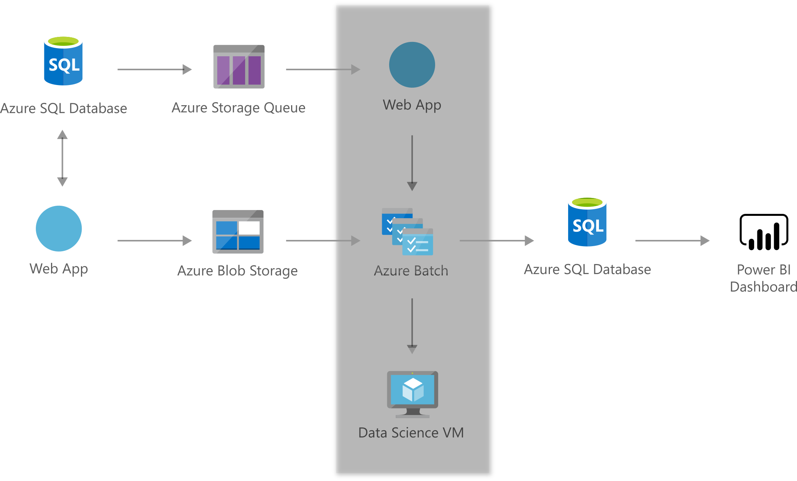

[!INCLUDE [header_file](../../../includes/sol-idea-header.md)]

This solution provides an Azure-based smart solution, applying external open-source tools, to determine the optimal energy unit commitments from various energy resources for an energy grid. The goal is to minimize the overall cost incurred by these commitments while satisfying the energy demand.

## Architecture

*Download a [Visio file](https://arch-center.azureedge.net/energy-supply-optimization.vsdx) of this architecture.*

### Dataflow

  1. The sample data is streamed by newly deployed Azure Web Jobs. The web job uses resource-related data from Azure SQL to generate the simulated data.
  1. The data simulator feeds this simulated data into the Azure Storage and writes message in Storage Queue that will be used in the rest of the solution flow.
  1. Another Web Job monitors the storage queue and initiate an Azure Batch job once message in the queue is available.
  1. The Azure Batch service together with Data Science Virtual Machines is used to optimize the energy supply from a particular resource type given the inputs received.
  1. Azure SQL Database is used to store the optimization results received from the Azure Batch service. These results are then consumed in the Power BI dashboard.
  1. Finally, Power BI is used for results visualization.
  
### Components

Key technologies used to implement this architecture:

- [Azure Batch](https://azure.microsoft.com/services/batch)
- [Azure Blob Storage](https://azure.microsoft.com/services/storage/blobs)
- [Azure Data Science Virtual Machines](https://azure.microsoft.com/services/virtual-machines/data-science-virtual-machines)
- [Azure SQL Database](https://azure.microsoft.com/services/sql-database)
- [Azure Queue Storage](https://azure.microsoft.com/services/storage/queues)
- [Power BI Dashboard](https://powerbi.microsoft.com)

## Scenario details

An energy grid consists of energy consumers, and various types of energy supplying, trading, and storage components: Substations accept power load or exports excessive power; Batteries may discharge energy or store it for future use; Windfarms and solar panel (self-scheduled generators), micro-turbines (dispatchable generators), and demand response bids can all be engaged to satisfying the demand from the consumers within the grid.

The costs of soliciting different types of resources vary, while the capacities and the physical characteristics of each resource type limit the dispatch of the resource. Given all these constraints, a challenge the smart grid operator must face is how much energy each type of the resources should commit over a time frame. This allows the forecasted energy demand from the grid is satisfied.

### Potential use cases

This solution demonstrates the ability of Azure to accommodate external tools, such as Pyomo and CBC, to solve large-scale numerical optimization problems such as mixed integer-linear programming, parallelizing multiple optimization tasks over an Azure Batch of Azure Virtual Machines. Other involved products include Azure Blob Storage, Azure Queue Storage, Azure Web App, Azure SQL Database, and Power BI.

## Deploy this scenario

For more details on how this solution is built, visit the solution guide in [GitHub](https://github.com/Azure/cortana-intelligence-energy-supply-optimization).

## Next steps

Product documentation:

- [What is Azure Batch?](/azure/batch/batch-technical-overview)
- [What is Azure Blob storage?](/azure/storage/blobs/storage-blobs-overview)
- [What is the Azure Data Science Virtual Machine?](/azure/machine-learning/data-science-virtual-machine/overview)
- [What is Azure SQL Database?](/azure/azure-sql/database/sql-database-paas-overview)
- [What is Azure Queue Storage?](/azure/storage/queues/storage-queues-introduction)
- [Introduction to dashboards](/power-bi/create-reports/service-dashboards)

Microsoft Learn modules:

- [Create and connect to a Data Science Virtual Machine](/training/modules/intro-to-azure-data-science-virtual-machine)
- [Deploy Azure SQL Database](/training/modules/deploy-azure-sql-database)
- [Explore Azure Blob storage](/training/modules/explore-azure-blob-storage)
- [Run parallel tasks in Azure Batch with the Azure CLI](/training/modules/run-parallel-tasks-in-azure-batch-with-the-azure-cli)

## Related resources

- [Artificial intelligence (AI) - Architectural overview](../../data-guide/big-data/ai-overview.md)
- [Data science and machine learning with Azure Databricks](azure-databricks-data-science-machine-learning.yml)
- [Defect prevention with predictive maintenance](defect-prevention-with-predictive-maintenance.yml)
- [Forecast energy and power demand with machine learning](forecast-energy-power-demand.yml)
- [Knowledge mining in business process management](business-process-management.yml)
- [Predictive maintenance](predictive-maintenance.yml)
