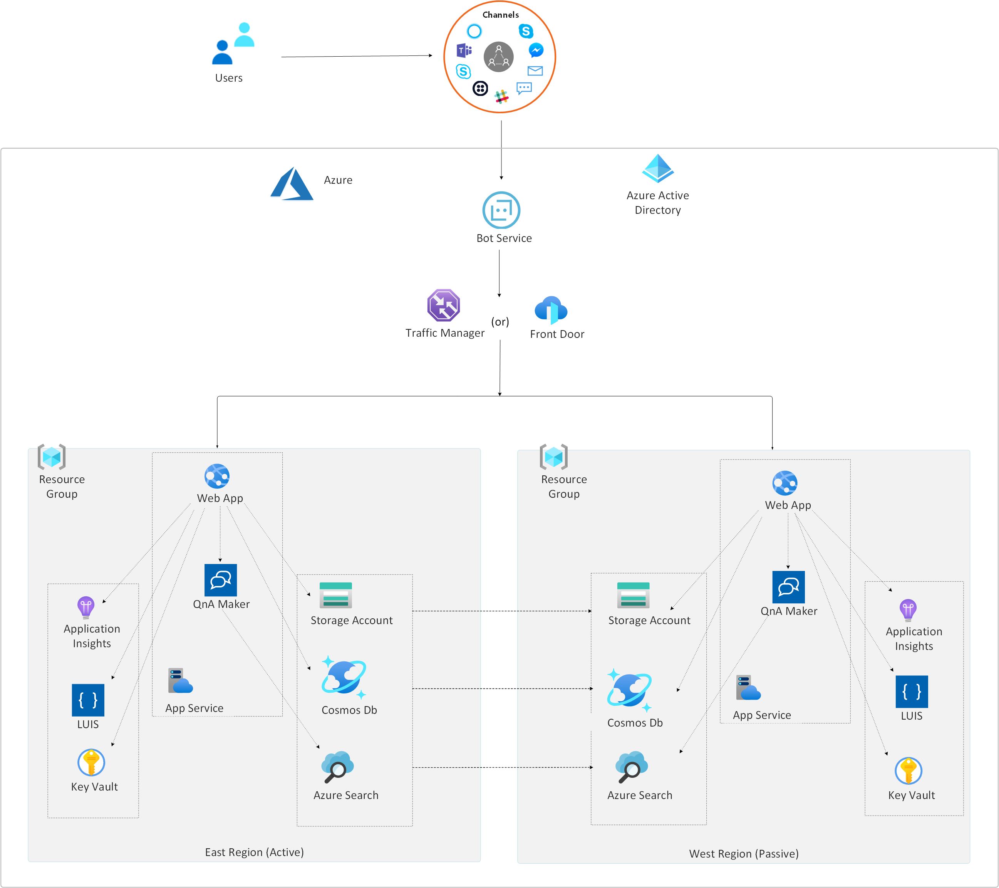

To set up disaster recovery for an enterprise-grade *conversational bot (chatbot)*, first review the service level agreement (SLA) that cover the *Recovery Point Objective (RPO)* and *Recovery Time Objective (RTO)* for the chatbot. Implement the disaster recovery patterns in this article to build highly available and disaster resistant chatbot solutions to meet the SLA.

For a description of the core components of a typical enterprise-grade chatbot solution in Azure, see [Enterprise-grade conversational bot](../../reference-architectures/ai/conversational-bot.yml).

## Architecture

This diagram shows deployment of a chatbot solution in *active-passive* failover mode in two different Azure regions for disaster recovery.

[Download a Visio file](https://arch-center.azureedge.net/Bot_DR.vsdx) of this architecture.

## Components

Disaster recovery solutions vary depending on your SLA and the Azure services you use.

### Non-regional services

Azure Active Directory (Azure AD), Azure Traffic Manager, Azure Front Door, and Azure Bot Service registration are non-regional services that are always available in Azure geographies, regardless of specific region availability or outage.

### Regional services with automatic failover

Although you provision Azure Key Vault and Language Understanding Intelligent Service (LUIS) in a specific Azure region, these services provide automatic failover to a different Azure region. For more information, see:

- [Azure Key Vault availability and redundancy](/azure/key-vault/key-vault-disaster-recovery-guidance)
- To set up high availability for Azure Cosmos DB, see [High availability with Azure Cosmos DB](/azure/cosmos-db/high-availability).
- [LUIS regions and endpoints](/azure/cognitive-services/luis/luis-reference-regions)

### Regional services without automatic failover

These services may need your attention to ensure high availability and disaster recovery.

Keep all deployment and source code artifacts in a source code repository, and use [Azure paired regions](/azure/best-practices-availability-paired-regions) to deploy them in parallel. You can automate all the following deployment tasks and save them as part of your deployment artifacts. When you deploy these services in the two paired regions, configure your bot API's environment variables to match the specific services in each Azure region.

- Keep the primary and secondary Azure search indexes in sync. For a sample app to back up and restore Azure search indexes, see [QnAMakerBackupRestore](https://github.com/pchoudhari/QnAMakerBackupRestore) on GitHub.
- Back up Application Insights by using [continuous export](/azure/azure-monitor/app/export-telemetry). Although you can't currently import the exported telemetry to another Application Insights resource, you can export into a storage account for further analysis.
- To set up high availability and disaster recovery for Azure Storage accounts, see [Disaster recovery and storage account failover](/azure/storage/common/storage-disaster-recovery-guidance).
- Deploy the bot API and QnA Maker into an Azure App Service Plan in both regions.
- Once you set up the primary and secondary stacks, use Azure Traffic Manager or Azure Front Door to configure the endpoints and set up a routing method for both QnA Maker and the bot API.
- Create a Secure Sockets Layer (SSL) certificate for your traffic manager endpoint, and [bind the SSL certificate](/azure/app-service/configure-ssl-bindings) in your App Services.
- Finally, use the Traffic Manager or Azure Front Door endpoint of QnA Maker in your bot, and use the traffic manager endpoint of the bot API as the bot endpoint in Azure Bot Service registration.

### List of services

Key technologies used to implement this architecture:

* [Azure Bot Service](https://azure.microsoft.com/services/bot-service)
* [Azure Active Directory](https://azure.microsoft.com/services/active-directory)
* [Azure Traffic Manager](https://azure.microsoft.com/services/traffic-manager)
* [Azure Front Door](https://azure.microsoft.com/services/frontdoor)
* [Azure App Service Web Apps](https://azure.microsoft.com/services/app-service/web)
* [Azure Cognitive Services QnA Maker](https://azure.microsoft.com/services/cognitive-services/qna-maker)
* [Azure Monitor](https://azure.microsoft.com/services/monitor): Application Insights is a feature of Azure Monitor.
* [Azure Cognitive Services Language Understanding](https://azure.microsoft.com/services/cognitive-services/language-understanding-intelligent-service)
* [Azure Cosmos DB](https://azure.microsoft.com/services/cosmos-db)
* [Azure Key Vault](https://azure.microsoft.com/services/key-vault)
* [Azure Cognitive Search](https://azure.microsoft.com/services/search)

## Next steps

- [Enterprise-grade conversational bot](../../reference-architectures/ai/conversational-bot.yml)
- [Overview of the resiliency pillar](../../framework/resiliency/overview.md)
- [Azure Key Vault availability and redundancy](/azure/key-vault/key-vault-disaster-recovery-guidance)
- [Business continuity and disaster recovery (BCDR): Azure Paired Regions](/azure/best-practices-availability-paired-regions)
- [Authoring and publishing regions and the associated keys](/azure/cognitive-services/luis/luis-reference-regions)
- [High availability with Azure Cosmos DB](/azure/cosmos-db/high-availability)
- [Disaster recovery and account failover](/azure/storage/common/storage-disaster-recovery-guidance)
- [Traffic Manager](/azure/traffic-manager/)
- [Azure Front Door](https://azure.microsoft.com/services/frontdoor/)
