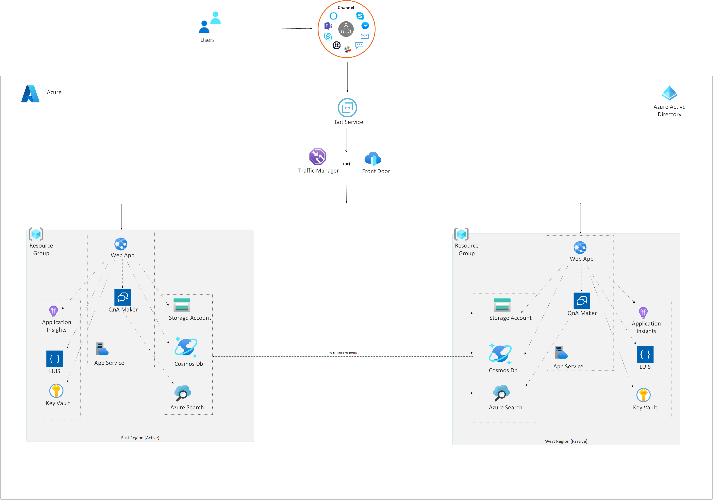

[!INCLUDE [header_file](../../../includes/sol-idea-header.md)]

This article shows how to set up disaster recovery and high availability for an enterprise-grade conversational bot in Azure, with regional and non-regional services.

## Architecture

The diagram below shows deployment of a chatbot solution for disaster recovery. The failover mode is *active-passive* in two different Azure regions.

*Download a [Visio file](https://arch-center.azureedge.net/Bot_DR.vsdx) of this architecture.*

### Dataflow

Disaster recovery solutions vary depending on your SLA and the Azure services you use.

#### Non-regional services

Azure Active Directory (Azure AD), Azure Traffic Manager, Azure Front Door, and Azure Bot Service registration are non-regional services. They're always available in Azure geographies, whatever the specific region availability or outage.

#### Regional services with automatic failover

Although you provision Azure Key Vault and Language Understanding Intelligent Service (LUIS) in a specific Azure region, these services provide automatic failover to a different Azure region. For more information, see:

- [Azure Key Vault availability and redundancy](/azure/key-vault/key-vault-disaster-recovery-guidance)
- To set up high availability for Azure Cosmos DB, see [High availability with Azure Cosmos DB](/azure/cosmos-db/high-availability).
- [LUIS regions and endpoints](/azure/cognitive-services/luis/luis-reference-regions)

#### Regional services without automatic failover

These services may need your attention to ensure high availability and disaster recovery.

Keep all deployment and source code artifacts in a source code repository, and use [Azure paired regions](/azure/best-practices-availability-paired-regions) to deploy them in parallel. You can automate all the following deployment tasks and save them as part of your deployment artifacts. When you deploy these services in the two paired regions, configure your bot API environment variables to match the specific services in each Azure region.

- Keep the primary and secondary Azure search indexes in sync. For a sample app to back up and restore Azure search indexes, see [QnAMakerBackupRestore](https://github.com/pchoudhari/QnAMakerBackupRestore) on GitHub.
- Back up Application Insights by using [continuous export](/azure/azure-monitor/app/export-telemetry). Although you can't currently import the exported telemetry to another Application Insights resource, you can export into a storage account for further analysis.
- To set up high availability and disaster recovery for Azure Storage accounts, see [Disaster recovery and storage account failover](/azure/storage/common/storage-disaster-recovery-guidance).
- Deploy the bot API and QnA Maker into an Azure App Service Plan in both regions.
- Once you set up the primary and secondary stacks, use Azure Traffic Manager or Azure Front Door to configure the endpoints. Set up a routing method for both QnA Maker and the bot API.
- Create a Secure Sockets Layer (TLS/SSL) certificate for your traffic manager endpoint, and [bind the TLS/SSL certificate](/azure/app-service/configure-ssl-bindings) in your App Services.
- Finally, use the Traffic Manager or Azure Front Door endpoint of QnA Maker in your bot. Then, use the Traffic Manager endpoint of the bot API as the bot endpoint in Azure Bot Service registration.

### Components

Key technologies used to implement this architecture:

- [Azure Bot Service](https://azure.microsoft.com/services/bot-service)
- [Azure Active Directory](https://azure.microsoft.com/services/active-directory)
- [Azure Traffic Manager](https://azure.microsoft.com/services/traffic-manager)
- [Azure Front Door](https://azure.microsoft.com/services/frontdoor)
- [Azure App Service Web Apps](https://azure.microsoft.com/services/app-service/web)
- [Azure Cognitive Services QnA Maker](https://azure.microsoft.com/services/cognitive-services/qna-maker)
- Application Insights is a feature of [Azure Monitor](https://azure.microsoft.com/services/monitor)
- [Azure Cognitive Services Language Understanding](https://azure.microsoft.com/services/cognitive-services/language-understanding-intelligent-service)
- [Azure Cosmos DB](https://azure.microsoft.com/services/cosmos-db)
- [Azure Key Vault](https://azure.microsoft.com/services/key-vault)
- [Azure Cognitive Search](https://azure.microsoft.com/services/search)

## Scenario details

To plan disaster recovery for an enterprise-grade conversational bot (chatbot), start by reviewing the service level agreement (SLA). The SLA should describe the *Recovery Point Objective (RPO)* and *Recovery Time Objective (RTO)* targets for the chatbot. Then, implement the patterns in this article to build highly available and disaster-resilient chatbot solutions to meet the SLA.

The core components of a typical enterprise-grade chatbot solution in Azure are discussed in [Enterprise-grade conversational bot](../../reference-architectures/ai/conversational-bot.yml).

### Potential use cases

This solution is ideal for the telecommunications industry. This article covers the most essential design aspects, and introduces the tools needed to build a robust, secure, and actively learning bot.

## Contributors

*This article is maintained by Microsoft. It was originally written by the following contributors.* 

Principal author:

 - [Sowmyan Soman](https://www.linkedin.com/in/sowmyancs/) | Principal Cloud Solution Architect
 
*To see non-public LinkedIn profiles, sign in to LinkedIn.*

## Next steps

Product documentation:

- Cognitive Services - [Authoring and publishing regions and the associated keys](/azure/cognitive-services/luis/luis-reference-regions)
- Azure Cosmos DB - [High availability with Azure Cosmos DB](/azure/cosmos-db/high-availability)
- Key Vault - [Azure Key Vault availability and redundancy](/azure/key-vault/key-vault-disaster-recovery-guidance)
- Storage - [Disaster recovery and account failover](/azure/storage/common/storage-disaster-recovery-guidance)

Article on availability:

- [Business continuity and disaster recovery (BCDR): Azure Paired Regions](/azure/best-practices-availability-paired-regions)

## Related resources

Azure Architecture Center:

- Review the overview article [Principles of the reliability pillar](/azure/architecture/framework/resiliency/principles)
- See the related reference architecture [Build an enterprise-grade conversational bot](../../reference-architectures/ai/conversational-bot.yml)
