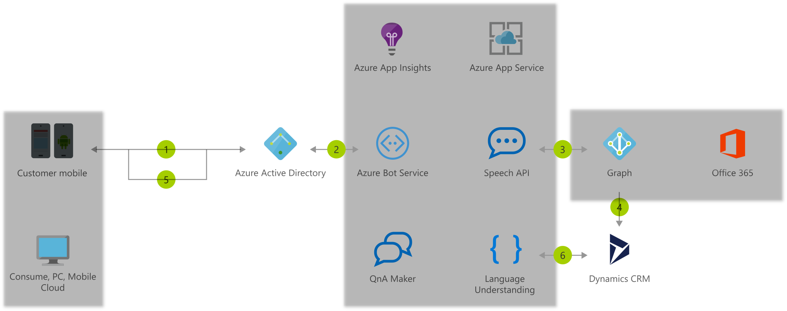

[!INCLUDE [header_file](../../../includes/sol-idea-header.md)]

Use Azure Bot and Cognitive Services to build enterprise bots for internal productivity. Process natural language requests to streamline common employee tasks.

## Architecture

*Download a [Visio file](https://arch-center.azureedge.net/enterprise-productivity-chatbot.vsdx) of this architecture.*

### Dataflow

1. An employee accesses the enterprise bot.
1. Azure Active Directory validates the employee's identity.
1. The bot queries the employee's Microsoft 365 calendar via Microsoft Graph.
1. By using data gathered from the calendar, the bot accesses case information in Dynamics CRM.
1. Information is returned to the employee, who can filter the data without leaving the bot.
1. Application Insights monitors the live application to diagnose issues and help understand how to improve bot performance and usability.

### Components

Key technologies used to implement this architecture:

* [Azure Active Directory](https://azure.microsoft.com/services/active-directory)
* [Azure Monitor](https://azure.microsoft.com/services/monitor): Application Insights is a feature of Azure Monitor.
* [Azure App Service](https://azure.microsoft.com/services/app-service)
* [Azure Bot Service](https://azure.microsoft.com/services/bot-service)
* [Azure Cognitive Services Speech Services](https://azure.microsoft.com/services/cognitive-services/speech-services)
* [Azure Cognitive Services QnA Maker](https://azure.microsoft.com/services/cognitive-services/qna-maker)
* [Azure Cognitive Services Language Understanding](https://azure.microsoft.com/services/cognitive-services/language-understanding-intelligent-service)
* [Microsoft Graph](https://developer.microsoft.com/graph)
* [Microsoft Dynamics 365](https://dynamics.microsoft.com)

## Scenario details

Use [Azure Bot Service](/azure/bot-service/) with [Language Understanding](/azure/cognitive-services/luis/) to build powerful enterprise bots for internal productivity. Enterprise bots streamline common employee tasks by bringing together data from external systems. Examples include data from Microsoft 365 calendar, customer cases stored in Dynamics CRM, and much more. This solution idea shows how you can architect an enterprise bot for employees tasks.

### Potential use cases

This solution is ideal for the HR, sales, and manufacturing industries. Some organizations utilize chatbots in these areas:

- Human Resources (recruitment, on-boarding, and training)
- Sales and Marketing (schedule meetings and provide contextual responses)
- Supply Chain (real-time shipping updates and simplify logging claims)

## Next steps

Product documentation:

* [What are Azure Cognitive Services?](/azure/cognitive-services/what-are-cognitive-services)
* [What is the Speech service?](/azure/cognitive-services/speech-service/overview)
* [What is QnA Maker?](/azure/cognitive-services/QnAMaker/Overview/overview)
* [What is Language Understanding (LUIS)?](/azure/cognitive-services/luis/what-is-luis)
* [Introduction to Bot Framework Composer](/composer/introduction)
* [What is Application Insights](/azure/azure-monitor/app/app-insights-overview)
* [Overview of Microsoft Graph](/graph/overview)

Microsoft Learn modules:

* [How to build a basic chatbot](/training/modules/how-build-basic-chatbot)
* [Build a bot with QnA Maker and Azure Bot Service](/training/modules/build-faq-chatbot-qna-maker-azure-bot-service)
* [Create Intelligent Bots with the Azure Bot Service](/training/paths/create-bots-with-the-azure-bot-service)

## Related resources

Azure Architecture Center overview articles:

* [Artificial intelligence (AI) - Architectural overview](../../data-guide/big-data/ai-overview.md)
* [Choosing an Azure Cognitive Services technology](../../data-guide/technology-choices/cognitive-services.md)

Azure Architecture Center articles describing other chatbot architectures:

* [Chatbot for hotel booking](../../example-scenario/ai/commerce-chatbot.yml)
* [Build an enterprise-grade conversational bot](../../reference-architectures/ai/conversational-bot.yml)
* [Speech-to-text conversion](/azure/architecture/example-scenario/ai/speech-to-text-transcription-analytics)
