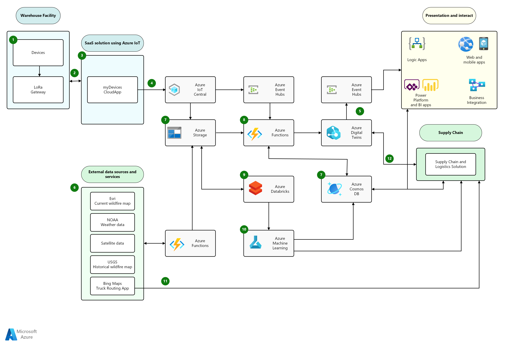

[!INCLUDE [header_file](../../../includes/sol-idea-header.md)]

This article describes a warehouse management scenario that monitors environmental conditions through the integration of sensor data and public datasets, processed with ML to generate predictions. The insights are then used to ensure the safety of people and optimize supply chain operations.

## Architecture

*Download a [Visio file](https://arch-center.azureedge.net/environment-monitor-supply-chain.vsdx) of this architecture.*

### Dataflow

1. Sensors in the warehouse facility are connected and send data to a LoRa (**Lo**ng **Ra**nge) gateway.

1. [LoRa](https://en.wikipedia.org/wiki/LoRa) gateway pushes data to the cloud using cellular connectivity.

1. myDevices is a software as a service (SaaS)-based plug and play solution. It uses devices and gateways that are automatically provisioned and associated with the corresponding customer.

1. Device data is sent to Azure IoT Central. Customers use the solution for controlling and monitoring the devices.

1. Modeling of the supply chain and warehouse facilities using Azure Digital Twins. This is a live executing environment where applications can ingest data to gain visibility on the status of the supply chain. Digital Twins integrates natively with Azure Event Hub, which other applications interact with to retrieve data from the twin.

1. Temporal and spatial data required by ML models is obtained from the external data sources.

1. Key data is stored in Azure data solutions. Blob storage is used for ML training data. Azure Cosmos DB is used for scored data and key performance indexes.

1. Telemetry data is ingested from IoT Central via Event Hub to ensure decoupling of the data ingestion and consumption. Azure Functions is used to combine external data sources and telemetry data, and then analyze this data set for any anomalies. The data is surfaced through Digital Twins.

1. Azure Databricks performs data transformations required for training the ML models.

1. Wildfire prediction models are trained using Azure Machine Learning by utilizing historical data, real-time data, and micro-weather data.

1. Routing updates are provided by the Bing Maps Truck Routing API.

1. Applications can query Digital Twins directly to obtain relevant data from the model.

### Components

- [Azure IoT Central](https://azure.microsoft.com/services/iot-central) is used as the IoT managed platform. It provides security, scalability, and availability as part of the service so that customers can focus efforts on business requirements. Users can integrate with business components such as Power Apps and Power BI, and create notifications through the [data export feature in IoT Central](/azure/iot-central/core/howto-export-to-blob-storage).

- [Azure storage](https://azure.microsoft.com/services/storage) is used for storing device information in the cloud in a secure and scalable way that is also cost-effective. The data stored is used for training the ML models.

- [Azure Cosmos DB](https://azure.microsoft.com/services/cosmos-db) is used to store application key performance indicators (KPIs) and model outputs. Azure Cosmos DB is a fully managed NoSQL database service for modern application development. It provides high-speed transactions and can easily enable the service for global distribution.

- [Azure Databricks](https://azure.microsoft.com/services/databricks) is a data analytics platform optimized for the Microsoft Azure cloud services platform. It's used for transforming, manipulating, and normalizing data so that it can be properly consumed by the machine learning pipeline.

- [Azure Machine Learning](https://azure.microsoft.com/services/machine-learning) is used to create wildfire prediction models. The models provide the intelligence required to assess the risk of a wildfire. Input from multiple data sources is required to train the model for accuracy. These sources can include satellite imagery, historical data, local soil conditions, and weather data. Based on the predicated wildfire area from the model, the Supply Chain and Logistics Solution can reroute trucks.

For more detailed discussions, see the [Azure IoT reference architecture](../../reference-architectures/iot.yml) to understand and explore the various implementation choices available.

## Scenario details

Environmental monitoring has become an important activity in the global supply chain. It provides key signals that help drive real-time decisions that can impact suppliers and logistics. Air quality, temperature, wind, humidity, and carbon dioxide (CO2) are some of the indicators that warehouse operators are interested in monitoring during natural disasters. More advanced scenarios can include the fusion of real-time and historical data from weather stations, air quality sensors, and other sources. Machine learning (ML) models can then be used to help predict the effect of these conditions and their possible impact on supply chain operations.

### Potential use cases

This solution is ideal for the environment, manufacturing, transportation, and agriculture industries.

- **Fleet management:** This solution can be used where routes need to be optimized for safety based on the evolving conditions of surrounding areas.
- **Agriculture:** Predicting wildfires that will impact the safety of workers and livestock is critical. By providing ample lead time for danger notifications, people in the affected area can evacuate to safety. Farms can also equip livestock areas with automated gates that can unlock and open in dire situations, allowing animals to escape.

### Challenges faced

There has been a significant [increase in wildfires](https://news.sciencebrief.org/wildfires-sep2020-update) in recent years, posing a growing danger to humans and the global supply chain. With the number of acres burned increasing by the year, [supply chain resilience to climate change](https://www.thebci.org/uploads/assets/e02a3e5f-82e5-4ff1-b8bc61de9657e9c8/BCI-0007h-Supply-Chain-Resilience-ReportLow-Singles.pdf) is top of mind for many leaders.

In the United States, the annual average of area affected by wildfires is approximately 7,000,000 acres. This area is more than double the average during the 1990s. The situation is even more alarming in other countries/regions. For example, in Australia there's an extra month of summer compared to 50 years ago and long-term drought has further worsened fire conditions. Massive bush fires there have caused economic damages nearly 10 times greater than in the United States. Australian wildfires can [impact the global food supply](https://www.foxbusiness.com/money/australian-wildfires-global-food-supply), including goods like beef, milk, wine, and wheat.

Risks to businesses worldwide [continue to increase each year](https://mitsloan.mit.edu/ideas-made-to-matter/supply-chain-resilience-era-climate-change), and supply chain resiliency during natural disasters is critical to maintaining the flow of goods globally. [Integrating weather-based forecasts and predictions](https://lot.dhl.com/if-australias-bushfires-are-the-new-normal-how-should-companies-manage-risks) into supply chain capacity planning can help operators adjust production and manage shipping schedules. This system can minimize disruptions and adverse effects.

#### Business outcomes

Warehouse operators and major distribution centers will benefit from a predictive way to determine if existing logistics infrastructure is in the path of a major fire. Having an early notification system would provide increased lead time to take preventive measures to protect facilities and personnel. Automated notices of changes and pauses in logistics activities would also allow rerouting of shipments with minimal human intervention.

#### Requirements

- Automation is critical. It can't be assumed that operators and facility managers can gather data across multiple systems to make timely decisions.
- Warehouses, distribution facilities, and operation managers need to be notified by multiple means when there's immediate danger, ensuring the information is received in a timely fashion. Examples include data dashboard, email, and text message.
- Only changes in the data need to be reported.
- The delivery and deployment of the solution needs to be simple. It should be installed without the need of a technician, using plug and play technology.
- The solution needs to be low maintenance and cost effective.

### Patterns to address challenges

The table below provides a summary of common use cases and corresponding IoT solutions. Each use case is an example of how an IoT process pattern can be applied to real-world scenarios.

| Use case | Solutions
|---|---|
| Enable supply chain logistics rerouting and production planning by predicting likelihood of interruption due to wildfires near the impacted location. | Ideally, you want to be able to monitor all the key elements of the supply chain so that you can provide a more comprehensive response. [myDevices](https://mydevices.com) has a catalog of certified plug and play devices that connect to a [LoRa](https://en.wikipedia.org/wiki/LoRa) network gateway. The gateway sends data to the cloud application using cellular connectivity. LoRa technology is ideal because the signal needs to penetrate deep into the buildings. Sensors for CO2, temperature, humidity, wind direction, and air quality can be installed in relevant building locations including roofs and storage facilities. Sensors can also be installed in trucks for location tracking to facilitate rerouting. |
| Identify wildfire conditions and understand the degree of danger for a given location. | Wildfire prediction models trained with historical data, micro-weather conditions, and local sensor data can help assess the risk of a wildfire. |
| Automated alerts for evacuation and facility rerouting | Once unsafe conditions are detected, the digital twin of the facility can then be updated to show that it's no longer online. Once updated, other distribution centers within the network can begin to reroute traffic accordingly, allowing on-site facility managers and warehouse operators to focus on employee safety. This scenario uses ML to predict where the wildfire will spread, using public real-time and historical data sets along with micro weather data for more accurate predictions. Sensors track current wildfire conditions, and facility alarms trigger employee evacuation. |

## Considerations

These considerations implement the pillars of the Azure Well-Architected Framework, which is a set of guiding tenets that can be used to improve the quality of a workload. For more information, see [Microsoft Azure Well-Architected Framework](/azure/architecture/framework).

### Connectivity

The solution's on-site devices and sensors need to send data to applications in the cloud, but reliable internet access may not be available for some locations, such as in rural areas.

This solution uses a LoRa network to provide cellular connectivity. LoRa has good building penetration, making it ideal for warehouse-related applications. This approach is cost-effective and provides flexibility for remote locations that require easy-to-connect IoT devices and sensors.

### Plug and play

In a remote setting, it's critical that devices are easy to deploy without requiring specialized expertise. myDevices has an extensive catalog of IoT devices and gateways that can be applied to multiple scenarios. They're Plug and Play certified, so all the user needs to do is place them in the right location and turn them on. With their IoT Central integration, customers can easily customize their dashboard to consume their device data and create alerts.

## Contributors

*This article is maintained by Microsoft. It was originally written by the following contributors.*

Principal author:

- [Ansley Yeo](https://www.linkedin.com/in/ansleyyeo) | Technology Leader

## Next steps

- [IoT in transportation and logistics](https://azure.microsoft.com/overview/iot/industry/transportation-and-logistics): How Azure can be used to bring greater efficiency and reliability to your value chain with world-class IoT and location intelligence services.
- [Architecture of IoT Central connected logistics application template](/azure/iot-central/retail/architecture-connected-logistics): An app template and guidance for developing end to end connected logistics solutions.
- [Bing Maps Truck Routing API](https://www.microsoft.com/en-us/maps/truck-routing): A commercial routing tool that calculates safe and efficient routes and considers a vehicle's attributes in relation to any route limitations.
- [Azure Digital Twins - Supply Chain demo](https://github.com/Azure-Samples/IoTDemos/tree/master/ADT-SupplyChainDemo) uses Digital Twins to model a supply chain scenario.
- [myDevices](https://mydevices.com) provides LoRa connectivity and devices that enable solutions to be deployed quickly in locations where connectivity is a challenge and broad network coverage is needed.
- [C.H. Robinson Navisphere](https://news.microsoft.com/2020/07/14/c-h-robinson-announces-alliance-with-microsoft-to-digitally-transform-the-supply-chain-of-the-future) works with Microsoft Azure and Azure IoT to provide real-time visibility into the supply chain and for more predictability and proactive decision making.
- [EPA AirNow API](https://docs.airnowapi.org) provides access to real-time air quality and wildfire data from [AirNow](https://www.airnow.gov), a service maintained by the US Environmental Protection Agency (EPA) and other federal, tribal, state, and local agencies.

## Related resources

- [Azure IoT reference architecture](../../reference-architectures/iot.yml) 
- [Process real-time vehicle data using IoT](../../example-scenario/data/realtime-analytics-vehicle-iot.yml): A reference architecture for ingesting real-time vehicle data for analysis, including route optimization.
- [Condition monitoring for industrial IoT](./condition-monitoring.yml) is an example scenario demonstrating how end manufacturers can connect their assets to the cloud using OPC UA (Open Platform Communication Unified Architecture) and the Industrial Components.
- [IoT and data analytics](../../example-scenario/data/big-data-with-iot.yml) is an example scenario for building solutions that integrate data from many IoT devices into a comprehensive data analysis architecture to improve and automate decision making.
- [IoT monitor and manage loops](../../example-scenario/iot/monitor-manage-loop.yml) is a design pattern describing a supervisory system that continually monitors a physical system controlled by a set of networked IoT devices.
- [IoT analyze and optimize loops](../../example-scenario/iot/analyze-optimize-loop.yml) is a design pattern enabling the generation and application of business optimization insights to physical systems controlled by software by sourcing telemetry, refining it, and combining it with enterprise data sources to generate insights.
- [IoT using Azure Cosmos DB](./iot-using-cosmos-db.yml) describes an example architecture for using Azure Cosmos DB to ingest device telemetry data at high rates and can serve indexed queries back with low latency and high availability.
