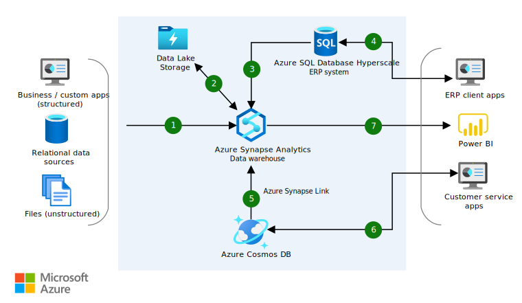

[!INCLUDE [header_file](../../../includes/sol-idea-header.md)]

This solution idea describes how you can use Azure managed databases and Azure Synapse Analytics to get insights via ERP applications and Power BI. 

## Architecture

*Download a [Visio file](https://arch-center.azureedge.net/erp-customer-service.vsdx) of this architecture.*

### Dataflow

First, the company must ingest data from various sources.

1. Use Azure Synapse Pipelines to ingest data of all formats.
2. Land data in Azure Data Lake Storage Gen 2, a highly scalable data lake.

   From there, they use Azure SQL Database Hyperscale to run a highly scalable ERP system:

1. Ingest relational data using Azure Synapse Pipelines into Azure SQL Database. The company's ERP system runs on Azure SQL Database and applies the Hyperscale service tier to scale compute or storage up to 100 TB.
2. This data is surfaced via ERP client applications to help the company manage their business processes.

   To improve service to their customers, they build highly scalable customer service applications that can scale to millions of users:

1. Provide near real-time analytics and insight into user interaction with applications by applying Azure Synapse Link for Azure Cosmos DB HTAP capabilities, with no ETL needed.
2. Power customer service applications with Azure Cosmos DB for automatic and instant scalability and SLA-backed speed, availability, throughput, and consistency.

   Finally, they surface business intelligence insights to users across the company to power data-driven decisions:

1. Power BI tightly integrates with Azure Synapse Analytics to provide powerful insights over operational, data warehouse, and data lake data.

### Components

- [Azure Data Lake Storage](https://azure.microsoft.com/products/storage/data-lake-storage) provides massively scalable and secure data lake storage for high-performance analytics workloads.
- [Azure Synapse Analytics](https://azure.microsoft.com/products/synapse-analytics) is an analytics service that brings together enterprise data warehousing and Big Data analytics within a unified experience.
- [Azure SQL Database Hyperscale](/azure/azure-sql/database/service-tier-hyperscale) is a storage tier in [Azure SQL Database](https://azure.microsoft.com/products/azure-sql/database) that uses Azure architecture to scale out storage and compute resources.  Hyperscale supports up to 100 TB of storage and provides nearly instantaneous backups and fast database restores in minutes – regardless of the size of data operation.
- [Azure Cosmos DB](https://azure.microsoft.com/products/cosmos-db) is a fully managed NoSQL database service for building and modernizing scalable, high-performance applications.
- [Power BI](https://powerbi.microsoft.com) is a suite of business tools for self-service and enterprise business intelligence (BI). Here, it's used to analyze and visualize data.

## Scenario details

Today's organizations are generating ever-increasing amounts of structured and unstructured data. With Azure managed databases and Azure Synapse Analytics, they can deliver insights to their employees via ERP applications and Power BI, as well as superior customer service through web and mobile applications, scaling without limits as data volumes and application users increase.

### Potential use cases

Organizations utilize ERP to assist with:

- Cost savings (automate simple tasks)
- Workflow visibility (managers can see project status)
- Regulatory compliance
- Data security
- Customer management (track survey responses, support tickets, and returns)

## Next steps

- [Azure Data Lake Storage](/azure/storage/blobs/data-lake-storage-introduction)
- [Azure Synapse Analytics](/azure/synapse-analytics/sql-data-warehouse/sql-data-warehouse-overview-what-is)
- [Azure Cosmos DB](/azure/cosmos-db/introduction)
- [Azure Synapse Link](/azure/cosmos-db/synapse-link)
- [Azure Synapse Link for Azure Cosmos DB: Near real-time analytics use cases](/azure/cosmos-db/synapse-link-use-cases)
- [Power BI](/power-bi/fundamentals/power-bi-overview)

## Related resources

- [Azure Data Architecture Guide](../../data-guide/index.md)
- [Azure Cosmos DB resource model](/azure/cosmos-db/account-databases-containers-items)
- [Campaign optimization with SQL Server and machine learning](../../solution-ideas/articles/campaign-optimization-with-sql-server.yml)
