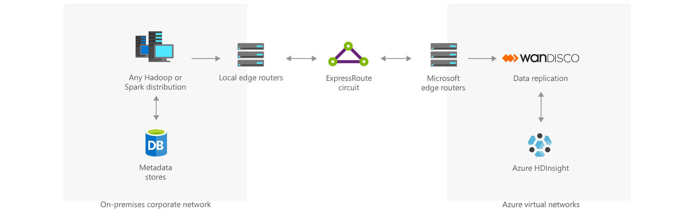

[!INCLUDE [header_file](../../../includes/sol-idea-header.md)]

Extend your on-premises big data investments to the cloud and transform your business using the advanced analytics capabilities of HDInsight.
The integration of WANdisco Fusion with Azure HDInsight presents an enterprise solution that enables organizations to meet stringent data availability and compliance requirements while seamlessly moving production data at petabyte scale from on-premises big data deployments to Microsoft Azure.

## Architecture

*Download an [SVG](../media/extend-your-on-premises-big-data-investments-with-hdinsight.svg) of this architecture.*

	
  1. Establish ExpressRoute between on-premises infrastructure and Microsoft datacenters, to allow private connection for reliable, speedy, and secure data replication from an on-    premises Hadoop setup to an Azure HDInsight cluster.
  2. Install the WANdisco Fusion server in the same Azure Virtual Network as the HDInsight cluster. This allows the server to access the cluster in a secure manner.
  3. Install the WANdisco Fusion app on a HDInsight cluster (new or existing). In the License key field, enter the Public IP of the Fusion Server.
  4. Configure the Fusion App on an HDInsight cluster to set up continuous active replication from on-premises big data/Hadoop deployments to Azure HDInsight, multi-region replication, backup and restore, and more.

### Components

- [Apache Hadoop](http://hadoop.apache.org/) or [Apache Spark](http://spark.apache.org)
- Metadata store
- Local edge router
- [Azure ExpressRoute](https://azure.microsoft.com/services/expressroute) circuit
- Microsoft Edge router
- Data replication (WANdisco's [LiveData Migrator for Azure](https://azuremarketplace.microsoft.com/marketplace/apps/wandisco.ldm) and [LiveData Plane for Azure](https://azuremarketplace.microsoft.com/marketplace/apps/wandisco.ldm?tab=PlansAndPrice))
- [Azure HDInsight](https://azure.microsoft.com/services/hdinsight)
- [Azure Virtual Network](https://azure.microsoft.com/services/virtual-network)

## Next steps

Learn more about the component technologies:

- [What is Azure ExpressRoute?](/azure/expressroute/expressroute-introduction)
- [Migrate your Hadoop data lakes with WANDisco LiveData Platform for Azure](https://azure.microsoft.com/blog/migrate-your-hadoop-data-lakes-with-wandisco-livedata-platform-for-azure/)
- [What is Azure HDInsight?](/azure/hdinsight/hdinsight-overview)
- [What is Azure Virtual Network?](/azure/virtual-network/virtual-networks-overview)

## Related resources

Explore related architectures:

- [Connect an on-premises network to Azure using ExpressRoute](../../reference-architectures/hybrid-networking/expressroute-vpn-failover.yml)
- [Extend an on-premises network using ExpressRoute](../../reference-architectures/hybrid-networking/expressroute.yml)
- [Interactive querying with HDInsight](./interactive-querying-with-hdinsight.yml)
