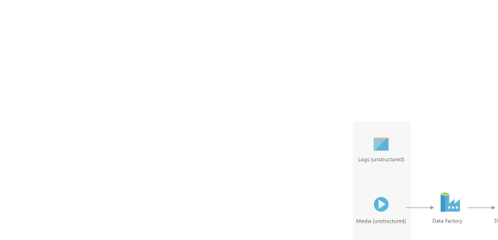

[!INCLUDE [header_file](../../../includes/sol-idea-header.md)]

This solution idea illustrates how to extract, transform, and load your big data clusters on demand by using Hadoop MapReduce and Apache Spark.

## Architecture

*Download a [Visio file](https://arch-center.azureedge.net/extract-transform-and-load-using-hdinsight.vsdx) of this architecture.*

### Dataflow

The data flows through the architecture as follows:

1. Using Azure Data Factory, establish [Linked Services](/azure/data-factory/concepts-linked-services) to source systems and data stores. Azure Data Factory Pipelines support 90+ connectors that also include generic protocols for data sources where a native connector isn't available.

1. Load data from source systems into Azure data lake with the [Copy Data tool](/azure/data-factory/quickstart-create-data-factory-copy-data-tool#start-the-copy-data-tool).

1. Azure Data Factory is able to create an on-demand HDInsight cluster. Start by creating an [On-Demand HDInsight Linked Service](/azure/hdinsight/hdinsight-hadoop-create-linux-clusters-adf#create-an-on-demand-hdinsight-linked-service). Next, [create a pipeline](/azure/hdinsight/hdinsight-hadoop-create-linux-clusters-adf#create-a-pipeline) and use the appropriate HDInsight activity depending on the Hadoop framework being used (that is, Hive, MapReduce, Spark, etc.).

1. Trigger the pipeline in Azure Data Factory. The architecture assumes Azure Data Lake store is used as the file system in the Hadoop script executed by the HDInsight activity which was created in Step 3. The script will be executed by an on-demand HDInsight cluster that will write data to a curated area of the data lake.

### Components

- [Azure Data Factory](https://azure.microsoft.com/services/data-factory) - Cloud scale data integration service for orchestrating data flow.
- [Azure Data Lake Storage](https://azure.microsoft.com/services/storage/data-lake-storage) - Scalable and cost-effective cloud storage for big data processing.
- [Apache Hadoop](http://hadoop.apache.org) - Big data distributed processing framework
- [Apache Spark](http://spark.apache.org) - Big data distributed processing framework that supports in-memory processing to boost performance for big data applications.
- [Azure HDInsight](https://azure.microsoft.com/services/hdinsight) - Cloud distribution of Hadoop components.

## Scenario details

This solution idea describes the data flow for an ETL use case.

### Potential use cases

You can use Azure HDInsight for various scenarios in big data processing. It can be historical data (data that's already collected and stored) or real-time data (data that's directly streamed from the source). For more information about processing such data, see [Scenarios for using HDInsight](/azure/hdinsight/hdinsight-overview#scenarios-for-using-hdinsight). 

## Contributors

*This article is maintained by Microsoft. It was originally written by the following contributors.*

Principal author:

 * [Jon Dobrzeniecki](https://www.linkedin.com/in/jonathan-dobrzeniecki) | Cloud Solution Architect

*To see non-public LinkedIn profiles, sign in to LinkedIn.*

## Next steps

Learn more about the component technologies:

- [Tutorial: Create on-demand Apache Hadoop clusters in HDInsight using Azure Data Factory](/azure/hdinsight/hdinsight-hadoop-create-linux-clusters-adf)
- [Introduction to Azure Data Factory](/azure/data-factory/v1/data-factory-introduction)
- [Introduction to Azure Data Lake Storage Gen2](/azure/storage/blobs/data-lake-storage-introduction)
- [Load data into Azure Data Lake Storage Gen2 with Azure Data Factory](/azure/data-factory/load-azure-data-lake-storage-gen2)
- [What is Apache Hadoop in Azure HDInsight?](/azure/hdinsight/hadoop/apache-hadoop-introduction)
- [Invoke MapReduce Programs from Data Factory](/azure/data-factory/v1/data-factory-map-reduce)
- [Use MapReduce in Apache Hadoop on HDInsight](/azure/hdinsight/hadoop/hdinsight-use-mapreduce)
- [What is Apache Spark in Azure HDInsight](/azure/hdinsight/spark/apache-spark-overview)

## Related resources

Explore related architectures:

- [Use a demand forecasting model for price optimization](./demand-forecasting-price-optimization-marketing.yml)
- [Predictive insights with vehicle telematics](./predictive-insights-with-vehicle-telematics.yml)
- [Interactive querying with HDInsight](./interactive-querying-with-hdinsight.yml)
