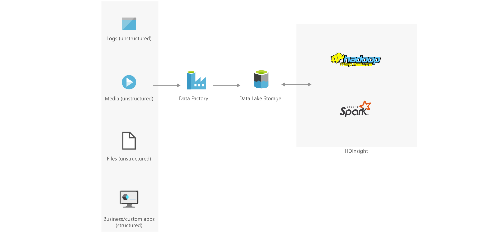

[!INCLUDE [header_file](../../../includes/sol-idea-header.md)]

Extract, transform, and load your big data clusters on demand with Hadoop MapReduce and Apache Spark.

## Architecture

## Components

- [Azure Data Factory](https://azure.microsoft.com/services/data-factory/)
- [Azure Data Lake Storage](https://azure.microsoft.com/services/storage/data-lake-storage/)
- [Apache Hadoop](http://hadoop.apache.org/)
- [Apache Spark](http://spark.apache.org/)
- [Azure HDInsight](https://azure.microsoft.com/services/hdinsight/)

## Next steps

Learn more about the component technologies:

- [Introduction to Azure Data Factory](/azure/data-factory/v1/data-factory-introduction)
- [Introduction to Azure Data Lake Storage Gen2](/azure/storage/blobs/data-lake-storage-introduction)
- [Load data into Azure Data Lake Storage Gen2 with Azure Data Factory](/azure/data-factory/load-azure-data-lake-storage-gen2)
- [What is Apache Hadoop in Azure HDInsight?](/azure/hdinsight/hadoop/apache-hadoop-introduction)
- [Invoke MapReduce Programs from Data Factory](/azure/data-factory/v1/data-factory-map-reduce)
- [Use MapReduce in Apache Hadoop on HDInsight](/azure/hdinsight/hadoop/hdinsight-use-mapreduce)
- [What is Apache Spark in Azure HDInsight](/azure/hdinsight/spark/apache-spark-overview)

Explore related architectures:

- [Use a demand forecasting model for price optimization](./demand-forecasting-price-optimization-marketing.yml)
- [Predictive insights with vehicle telematics](./predictive-insights-with-vehicle-telematics.yml)
- [Interactive querying with HDInsight](./interactive-querying-with-hdinsight.yml)