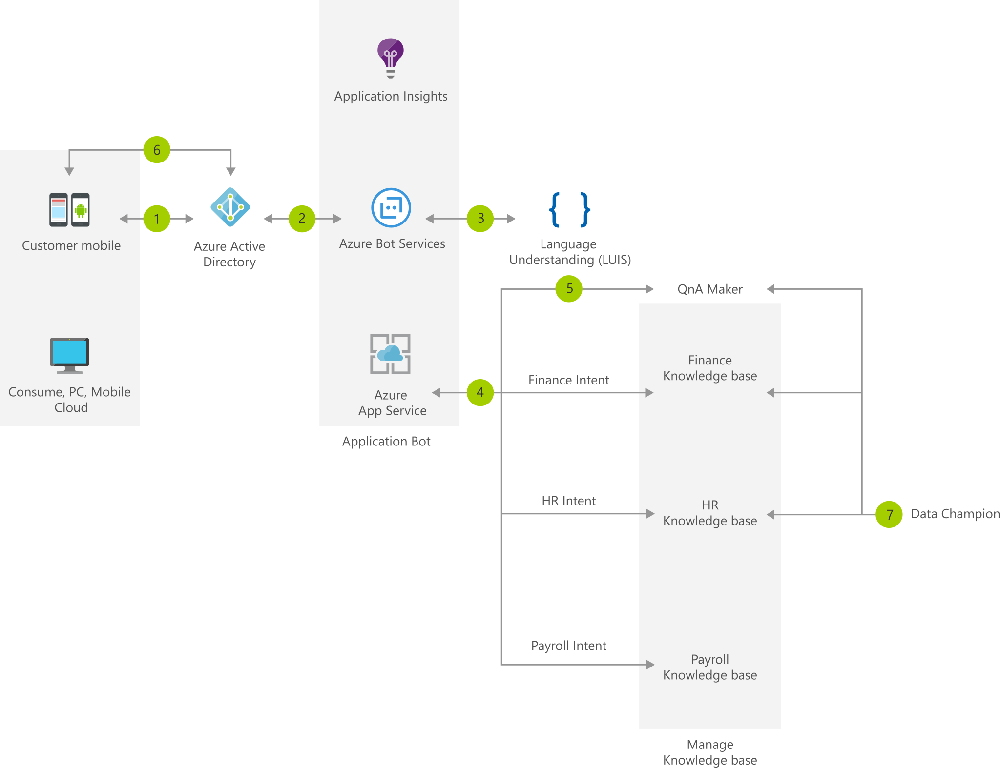

[!INCLUDE [header_file](../../../includes/sol-idea-header.md)]

This solution idea shows how to use [QnA Maker](/azure/cognitive-services/qnamaker/overview/overview) to answer common employee questions.

## Architecture

*Download a [Visio file](https://arch-center.azureedge.net/faq-chatbot-with-data-champion-model.vsdx) of this architecture.*

### Dataflow

1. Employee accesses FAQ bot.
1. Azure Active Directory validates the employee's identity.
1. Query is sent to Language Understanding (LUIS) model to get the intent of the query.
1. Based in the intent, the query is redirected to the appropriate knowledge base.
1. QnA Maker gives the best match to the incoming query.
1. The result is shown to the employee.
1. Data champions manage and update their QnA knowledge bases using feedback from user traffic.

### Components

* Application Insights, a feature of [Azure Monitor](https://azure.microsoft.com/services/monitor)
* [Azure Active Directory](https://azure.microsoft.com/services/active-directory)
* [Azure App Service](https://azure.microsoft.com/services/app-service)
* [Azure Bot Services](https://azure.microsoft.com/services/bot-services)
* [Language Understanding (LUIS)](https://azure.microsoft.com/services/cognitive-services/language-understanding-intelligent-service)
* [QnA Maker](https://azure.microsoft.com/services/cognitive-services/qna-maker) with [active learning](/azure/cognitive-services/qnamaker/how-to/use-active-learning)

## Scenario details

QnA Maker enables you to create FAQ chatbots from existing data. The bot responds using existing company knowledge bases (KB). The bot can choose from multiple knowledge bases based on the intent of the query. And, with [active learning](/azure/cognitive-services/qnamaker/how-to/use-active-learning), data champions in the company can improve the quality of the knowledge bases based on employee feedback.

### Potential use cases

This solution is optimized for the retail industry.

## Next steps

Microsoft Learn modules:

* [Build a bot with QnA Maker and Azure Bot Service](/training/modules/build-faq-chatbot-qna-maker-azure-bot-service)
* [Manage your Language Understanding Intelligent Service (LUIS) Apps](/training/modules/manage-language-understanding-intelligent-service-apps)

## Related resources

Azure Architecture Center overview article:

* [Artificial intelligence (AI) - Architectural overview](../../data-guide/big-data/ai-overview.md)

Explore related chatbot solution ideas and architectures in this docset:

* [Chatbot for hotel reservations](../../example-scenario/ai/commerce-chatbot.yml)
* [Build an enterprise-grade conversational bot](../../reference-architectures/ai/conversational-bot.yml)
* [Commerce chatbot for customer service](./commerce-chatbot.yml)
* [Disaster recovery for enterprise bots](./enterprise-chatbot-disaster-recovery.yml)
