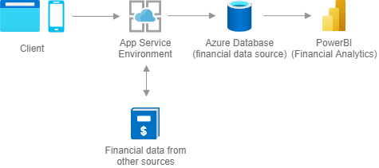

[!INCLUDE [header_file](../../../includes/sol-idea-header.md)]

Securely store critical data and provide high-value analytics and insights over aggregated data to users, using in-built security and performance.

## Architecture

*Download an [SVG](../media/finance-management-apps-using-azure-database.svg) of this architecture.*

## Data Flow

1. The user browses to your application, hosted in an App Service Environment.
1. The web application runs business logic and uses Azure Database and/or other sources.
1. Power BI provides an interactive dashboard with visualization that uses data stored in Azure Database.

## Components

Key technologies used to implement this architecture:

* [App Service Environment](https://docs.microsoft.com/azure/app-service/environment/intro)

  The App Service Environment helps in achieving PCI DSS compliance, an information security standard for organizations that handle financial data (see also [Is App Service compliant with PCI Standard 3.0 and 3.1?](https://docs.microsoft.com/en-us/azure/app-service/faq-configuration-and-management#is-app-service-compliant-with-pci-standard-30-and-31)). If your solution does not need to comply with with this standard, regular [App Service](https://azure.microsoft.com/services/app-service) can be used.

* Azure Database

  Azure offers various managed Platform-as-a-Service database solutions that fit into your existing landscape, eg.
  * [Azure SQL Database](https://azure.microsoft.com/services/sql-database/)
  * [Azure Database for PostgreSQL](https://azure.microsoft.com/services/postgresql/)
  * [Azure Database for MySQL](https://azure.microsoft.com/services/mysql/)

* [PowerBI](https://powerbi.microsoft.com/)

## Next Steps

* [Introduction to App Service](https://docs.microsoft.com/en-us/azure/app-service/overview)
* [Introduction to App Service Environment](https://docs.microsoft.com/azure/app-service/environment/intro)
* [Payment Card Industry (PCI) Data Security Standard (DSS)](https://docs.microsoft.com/en-us/compliance/regulatory/offering-PCI-DSS)
* [Azure App Service Compliance with PCI Standards 3.0 and 3.1](https://docs.microsoft.com/en-us/troubleshoot/azure/general/app-service-compliance-wit)
* [Choosing a database technology on Azure](https://azure.microsoft.com/product-categories/databases/)
* [Connect PowerBI to Azure SQL Database](https://docs.microsoft.com/power-bi/connect-data/service-azure-sql-database-with-direct-connect)

## Fully deployable architectures:

* [Overview of the ISO 27001 App Service Environment/SQL Database workload blueprint sample](https://docs.microsoft.com/en-us/azure/governance/blueprints/samples/iso27001-ase-sql-workload/)
* [Overview of the PCI-DSS v3.2.1 blueprint sample](https://docs.microsoft.com/en-us/azure/governance/blueprints/samples/pci-dss-3.2.1)