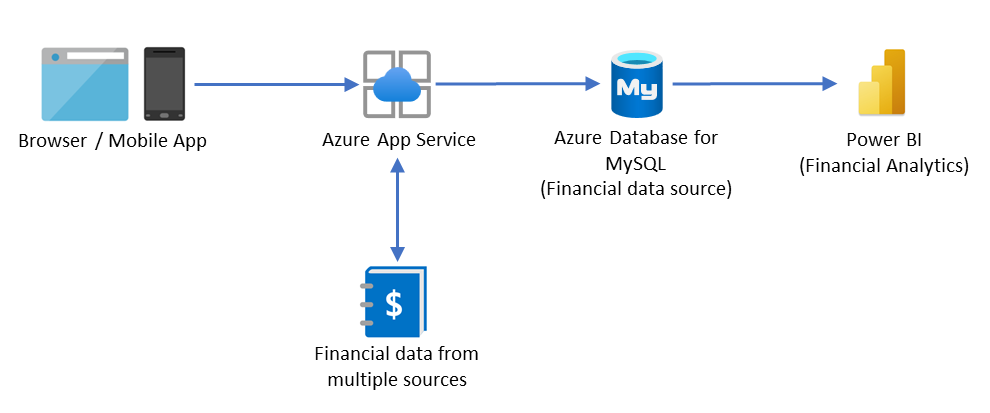

[!INCLUDE [header_file](../../../includes/sol-idea-header.md)]

Securely store data and provide high-value analytics over aggregated data, using in-built security and performance.

## Potential use cases

This architecture is a simple example of a tier-3 application design on Azure with Power BI for data analytics. A use of case for a finance management application is used to add business context, but this design is applicable for many use cases.

## Architecture

*Download an [SVG](../media/finance-management-apps-using-azure-database-for-mysql.svg) of this architecture.*

### Dataflow

The architecture shows the flow of data in a common tier-3 application design: 

* The presentation tier-1 is represented by the web app (browser) and/or mobile app used by clients. 
* Azure App Service hosts backend APIs and business logic that comprise tier-2. 
* Azure Database for MySQL offers a fully managed OSS database for the data layer tier-3. 
* Power BI supports native connectivity with MySQL to ingest data for analytics.

### Components

- [Azure App Service](/azure/app-service) - Azure App Service enables you to build and host web apps, mobile back ends, and RESTful APIs in the programming language of your choice without managing infrastructure.
- [Azure Database for MySQL](/azure/mysql) - Azure Database for MySQL is a relational database service powered by the MySQL community edition.
- [Power BI](/power-bi/fundamentals) - Power BI is a collection of software services, apps, and connectors that work together to turn your unrelated sources of data into coherent, visually immersive, and interactive insights.

## Next steps

Learn more about the component technologies:

- [Connect an existing Azure App Service to Azure Database for MySQL server](/azure/mysql/howto-connect-webapp)
- [Tutorial: Design an Azure Database for MySQL database using the Azure portal](/azure/mysql/tutorial-design-database-using-portal)
- [Power BI MySQL Database Connector](/power-query/connectors/mysqldatabase)

## Related resources

Explore related architectures:

- [Finance management apps using Azure Database for PostgreSQL](/azure/architecture/solution-ideas/articles/finance-management-apps-using-azure-database-for-postgresql)
