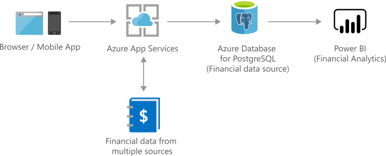

# Finance management apps using Azure Database for PostgreSQL

[!INCLUDE [header_file](../../../includes/sol-idea-header.md)]

Securely store critical data and provide high-value analytics and insights over aggregated data to users, using in-built security and performance.

## Architecture

