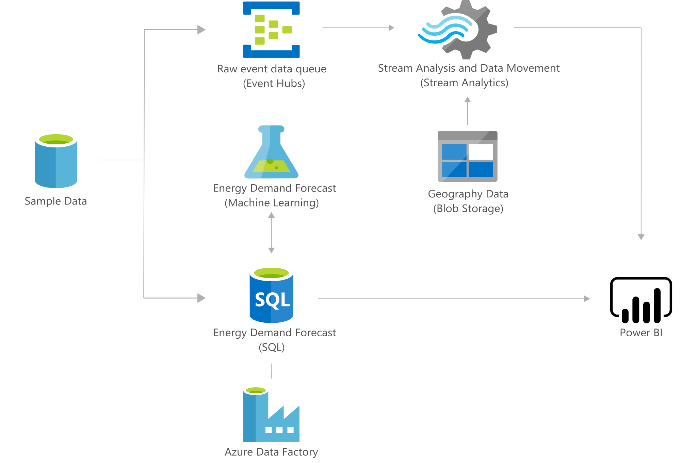

[!INCLUDE [header_file](../../../includes/sol-idea-header.md)]

Learn how Azure Machine Learning can help forecast spikes in demand for energy products and services.

## Architecture

*Download a [Visio file](https://arch-center.azureedge.net/forecast-energy-power-demand.vsdx) of this architecture.*

### Dataflow

1. Time series data can be stored in various formats, depending on its original source. Data can be stored as files within Azure Data Lake Storage or in tabular form in Azure Synapse or Azure SQL Database.
1. Read: Azure Machine Learning (ML) can connect and read from such sources. Ingestion of time series data into Azure Machine Learning, enables automated machine learning (AutoML) to pre-process the data and to train and register a model.
1. The first step within AutoML is configuration and preprocessing the time series data. In this step, the provided data is prepared for training. The data drives the following features and forecasted configurations:
    - Imputed missing values
    - Holiday and DateTime feature engineering
    - Lags and rolling windows
    - Rolling origin cross validation
1. During the training stage, AutoML uses the preprocessed dataset to train, select, and explain the best forecasting model.
    - Model training: A wide range of machine learning models can be used, ranging from classical forecasting, deep neural networks, and regression models.
    - Model evaluation: The evaluation of models allows AutoML to assess the performance of each trained model, and it enables you to select the best performing model for deployment.
    - Explainability: AutoML provides explainability for the selected model, which enables you to better understand what features are driving the model outcomes.
1. The model with best performance is registered in Azure Machine Learning using AutoML, which makes it available for deployment.  
1. Deploy: The model registered in Azure Machine Learning can be deployed, which provides a live endpoint that can be exposed for inferencing.
1. The deployment can be done through Azure Kubernetes Service (AKS), while you run a Kubernetes-managed cluster where the containers are deployed from images that are stored in Azure Container Registry. Alternatively, Azure Container Instances can be used instead of AKS.
1. Inference: Once the model is deployed, the inferencing of new data can be done via the available endpoint. Batch and near real-time predictions can be supported. The inference results can be stored as documents within Azure Data Lake Storage or in tabular form in Azure Synapse or Azure SQL Database.
1. Visualize: The stored model results can be consumed through user interfaces, such as Power BI dashboards, or through custom-built web applications. The results are written to a storage option in a file or tabular format, then are properly indexed by Azure Cognitive Search. The model runs as batch inference and stores the results in the respective datastore.

### Components

* [Azure Data Factory](https://azure.microsoft.com/services/data-factory): Handle data manipulation and preparation.
* [Azure Automated Machine Learning](https://azure.microsoft.com/services/machine-learning/automatedml): Use Azure ML to forecast the energy demand of a particular region.
* [MLOps](https://azure.microsoft.com/services/machine-learning/mlops): Design, deploy, and manage production model workflows.
* [Power BI Azure ML integration](/power-bi/connect-data/service-aml-integrate): Consume model prediction results in Power BI.

## Scenario details

The energy consumption and energy demand change over time. The monitoring of this change over time, results in time-series that can be utilized to understand patterns, and to forecast future behaviors. Azure Machine Learning can help forecast spikes in demand for energy products and services.

This solution is built on the Azure managed services:

- [Azure Stream Analytics](https://azure.microsoft.com/services/stream-analytics)
- [Event Hubs](https://azure.microsoft.com/services/event-hubs)
- [Azure Machine Learning](https://azure.microsoft.com/services/machine-learning)
- [Azure SQL Database](https://azure.microsoft.com/services/sql-database)
- [Data Factory](https://azure.microsoft.com/services/data-factory)
- [Power BI](https://powerbi.microsoft.com)

These services run in a high-availability environment, patched and supported, allowing you to focus on your solution instead of the environment they run in.

### Potential use cases

This solution is ideal for the energy industry.

## Contributors

*This article is maintained by Microsoft. It was originally written by the following contributors.*

Principal author:

 * [Dr. Carlos Santos](https://www.linkedin.com/in/carlosafsantos) | Senior Cloud Solution Architect - AI & Data Science

## Next steps

See the following product documentation:

* [Welcome to Stream Analytics](/azure/stream-analytics/stream-analytics-introduction)
* [What is Event Hubs?](/azure/event-hubs/event-hubs-what-is-event-hubs)
* [Azure SQL documentation](/azure/sql-database)
* [Learn more about Data Factory](/azure/data-factory/data-factory-introduction)
* [What is Azure Machine Learning?](/azure/machine-learning/overview-what-is-azure-ml)
* [Machine Learning and time series forecasting](/azure/machine-learning/concept-automated-ml#time-series-forecasting)
* [Power BI](https://powerbi.microsoft.com/documentation/powerbi-landing-page)

Learn more:

* [Set up AutoML to train a time-series forecasting model with Python](/azure/machine-learning/how-to-auto-train-forecast)
* Try the Machine Learning Notebook for [Forecasting using the Energy Demand Dataset](https://github.com/Azure/MachineLearningNotebooks/blob/master/how-to-use-azureml/automated-machine-learning/forecasting-energy-demand/auto-ml-forecasting-energy-demand.ipynb).
* Try the Microsoft Learn module, [Use automated machine learning in Azure Machine Learning](/training/modules/use-automated-machine-learning).

## Related resources

* [Solutions for the energy and environment industries](/azure/architecture/industries/energy-environment)
* [Batch scoring with R models to forecast sales](/azure/architecture/reference-architectures/ai/batch-scoring-r-models)
* [Oil and gas tank level forecasting](/azure/architecture/solution-ideas/articles/oil-and-gas-tank-level-forecasting)
* [Demand forecasting for shipping and distribution](/azure/architecture/solution-ideas/articles/demand-forecasting-for-shipping-and-distribution)
