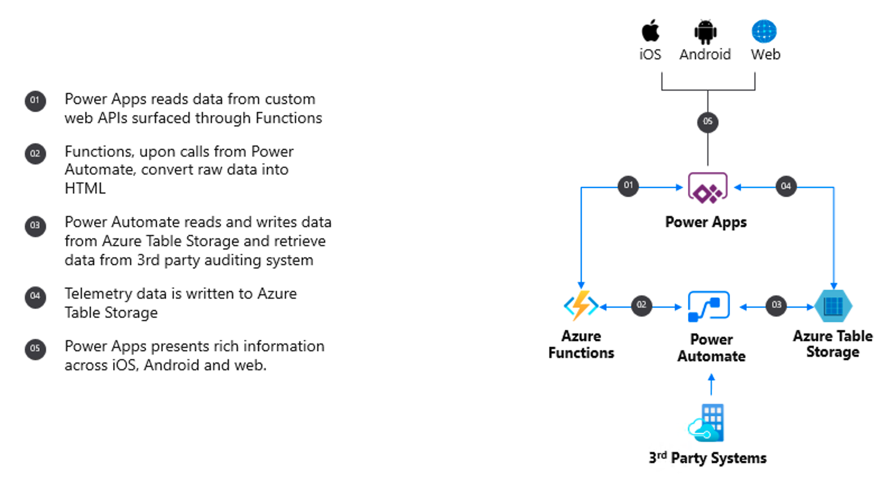

[!INCLUDE [header_file](../../../includes/sol-idea-header.md)]

Utilize Azure Functions for low latency processing and quick reads/writes to Azure Table Storage. Azure Power Apps and Power Automate provide out-of-box connectors for you to tap into data sources that can live anywhere, including in a 3rd-party systems.

## Potential use cases

This solution demonstrates how you can accelerate frontend and business process development with a drag-and-drop visual designer.

## Architecture

*Download a [Visio file](https://arch-center.azureedge.net/front-end.vsdx)* of this architecture.

### Dataflow

The data flows through the solution as follows:

1. Power Apps reads data from custom web APIs surfaced through Functions
1. Functions, upon calls from Power Automate, convert raw data into HTML
1. Power Automate reads and writes data from Azure Table Storage and retrieve data from third party auditing system
1. Telemetry data is written to Azure Table Storage
1. Power Apps presents rich information across iOS, Android and web.

### Components

Data is loaded from these different data sources using several Azure components:

- [Power Apps](https://powerapps.microsoft.com): Increase agility across your organization by rapidly building low-code apps that modernize processes and solve tough challenges.
- [Azure Functions](https://azure.microsoft.com/services/functions): Accelerate and simplify application development with serverless compute
- [Power Automate](https://flow.microsoft.com): Streamline repetitive tasks and paperless processes with Microsoft Power Automate—so you can focus your attention where it's needed most.
- [Azure Table Storage](https://azure.microsoft.com/services/storage/tables): A NoSQL key-value store for rapid development using massive semi-structured datasets

## Next steps

- Learn more: [https://aka.ms/learnpowerapps](/training/browse/?products=power-apps)
