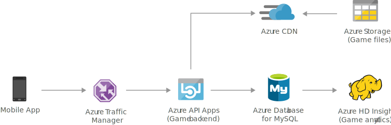

[!INCLUDE [header_file](../../../includes/sol-idea-header.md)]

This gaming solution idea elastically scales your database to accommodate unpredictable bursts of traffic and deliver low-latency multi-player experiences on a global scale.

## Architecture

*Download a [Visio file](https://arch-center.azureedge.net/gaming-using-azure-database-for-mysql.vsdx) of this architecture.*

### Dataflow
1. [Azure Traffic Manager](/azure/traffic-manager/traffic-manager-overview) routes a user's game traffic to the apps hosted in [Azure App Service](/azure/app-service-web/app-service-web-overview), Functions or Containers and APIs published via Azure API Gateway.
1. [Azure CDN](/azure/cdn/cdn-overview) serves static images and game content to the user that are stored in [Azure Blob Storage](/azure/storage/blobs/storage-blobs-overview).
1. [Azure Database for MySQL](/azure/mysql/overview) stores user's game data in a transactional database hosted.
1. The data from Azure Database for MySQL are processed using [Azure Databricks](/azure/databricks/scenarios/what-is-azure-databricks) and stored in the analytics platform.
1. (Optional) Use [Power BI](/power-bi/fundamentals/power-bi-overview) to interpret this data and create new visualizations

### Components

This architecture includes the following components:

- [Azure Traffic Manager](https://azure.microsoft.com/services/traffic-manager) is a DNS-based load balancer that controls the distribution of user traffic for service endpoints in different Azure regions. During normal operations, it routes requests to the primary region. If that region becomes unavailable, Traffic Manager can fail over to secondary region as needed.

- [Azure API Management](https://azure.microsoft.com/services/api-management) provides an API gateway that sits in front of the Gaming APIs. API Management also can be used to implement concerns such as:
    - Enforcing usage quotas and rate limits
    - Validating OAuth tokens for authentication
    - Enabling cross-origin requests (CORS)
    - Caching responses
    - Monitoring and logging requests

- [Azure App Service](https://azure.microsoft.com/services/app-service) hosts API applications allowing autoscale and high availability without having to manage infrastructure.

- [Azure CDN](https://azure.microsoft.com/services/cdn) delivers static, cached content from locations close to users to reduce latency.

- [Azure Blob Storage](https://azure.microsoft.com/services/storage/blobs) are optimized to store large amounts of unstructured data, such as static gaming media.

- [Azure Database for MySQL](https://azure.microsoft.com/free/mysql) is a fully managed relational database service based on the community edition of the open-source MySQL database engine.

- [Azure HDInsight](https://azure.microsoft.com/free/hdinsight) is a managed, full-spectrum, open-source analytics service in the cloud for enterprises. You can use open-source frameworks, such as Hadoop, Apache Spark, Apache Hive, LLAP, Apache Kafka, Apache Storm, R, and so on.

- (Optional) [Power BI](https://powerbi.microsoft.com) provides an interactive dashboard with visualization that uses data stored in SQL Server to drive decisions on the predictions.

## Scenario details

### Potential use cases

This solution is based on a gaming scenario. However, the design patterns are relevant for many industries that are required to process high-traffic web calls and API requests, such as e-commerce and retail applications.

## Next steps

- [Understand data store models](../../guide/technology-choices/data-store-overview.md)

Product documentation:

- [What is Azure Traffic Manager?](/azure/traffic-manager/traffic-manager-overview)
- [Azure API Management](/azure/api-management/api-management-key-concepts)
- [What is Azure CDN?](/azure/cdn/cdn-overview)
- [Azure App Service overview](/azure/app-service-web/app-service-web-overview)
- [Azure Databricks](/azure/databricks/scenarios/what-is-azure-databricks)
- [What is Azure Blob Storage?](/azure/storage/blobs/storage-blobs-overview)
- [Azure Database for MySQL](/azure/mysql/overview)
- [What is Azure HDInsight?](/azure/hdinsight/hdinsight-overview)

## Related resources

The following solution ideas feature Azure Database for MySQL:

* [Retail and e-commerce using Azure Database for MySQL](./retail-and-ecommerce-using-azure-database-for-mysql.yml)
* [Intelligent apps using Azure Database for MySQL](./intelligent-apps-using-azure-database-for-mysql.yml)
* [Finance management apps using Azure Database for MySQL](./finance-management-apps-using-azure-database-for-mysql.yml)
* [Scalable web and mobile applications using Azure Database for MySQL](./scalable-web-and-mobile-applications-using-azure-database-for-mysql.yml)
